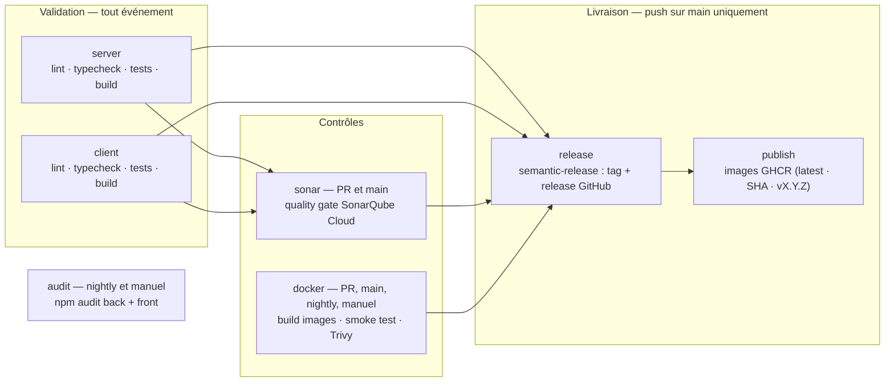
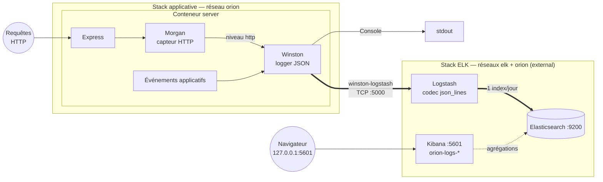

# Documentation technique – Orion CRM

- **Titre du document** : Documentation technique – Orion CRM
- **Auteur** : Vincent Vanwaelscappel
- **Option choisie** : Option B (Scénario Orion)
- **Date** :

## Sommaire

1. [Introduction](#1-introduction)
2. [Étapes de mise en œuvre du pipeline CI/CD](#2-étapes-de-mise-en-œuvre-du-pipeline-cicd) — [2.1 Structure](#21-structure-du-pipeline) · [2.2 Scripts](#22-scripts-dautomatisation) · [2.3 Reproductibilité](#23-reproductibilité)
3. [Plan de conteneurisation et de déploiement](#3-plan-de-conteneurisation-et-de-déploiement) — [3.1 Dockerfiles](#31-dockerfiles) · [3.2 docker-compose.yml](#32-docker-composeyml) · [3.3 Déploiement](#33-stratégie-de-déploiement)
4. [Plan de testing périodique](#4-plan-de-testing-périodique) — [4.1 Types de tests](#41-types-de-tests-automatisés) · [4.2 Fréquence](#42-fréquence-dexécution) · [4.3 Objectifs](#43-objectifs-des-tests)
5. [Plan de sécurité](#5-plan-de-sécurité) — [5.1 Résultats SonarQube](#51-résultats-sonarqube) · [5.2 Analyse des risques](#52-analyse-des-risques) · [5.3 Remédiation](#53-plan-daction--remédiation)
6. [Monitoring, métriques & KPI](#6-monitoring-métriques--kpi) — [6.1 Métriques DORA](#61-métriques-dora) · [6.2 KPI personnalisés](#62-kpi-personnalisés) · [6.3 Analyse synthétique](#63-analyse-synthétique-du-monitoring)
7. [Plan de sauvegarde des données](#7-plan-de-sauvegarde-des-données) — [7.1 Périmètre](#71-ce-qui-doit-être-sauvegardé) · [7.2 Sauvegarde](#72-procédure-de-sauvegarde) · [7.3 Restauration](#73-procédure-de-restauration)
8. [Plan de mise à jour](#8-plan-de-mise-à-jour) — [8.1 Application](#81-mise-à-jour-de-lapplication) · [8.2 Pipeline](#82-mise-à-jour-du-pipeline-cicd) · [8.3 Fréquence](#83-fréquence--bonnes-pratiques)
9. [Conclusion](#9-conclusion)
10. [Annexes](#annexes) — A [Commandes utiles](#annexe-a---commandes-utiles) · B [Détails d'implémentation](#annexe-b---détails-dimplémentation) · C [Captures d'écran](#annexe-c---captures-décran)

## 1. Introduction

**Contexte.** Orion, PME dont l'équipe s'appuie sur un CRM interne développé en JavaScript full-stack, livre son
application à la main : le dépôt de départ ne contient ni tests réels (un placeholder par module, [§ 4](#4-plan-de-testing-périodique)), ni
conteneurisation exploitable ([§ 3.1](#31-dockerfiles)), ni chaîne de livraison. La mission - Option B, cadrée par la CTO - consiste à
**industrialiser** ce dépôt : un pipeline CI/CD complet (Partie 1), puis son exploitation - monitoring, métriques, et
les plans de testing périodique, sécurité, sauvegarde et mise à jour (Partie 2).

**Objectifs de l'industrialisation.** Quatre fils conducteurs traversent ce document :

- **aucune livraison non validée** - 46,2 puis 13,3 % de changements poussés défectueux sur les deux campagnes, zéro
  défaut livré ([§ 6.1](#61-métriques-dora)) ;
- **tout est reproductible et versionné** - scripts identiques local/CI, lockfiles, SHA, digests, dashboards et
  calendriers en code ([§ 2.3](#23-reproductibilité), [§ 8](#8-plan-de-mise-à-jour)) ;
- **ce qui échoue doit se voir** - logs structurés, métriques mesurées, dashboards, chasse aux échecs silencieux
  ([§ 6.3](#63-analyse-synthétique-du-monitoring)) ;
- **rester au strict nécessaire** - choix dimensionnés pour une PME, chaque « non » justifié là où il se prend.

**Technologies principales.** Front React 19 + TypeScript + Vite ; back Node.js 22 + Express 5 + Prisma sur SQLite ;
conteneurisation Docker multi-stage orchestrée par Compose ; pipeline GitHub Actions avec SonarQube Cloud (quality gate
bloquante), Trivy, semantic-release et publication sur GHCR ; Dependabot pour la veille de dépendances ; stack ELK
locale pour l'observation.

**Le pipeline en bref.** Un seul workflow, sept jobs (détail et diagramme au [§ 2.1](#21-structure-du-pipeline)) : validation back et front en
parallèle (lint → types → tests → build), puis quality gate SonarQube et build/smoke test/scan des images, et - sur
`main` uniquement - release SemVer et publication. Un nightly rejoue la validation et le build/scan des images, en y
ajoutant l'audit de dépendances : il détecte les régressions qui surviennent *sans commit*.

## 2. Étapes de mise en œuvre du pipeline CI/CD

### 2.1 Structure du pipeline

Le pipeline tient dans un seul workflow (`.github/workflows/ci.yml`), déclenché sur **quatre événements** dont la
matrice est justifiée au [§ 4.2](#42-fréquence-dexécution) : push (toute branche), pull request vers `main`, nightly (3 h 30 UTC) et
déclenchement manuel (`workflow_dispatch`). Sept jobs le composent :

**Ordre d'exécution.** `server` et `client` tournent **en parallèle**, chacun du signal le plus rapide au plus lent
(`npm ci`, lint, types, tests avec couverture, build) - le *fail-fast* mesuré au [§ 6.2](#62-kpi-personnalisés). `sonar` consomme leurs
rapports de couverture ; `docker` construit les images, démarre la stack complète (`--wait` sur les healthchecks) puis
scanne avec Trivy. `release` n'existe que sur un push `main` intégralement validé (`needs`), `publish` étiquette les
images avec la version taguée. `concurrency` annule les runs obsolètes, sauf en nightly.

**Choix des actions GitHub.** Deux principes : des éditeurs de référence (actions officielles GitHub et Docker,
`SonarSource/sonarqube-scan-action` avec `qualitygate.wait=true` pour que le job échoue si la gate est rouge,
`aquasecurity/trivy-action`) et l'épinglage par SHA. Un seul outil tourne **sans** action : semantic-release, en `npx`
depuis le lockfile racine. Les deux choix sont justifiés au [§ 8.2](#82-mise-à-jour-du-pipeline-cicd).

### 2.2 Scripts d'automatisation

Règle de conception : **le YAML orchestre, il n'implémente pas**. Chaque étape exécute un script npm défini dans le
`package.json` du module concerné - la commande que la CI lance est donc **exactement** celle qu'un développeur lance
en local, et adapter une étape se fait dans le script, jamais dans le workflow.

Inventaire des scripts par module : **[annexe A](#annexe-a---commandes-utiles)**.

### 2.3 Reproductibilité

**Relancer le pipeline** ne demande aucun état préalable : chaque run part d'un runner vierge. Quatre portes d'entrée -
un push, une PR, le nightly, et l'onglet Actions pour un déclenchement manuel ou le re-run d'un run passé. En local, la
reproduction est directe puisque la CI n'exécute que des scripts npm :
`npm ci && npm run lint && npm run typecheck && npm run test:coverage && npm run build` dans `server/` ou `client/`, et
`docker compose up --build` reconstitue la stack du smoke test (créer d'abord `backups/`, [§ 7.2](#72-procédure-de-sauvegarde)).

Le déterminisme repose sur une chaîne d'épinglages, chacune justifiée dans sa section : `npm ci` + lockfiles pour
toutes les dépendances (y compris l'outillage de release, [§ 8.2](#82-mise-à-jour-du-pipeline-cicd)), actions GitHub par SHA ([§ 8.2](#82-mise-à-jour-du-pipeline-cicd)), images de base par
digest ([§ 8.1](#81-mise-à-jour-de-lapplication)), version de Node centralisée (`env.NODE_VERSION`, alignée sur les Dockerfiles et `engines`). Le cache
npm de `setup-node` n'accélère que l'installation : il est invalidé par le lockfile, jamais source de dérive.

**Gestion des secrets.** Un seul secret est stocké dans le dépôt : `SONAR_TOKEN`, consommé exclusivement par le job
`sonar` via le contexte `secrets`, que GitHub masque automatiquement dans les journaux. Tout le reste passe par le
`GITHUB_TOKEN` éphémère fourni à chaque run, régi par le moindre privilège : `contents: read` par défaut, élevé
localement en `contents: write` pour le seul job `release` et `packages: write` pour le seul job `publish`. En local, la
configuration vit dans des `.env` gitignorés, dont `.env.example` documente les clés sans leurs valeurs ; leur
sauvegarde est traitée au [§ 7.1](#71-ce-qui-doit-être-sauvegardé).

## 3. Plan de conteneurisation et de déploiement

### 3.1 Dockerfiles

**État initial.** Le dépôt fournit un Dockerfile par module, volontairement basiques : image `node:22` complète
(~1 Go), `npm install` non reproductible, build et exécution dans la même image, processus lancé en root, et front
servi par `vite preview`, outil de prévisualisation non prévu pour la production.

**Choix techniques cibles.**

| Choix               | Décision                                                    | Justification                                                                                                                                                                                                                                                                                                                                                                                                                                                                                        |
|---------------------|-------------------------------------------------------------|------------------------------------------------------------------------------------------------------------------------------------------------------------------------------------------------------------------------------------------------------------------------------------------------------------------------------------------------------------------------------------------------------------------------------------------------------------------------------------------------------|
| Image de base build | `node:22-alpine`                                            | Alignée sur `engines` (Node ≥ 22) ; alpine ~5× plus légère, surface d'attaque réduite                                                                                                                                                                                                                                                                                                                                                                           |
| Installation        | `npm ci`                                                    | Reproductible depuis le lockfile (échoue s'il est désynchronisé), contrairement à `npm install`                                                                                                                                                                                                                                                                                                                                                                           |
| Structure           | Multi-stage build                                           | L'étage `builder` compile ; l'étage final ne contient que le build et les dépendances de production - plus petit, sans compilateur ni devDependencies                                                                                                                                                                                                                                                          |
| Runtime front       | `nginxinc/nginx-unprivileged:alpine`                        | Un build Vite produit des statiques : nginx est fait pour ça, `vite preview` non. Variante *unprivileged* nativement non-root |
| Utilisateur         | `USER node` (back) / `nginx` (front)                        | Jamais de conteneur en root : une compromission du processus n'obtient pas root                                                                                                                                                                                                                                                                                                                                                                |
| Healthcheck         | `HEALTHCHECK` sur `GET /api/health` (back) et `/` (front)   | Docker/Compose connaît l'état réel du service, pas la seule existence du processus                                                                                                                                                                                                                                                                                                                                                              |
| `.dockerignore`     | `node_modules`, `dist`, `.env*`, `*.db`, `.git`, `coverage` | Contexte minimal ; aucun secret ni base locale copiés dans l'image                                                                                                                                                                                                                                                                                                                                                                                                       |
| Outillage runtime   | npm/npx/yarn supprimés de l'image finale (back)             | Un runtime n'installe rien : surface réduite, et les CVE internes de npm disparaissent. L'entrypoint appelle `node_modules/.bin/prisma` directement |

**Spécificités Prisma/SQLite (back)** : `prisma generate` exécuté dans l'image finale (client dépendant de la
plateforme musl) avec le paquet `openssl`, sans lequel Prisma télécharge des moteurs incompatibles ; migrations
**versionnées** - elles ne l'étaient pas dans le dépôt de départ - et appliquées au démarrage par l'entrypoint ;
fichier SQLite hors de l'image, dans le volume `orion-db`, cible du plan de sauvegarde ([§ 7](#7-plan-de-sauvegarde-des-données)).

**Communication front → back.** Plutôt qu'une URL d'API figée au build Vite, soit une image par environnement, le nginx
du front fait reverse proxy : `/api` → `server:8080`, en miroir du proxy Vite de développement. URL relatives, image
agnostique, une seule origine pour le navigateur - donc pas de CORS inter-conteneurs.

### 3.2 docker-compose.yml

Trois services (pas de service base de données : SQLite est embarqué dans le back) :

| Service  | Image                     | Port hôte | Rôle                                                           |
|----------|---------------------------|-----------|----------------------------------------------------------------|
| `server` | build `server/Dockerfile` | 8080      | API Express + fichier SQLite dans le volume `orion-db`         |
| `client` | build `client/Dockerfile` | 4200      | nginx : statiques React + reverse proxy `/api` → `server:8080` |
| `backup` | celle du `server` (réutilisée) | -    | Planificateur de sauvegarde de la base (détail au [§ 7.2](#72-procédure-de-sauvegarde))       |

- **Healthchecks** : `server` est vérifié via `/api/health` ; `client` ne démarre qu'une fois le back sain
  (`depends_on: condition: service_healthy`).
- **Images nommées GHCR** : chaque service déclare `image:` et `build:` - `docker compose up --build` reste autonome
  depuis le dépôt (exigence du brief), tandis que `docker compose pull` bascule sur les dernières images publiées par
  la CI ([§ 3.3](#33-stratégie-de-déploiement)).
- **Volume nommé** `orion-db` monté sur `/app/data` : persistance des données entre recréations de conteneurs.
- **Réseau bridge nommé** `orion`, déclaré explicitement : les services se résolvent par leur nom, et la stack ELK
  (compose séparé) s'y raccorde en `external: true` sans fusionner les deux stacks.
- **Configuration par variables d'environnement** (`.env` gitignoré, jamais copié dans les images) : aucune valeur
  sensible en dur.

**Lancement local** : `docker compose up --build`, application sur `http://localhost:4200`. `docker compose down`
préserve les données (volume nommé) ; `down -v` est **destructif**, réservé au poste de développement - risque couvert
par le plan de sauvegarde ([§ 7](#7-plan-de-sauvegarde-des-données)). En production, le volume serait déclaré `external: true`, donc insupprimable par
`down -v` ; durcissement non appliqué ici pour préserver le lancement en une commande.

### 3.3 Stratégie de déploiement

- **Publication d'images** : chaque push sur `main` validé pousse les deux images sur **GHCR**, taguées `latest`, SHA
  du commit et `vX.Y.Z` en cas de release. Authentification par le `GITHUB_TOKEN` du run, aucun secret supplémentaire.
- **Déploiement** : sur la machine cible, `docker compose pull && docker compose up -d` ; le healthcheck sert de
  smoke test post-déploiement.
- **Retour arrière** : le tag par SHA permet de redémarrer l'image du commit précédent ([§ 7](#7-plan-de-sauvegarde-des-données) pour les données).

**Releases versionnées (SemVer).** Les releases sont marquées par un tag git **`vX.Y.Z`**, posé par
**semantic-release** depuis les *conventional commits* : à chaque push sur `main` intégralement validé, l'historique
est analysé (`feat:` → MINOR, `fix:`/`perf:` → PATCH, `BREAKING CHANGE` → MAJOR ; les types neutres ne déclenchent
rien), le tag est posé et une release GitHub publiée avec notes et artefacts. L'arbitrage de version est ainsi encodé
dans les messages de commit au moment où le changement est écrit.

## 4. Plan de testing périodique

**État initial** : le dépôt de départ ne contient qu'un test placeholder par module, la couverture réelle est donc
nulle. Le plan ci-dessous définit la cible que le pipeline met en œuvre ([§ 2](#2-étapes-de-mise-en-œuvre-du-pipeline-cicd)).

### 4.1 Types de tests automatisés

| Type                      | Périmètre                                                                               | Outil                                   | Ce qui est vérifié                                                                                                                   |
|---------------------------|-----------------------------------------------------------------------------------------|-----------------------------------------|--------------------------------------------------------------------------------------------------------------------------------------|
| Analyse statique | back + front | ESLint, `tsc --noEmit` | Typage et règles, avant toute exécution |
| Tests unitaires back | services, repositories, validation Zod | Vitest (+ mock Prisma) | Logique métier isolée, sans base réelle |
| Tests d'intégration back | routes Express de bout en bout | Vitest + Supertest, SQLite jetable | Contrats de l'API sur la chaîne route → controller → service → Prisma |
| Tests de composants front | composants, hooks, appels API | Vitest + Testing Library (jsdom) | Rendu et comportement React/TanStack Query, couche API mockée |
| Tests e2e navigateur **(planifiés)** | smoke *(PR)* ; suite étendue *(nightly)* | Playwright (Chromium) | Le comportement vu de l'utilisateur : front, API et base réunis |
| Smoke test conteneurisé | application complète | `docker compose up` + `curl` en CI | L'application démarre réellement en conteneurs |
| Analyse qualité/sécurité | tout le code | SonarQube Cloud | Bugs, vulnérabilités, code smells, duplication, couverture ([§ 5](#5-plan-de-sécurité)) |
| Analyses de vulnérabilités | dépendances et images construites en CI | `npm audit`, Trivy | CVE connues (seuil bloquant HIGH/CRITICAL corrigeables) |

Les tests unitaires et d'intégration produisent un rapport de couverture **lcov**, transmis à SonarQube. Les e2e
Playwright sont **planifiés, pas encore implémentés** (recommandation [§ 9](#9-conclusion)). Le smoke e2e s'exécutera **en PR**, sur la
stack Compose que le job démarre déjà : un merge sur `main` publiant immédiatement des images déployables
([§ 3.3](#33-stratégie-de-déploiement)), ce qui n'est pas vérifié avant merge l'est trop tard. La suite étendue ira en nightly. Garde-fous prévus
contre la *flakiness* : périmètre smoke minimal, `retries` en CI, test instable déplacé en nightly.

### 4.2 Fréquence d'exécution

| Déclencheur                   | Tests exécutés                                                                                                                                             | Rôle                                                                                                                                                                                                                                                                                                                                        |
|-------------------------------|------------------------------------------------------------------------------------------------------------------------------------------------------------|---------------------------------------------------------------------------------------------------------------------------------------------------------------------------------------------------------------------------------------------------------------------------------------------------------------------------------------------|
| **Push** (toute branche)      | Lint + typecheck + tests unitaires, d'intégration et de composants avec couverture + build back et front | Feedback rapide à chaque commit poussé |
| **Pull request** vers `main`  | Idem push + quality gate SonarQube + build/smoke test/scan Trivy des images + *(planifié, [§ 4.1](#41-types-de-tests-automatisés))* smoke e2e. **Exception Dependabot** : tout sauf Sonar (voir ci-dessous) | Dès l'ouverture puis à chaque mise à jour : le reviewer ne relit que des PR vertes. La **protection de branche** recommandée ([§ 6.3](#63-analyse-synthétique-du-monitoring)) rendrait ces résultats opposables au merge |
| **Nightly** (cron quotidien)  | Validation complète + images + `npm audit` + *(planifié)* e2e étendus - Sonar, lié aux PR et à `main`, n'y court pas | Détecter les régressions *sans commit* : nouvelle CVE, dérive de dépendance |
| **Release / push sur `main`** | Suite complète + publication des images GHCR | Seul un état intégralement validé est promu en artefact déployable |

**Cas particulier des pull requests Dependabot** - l'analyse SonarQube y est **exclue** (ces runs n'ont pas accès aux
secrets Actions, et une montée de dépendance n'apporte aucun code source à analyser) ; tout le reste s'exécute, dont le
scan Trivy. Mécanisme et arbitrage : **[annexe B](#annexe-b---détails-dimplémentation)**.

### 4.3 Objectifs des tests

- **Non-régression** : toute modification est confrontée aux comportements existants, condition pour livrer
  fréquemment ([§ 6](#6-monitoring-métriques--kpi)).
- **Qualité** : critères de réussite explicites et bloquants - tests verts obligatoires, couverture ≥ 80 % sur le
  périmètre métier du back (seuil appliqué par les *thresholds* Vitest), quality gate SonarQube au vert. Un échec rend
  le pipeline rouge et bloque la livraison, les jobs `release`/`publish` dépendant de tous les autres ; la protection
  de branche recommandée au [§ 6.3](#63-analyse-synthétique-du-monitoring) le rendrait bloquant dès le merge.
- **Déployabilité** : le smoke test conteneurisé vérifie que ce qui est publié démarre réellement - pas seulement le
  code, mais l'artefact déployé.
- **Alerte** : un échec de CI produit la notification GitHub par défaut, insuffisante pour les runs planifiés
  ([§ 6.3](#63-analyse-synthétique-du-monitoring)) ; une notification dédiée y est recommandée.

## 5. Plan de sécurité

### 5.1 Résultats SonarQube

**Rôle dans le pipeline.** SonarQube Cloud analyse le monorepo (SAST) à chaque PR et push sur `main` : vulnérabilités,
*security hotspots*, bugs, code smells, duplication, complexité, couverture. Le **quality gate** est bloquant : un
échec stoppe la livraison (`needs`), et stopperait le merge avec la protection de branche recommandée ([§ 6.3](#63-analyse-synthétique-du-monitoring)).
Authentification par le secret `SONAR_TOKEN` ([§ 2.3](#23-reproductibilité)).

**Résultats d'analyse** (relevés sur `main`, capture `docs/sonarqube-quality-gate.png`) :

| Mesure | Valeur | Lecture |
|---|---|---|
| **Quality gate** | **Passed** | Condition portant sur le *nouveau code* : c'est elle qui bloque la livraison |
| Vulnérabilités / *security hotspots* | **0** / **0** | Note de sécurité **A**. Aucune faille détectée dans le code écrit ; les risques du [§ 5.2](#52-analyse-des-risques) sont architecturaux, pas syntaxiques, et échappent par nature au SAST |
| Bugs | **0** | Note de fiabilité **A** |
| Code smells | **23** (14 majeurs, 9 mineurs) | Note de maintenabilité **A**, dette estimée à **439 min** (~7 h 20) sur 1 819 lignes |
| Duplication | **0,0 %** | Aucun copier-coller sur 2 300 lignes analysées |
| Couverture | **60,3 %** au global, **92,8 % sur le nouveau code** | Le nouveau code est la condition du gate. Le global mêle les deux modules : **77,9 % côté back**, **28,5 % côté front**, dont les quatre pages CRUD ne sont pas couvertes ([§ 6.2](#62-kpi-personnalisés)) |
| Complexité | 293 cyclomatique, 135 cognitive | Réparties sur 1 819 lignes : aucune fonction ne concentre la complexité |

**Les 23 alertes ouvertes, par règle** - toutes sont des *code smells*, aucune n'est une vulnérabilité, distinction
que le brief demande explicitement de ne pas confondre :

| Règle | Occurrences | Où | Nature |
|---|---|---|---|
| `S6853` - un `label` doit être associé à un contrôle | 10 (majeur) | `ContactForm.tsx`, `OrganizationForm.tsx` | **Accessibilité** : le poste le plus rentable, et le seul qui dégrade l'usage réel |
| `S2486` - une exception ne doit pas être ignorée | 6 (mineur) | contrôleurs `contact` et `organization` | Blocs `catch` vides : se règle avec le correctif de l'error handler ([§ 5.3](#53-plan-daction--remédiation)) |
| `S9011` - un `button` doit porter un `type` explicite | 2 (majeur) | `ContactList.tsx`, `OrganizationList.tsx` | Sans `type`, un bouton dans un formulaire le soumet |
| `S3358` - pas de ternaires imbriqués | 2 (majeur) | formulaires | Lisibilité |
| `S6759` - les props React doivent être en lecture seule | 2 (mineur) | `Card.tsx`, `Layout.tsx` | Typage |
| `S7781` - `replaceAll()` plutôt que `replace()` global | 1 (mineur) | `backupRunner.ts` | Modernisation |

**Interprétation.** Zéro vulnérabilité ne signifie pas « rien à faire » : les quatre risques du dépôt de départ - CORS
ouvert, middleware d'erreurs inopérant, absence d'authentification, absence d'en-têtes HTTP - sont des défauts de
**conception**, invisibles à une analyse statique qui cherche des motifs dangereux dans le code. Ils sont traités au
[§ 5.2](#52-analyse-des-risques) et au [§ 5.3](#53-plan-daction--remédiation). À l'inverse, les 23 smells sont tous mécaniques et concentrés sur le front : 12 des 14 majeurs
relèvent de l'accessibilité et de la sémantique HTML des deux formulaires, ce qui en fait un lot cohérent à traiter en
une seule passe.

### 5.2 Analyse des risques

**Risques applicatifs**

| Risque                                                 | Référence OWASP                 | Impact                                                                     |
|--------------------------------------------------------|---------------------------------|----------------------------------------------------------------------------|
| API sans authentification ni contrôle d'accès          | A01 – Broken Access Control     | Lecture/modification des données CRM par tout accédant au réseau           |
| CORS non restreint                                     | A05 – Security Misconfiguration | Requêtes cross-origin malveillantes vers l'API                             |
| Error handler inopérant → réponses d'erreur par défaut | A05                             | Fuite d'informations techniques (stack traces)                             |
| Pas de rate limiting                                   | A04 – Insecure Design           | Abus de l'API, force brute future sur l'authentification                   |
| Absence d'en-têtes de sécurité HTTP (helmet, CSP)      | A05                             | Clickjacking, sniffing de type MIME, absence de politique de contenu       |
| Fichier SQLite unique, non chiffré                     | -                               | Perte/exfiltration des données si le volume est compromis (mitigé par [§ 7](#7-plan-de-sauvegarde-des-données)) |

Point positif du starter : les entrées sont déjà validées par **Zod** dans chaque controller (protection contre
l'injection et le mass-assignment).

**Risques pipeline et chaîne d'approvisionnement**

| Risque                                               | Mitigation prévue                                                                                                      |
|------------------------------------------------------|------------------------------------------------------------------------------------------------------------------------|
| Secret exposé en clair (token Sonar, `.env` commité) | Secrets GitHub Actions exclusivement ; `.env`, `*.db` gitignorés ; aucun secret dans les images |
| Dépendance vulnérable (CVE) | `npm audit` en nightly + Dependabot ([§ 8](#8-plan-de-mise-à-jour)) |
| Action GitHub compromise (supply chain) | Actions épinglées par SHA de commit ; permissions du `GITHUB_TOKEN` réduites au minimum par job |
| Image de base vulnérable | Images officielles minimales, épinglées par digest et montées par PR Dependabot ([§ 8.1](#81-mise-à-jour-de-lapplication)) ; scan Trivy bloquant en CI |
| Conteneur exécuté en root                            | Utilisateurs non-root dans les deux images ([§ 3.1](#31-dockerfiles))                                                                     |

### 5.3 Plan d'action / Remédiation

**Actions immédiates** (intégrées à la mise en place du pipeline) :

- mettre à jour sans délai les dépendances vulnérables détectées par `npm audit` ([§ 8.1](#81-mise-à-jour-de-lapplication)) ;
- corriger le middleware d'erreurs (signature à 4 paramètres, réponse JSON générique sans stack trace) ;
- supprimer le middleware CORS : avec le reverse proxy ([§ 3.1](#31-dockerfiles)), front et API partagent la même origine, aucune requête
  cross-origin n'est légitime - n'émettre aucun en-tête CORS est la politique la plus restrictive ;
- ajouter helmet côté Express ;
- durcir la conteneurisation : non-root, multi-stage, `.dockerignore`, secrets hors images ([§ 3](#3-plan-de-conteneurisation-et-de-déploiement)) ;
- brancher SonarQube Cloud avec quality gate bloquant ;
- scanner les images avec **Trivy** (seuil bloquant HIGH/CRITICAL corrigeables) - retenu à la place du Twistlock cité
  par le brief : même service, open source, sans console sous licence.

Les trois corrections applicatives (error handler, CORS, helmet) ont été volontairement différées **après** la première
analyse SonarQube, afin de disposer d'une baseline avant remédiation. Celle-ci est désormais relevée
([§ 5.1](#51-résultats-sonarqube)) - et elle apporte un enseignement : **aucune des trois n'apparaît dans les alertes**. Le CORS ouvert et
l'error handler à trois paramètres ne sont pas des motifs détectables, ce qui confirme que le SAST ne remplace pas la
revue d'architecture. La raison de les différer a donc expiré : elles passent en tête des remédiations à appliquer
([§ 9](#9-conclusion)).

**Actions à court terme** (itérations suivantes) :

- traiter les 23 *code smells* relevés au [§ 5.1](#51-résultats-sonarqube), en commençant par le lot d'accessibilité des deux formulaires
  (12 des 14 majeurs) ;
- **relever la couverture du front**, à 28,5 % contre 77,9 % côté back : les quatre pages CRUD n'ont aucun test, et
  aucun seuil n'y est imposé, contrairement au back ([§ 6.2](#62-kpi-personnalisés)) ;
- ~~activer Dependabot~~ **fait** ([§ 8](#8-plan-de-mise-à-jour)) ; reste à instaurer la revue hebdomadaire du lot de PR du lundi ;
- ajouter un rate limiting sur l'API (`express-rate-limit`).

**Actions à long terme** :

- mettre en place une authentification (JWT + bcrypt) et un contrôle d'accès par rôle - indispensable si l'application
  dépasse le réseau interne ;
- planifier la rotation des secrets et les montées de versions majeures selon le plan de mise à jour ([§ 8](#8-plan-de-mise-à-jour)).

## 6. Monitoring, métriques & KPI

**Mise en place du monitoring (stack ELK)** - Les logs applicatifs sont collectés, centralisés et visualisés par une
stack **Elasticsearch + Logstash + Kibana 8.19** locale, décrite dans `elk/docker-compose.yml`. Conformément au brief,
elle reste **hors du pipeline CI/CD** (trop lourde pour y être exécutée à chaque run) : c'est un outil d'observation
lancé à la demande sur le poste (`docker compose up -d` depuis `elk/`, Kibana sur `http://localhost:5601`).

- **Sources** : logs **JSON structurés** via **Winston** - événements applicatifs, et un événement par requête HTTP
  via **Morgan** (méthode, URL, statut, durée). Ping du healthcheck exclu ; front non raccordé, le signal utile vit
  dans l'API.
- **Acheminement** : transport TCP `winston-logstash` vers `logstash:5000`, activé uniquement si `LOGSTASH_HOST` est
  défini - sans la stack ELK, l'application logge sur stdout.
- **Résilience** : Logstash injoignable → le transport se désactive seul et l'API continue de servir, un écouteur
  d'erreur sur le logger étant obligatoire pour cela (comportement verrouillé par tests). L'observabilité ne doit
  jamais pouvoir arrêter l'application qu'elle observe. Limite : le transport désactivé ne se reconnecte pas.
- **Réseau** : la stack ELK rejoint le réseau `orion` en `external: true` ([§ 3.2](#32-docker-composeyml)), cycles de vie indépendants.
- **Indexation** : un index par jour (`orion-logs-AAAA.MM.JJ`), purge = suppression d'index.
- **Sécurité** : `xpack.security.enabled=false` assumé - stack locale, ports liés à `127.0.0.1`, aucune exposition.

Chemin d'un log, de la requête au dashboard :

### 6.1 Métriques DORA

**Source et méthode.** Les quatre métriques sont calculées sur l'historique réel du pipeline (API GitHub Actions) par
`tools/dora-metrics.ts` : chiffres reproductibles et rafraîchissables, jamais relevés à la main. Les plateformes
dédiées (DevLake, Middleware ; Four Keys archivé) ont été écartées à cette échelle - la définition de « déploiement »
y serait enfouie dans une configuration au lieu d'être explicitée ici, et DevLake ajoute quatre conteneurs. Le script
maison est en contrepartie testé comme le reste du code. Avec plusieurs dépôts ou plusieurs équipes, DevLake
deviendrait le choix rationnel.

**Dashboards décrits en code**, un dashboard construit à la souris n'étant pas reproductible. Les quatre dashboards
sont définis dans `tools/kibana/` et créés par `npm run kibana:setup`, commande rejouable ;
`kibana:export`/`import` couvrent l'aller-retour avec l'interface, le code restant la référence. Quatre dashboards pour
trois data views, chacune correspondant à une nature de données :

| Dashboard | Data view | Alimentation |
|---|---|---|
| Pipeline CI/CD - DORA | `orion-pipeline-metrics` | projection de l'API GitHub Actions (`dora:index`, en *pull*) |
| Logs applicatifs | `orion-logs-*` | Winston + Morgan → Logstash, en continu (*push*) |
| Sauvegardes ([§ 7.3](#73-procédure-de-restauration)) | `orion-logs-*` | même flux : les événements de sauvegarde sont émis par le logger de l'application ([§ 7.2](#72-procédure-de-sauvegarde)) |
| Vulnérabilités ([§ 8](#8-plan-de-mise-à-jour)) | `orion-vulnerabilities` | projection de l'API GitHub (`deps:index`, en *pull*) |

`npm run dora:index` projette l'historique dans `orion-pipeline-metrics` (identifiants stables, réexécution
idempotente) ; Kibana dérive les indicateurs par agrégation, dans un index distinct des logs applicatifs. La collecte
est locale : la stack ELK n'est pas exposée et aucun job de CI ne l'alimente (consigne du brief). Le taux d'échec est
obtenu par agrégation d'un indicateur 0/1 porté par chaque run, sans valeur pré-calculée qui se périmerait, et chaque
panneau porte une description rappelant ce qui est mesuré et sur quel périmètre. Les contraintes de l'API Kibana sont
consignées dans le code et couvertes par les 65 tests de `tools/`.

**Limite structurante : le projet n'a pas d'environnement de production**, alors que les métriques DORA décrivent du
code qui y tourne. Les indicateurs présentés sont donc des **proxys explicites**, arrêtés au dernier événement
observable - la publication des images ([§ 3.3](#33-stratégie-de-déploiement)) : le lead time court du commit à la fin de cette publication, un
épisode d'indisponibilité du run rouge au run vert suivant. Une cible de déploiement réelle et une étape
`environment:` horodatée par GitHub rendraient ces métriques exactes plutôt qu'approchées ([§ 6.3](#63-analyse-synthétique-du-monitoring)).

**Période observée** : du 04/08/2026 au 15/08/2026, soit **11,38 jours** et **26 exécutions** du workflow CI sur
`main` - 15 déclenchées par un push, dont 6 par la fusion d'une pull request, et 11 par le cron nightly. Le brief
demande au moins 3 exécutions ; l'échantillon reste petit, ce qui est signalé dans chaque interprétation.

**Trois propriétés de la mesure** conditionnent la lecture des chiffres : la fenêtre **glisse**, l'API ne renvoyant
que les 100 derniers runs - la première campagne (23-27/07, 17 runs) n'est donc plus atteignable par la commande, et
les valeurs publiées sont celles du jour ; le **périmètre** est le seul workflow CI, les runs « Dependabot Updates »
(28 sur la période) étant des mises à jour de dépendances par un robot et non des changements livrés ; enfin les
**runs de pull request n'apparaissent pas**, s'exécutant sur la branche source et non sur la branche de livraison
mesurée. Le dépôt compte par ailleurs 20 pull requests et 40 exécutions déclenchées par une PR, toutes émises par
Dependabot ([§ 6.3](#63-analyse-synthétique-du-monitoring), point critique n° 2).

| Métrique DORA | Ce qui est réellement mesuré | Valeur | Interprétation |
|---|---|---|---|
| **Lead Time for Changes** | commit → **mise à disposition** (publication d'images), et non → production | **3,7 min** (médiane sur 10 publications) | Niveau *elite* (< 1 h) sur la partie mesurée ; le pipeline n'est pas le facteur limitant. Non compté : l'installation (`docker compose pull`), manuelle. |
| **Deployment Frequency** | fréquence de **livraison** (images prêtes à déployer) | **0,88 / jour** (10 publications en 11,38 j) | Rythme quotidien, niveau *high* rapporté à la livraison. Complément : 10 pushes sur 15 intégralement verts. |
| **MTTR** | rétablissement du **pipeline** (rouge → vert), pas d'un service | médiane **1,4 h**, moyenne **3,5 h** (4 épisodes) | L'écart moyenne/médiane tient à un unique épisode long, couvrant une nuit. Restreint aux pushes, l'indicateur monte à 7,8 h sur 2 épisodes : le rétablissement y est compté jusqu'au **push** vert suivant, plus tardif que le run vert suivant, les deux séries ne sont donc pas comparables terme à terme. |
| **Change Failure Rate** | taux d'échec **du pipeline** (celui *au déploiement* est non mesurable sans production) | **13,3 %** (2 pushes rouges sur 15) | Divisé par 3,5 depuis juillet. Aucun changement défectueux livré : `release`/`publish` sont conditionnés (`needs`), l'échec bloque au lieu de dégrader. |

**Tout run rouge n'est pas une défaillance du code.** Sur la période, les deux pushes en échec relèvent d'aléas
d'infrastructure GitHub - aucune machine allouée pour l'un, coupure réseau pendant la construction d'image pour
l'autre, traitée depuis par la mise en cache des couches ([§ 8.2](#82-mise-à-jour-du-pipeline-cicd)). Ces aléas entrent dans le taux d'échec et
dans le MTTR au même titre qu'une régression et les surestiment ; ici ils absorbent la totalité du taux affiché, le
taux imputable au code étant nul. Les distinguer automatiquement supposerait de lire les annotations de chaque job,
accessibles seulement avec authentification : correction identifiée, non implémentée. Une réserve joue en sens
inverse : 3 pushes conclus `cancelled` restent au dénominateur sans être ni des succès ni des échecs ; les écarter
porterait le taux à 16,7 %.

**Évolution depuis la première campagne** (23-27/07, 17 runs, phase de construction du pipeline) : le taux d'échec est
passé de **46,2 % à 13,3 %**, les échecs de juillet tenant à la construction du pipeline ; le lead time médian est
resté stable (3,6 → 3,7 min) malgré l'allongement du pipeline ; les publications sont passées de 2 à 10 (0,59 → 0,88
par jour) ; le premier signal d'échec de 67 à 22 s, dont une part vient de l'exclusion des runs Dependabot ; et le MTTR
des runs planifiés de 60,4 h à 17 min et 2,4 h, sans qu'aucune notification ait pourtant été mise en place.

### 6.2 KPI personnalisés

Cinq KPI pipeline, complétés d'un sixième indicateur applicatif (dernière ligne), pour couvrir les deux natures de
mesure que le brief demande de distinguer : KPI **pipeline** issus de GitHub Actions, et KPI **applicatifs** issus de
la stack ELK ([§ 6.3](#63-analyse-synthétique-du-monitoring)).

| KPI | Valeur mesurée | Pourquoi ce KPI | Seuil d'alerte proposé |
|---|---|---|---|
| **Durée d'un pipeline vert** | médiane **219 s** (160-264 s) | Délai de feedback : trop long, on contourne la CI | > 5 min |
| **Temps avant le premier signal d'échec** | médiane **22 s** (10-166 s, sur 3 échecs) | Qualité du *fail-fast* : signaler tôt, pas seulement signaler | > 3 min |
| **Durée des jobs de test** | back **28 s**, front **24 s** (médianes) | Poste de coût principal quand la suite grossit ; stable = marge | > 2 min |
| **Taux de réussite des runs** | **73,1 %** global, **66,7 %** sur push | Santé du pipeline ; les 41,2 % de juillet tenaient à sa construction | < 80 % sur 20 runs |
| **Couverture de tests** | **back 77,9 %** (100 % sur services, repositories et modèles ; 90,4 % au plus bas sur le code de sauvegarde), **front 28,5 %**, **92,8 % sur le nouveau code** (SonarQube) | Condition de la détection de régressions et du quality gate ([§ 5.1](#51-résultats-sonarqube)). Trois mesures complémentaires : les *thresholds* Vitest imposent 80 % au périmètre métier du back, le gate SonarQube porte sur le nouveau code, et le front n'a **aucun seuil imposé** - c'est le déséquilibre à corriger | < 80 % sur le périmètre métier = build rouge (déjà bloquant) |
| **Taux de réponses en erreur** (applicatif) | non significatif (trafic de démonstration) | Seule mesure de dégradation **vue par l'utilisateur**, invisible dans Actions | > 1 % de 5xx sur 1 h |

Décomposition d'un pipeline vert (médianes) : tests back/front 28/24 s en parallèle, Sonar 65 s, images + smoke test
+ Trivy 85 s, release 32 s, publication 64 s. La durée totale a doublé depuis juillet (107 → 219 s) au fil des ajouts,
coût assumé de la couverture - toujours sous le seuil de 5 min, mais la marge s'est réduite de moitié.

### 6.3 Analyse synthétique du monitoring

**Tendances** - Le pipeline est sorti de sa phase de construction : le taux d'échec est passé de 46,2 % à **13,3 %**
entre les deux campagnes, et les deux échecs restants relèvent de l'infrastructure GitHub, non de régressions
([§ 6.1](#61-métriques-dora)). Sa durée a doublé (107 → 219 s) sans approcher un seuil gênant. Aucun changement défectueux n'a été
livré sur l'ensemble des deux périodes.

**Points forts** - lead time *elite* jusqu'à la mise à disposition (3,7 min), stable alors que le pipeline s'est
allongé ; conditionnement effectif de la livraison, un échec bloquant au lieu de livrer ; détection par le smoke test
conteneurisé de défauts invisibles aux tests unitaires.

**Points critiques identifiés** (anomalies relevées dans les métriques et les journaux d'exécution) :

1. **Les échecs de runs planifiés ne sont notifiés à personne.** En juillet, trois exécutions nightly consécutives sont
   restées rouges 60,4 h sur un audit signalant 13 vulnérabilités *high*. Sans notification dédiée, un contrôle
   nocturne produit un faux sentiment de sécurité. Les deux échecs de la seconde campagne sont repassés au vert en
   17 min et 2,4 h, mais aucune instrumentation n'a été ajoutée entre-temps : l'amélioration tient à la cadence de
   travail. *Correction proposée* : une notification conditionnée à l'échec d'un run planifié.
2. **Aucun changement humain n'est passé par une pull request.** La voie PR fonctionne, mais seul Dependabot
   l'emprunte : sur les 15 pushes de la période, 6 proviennent de la fusion d'une PR du robot et 9 sont allés
   directement sur `main`. Les garde-fous les plus coûteux (quality gate, smoke test, scan Trivy avant fusion)
   s'exécutent donc 40 fois, mais uniquement sur des montées de dépendances. C'était la cause directe du taux d'échec
   de 46 % en juillet ; ce n'est plus ce qui explique les 13,3 % d'août, d'origine infrastructurelle, mais le risque
   reste entier - inexercé là où il compte. *Correction proposée* : activer la protection de branche (checks requis,
   branche à jour) et passer par des branches courtes.
3. **Deux classes d'erreurs étaient évitables en local** - défauts d'exécution des conteneurs et lockfile
   désynchronisé, détectables avant push par un `docker compose up --wait` et un `npm ci`. *Correction proposée* :
   documenter cette vérification, voire un hook de pré-push.
4. **Aucun environnement de production, donc aucune métrique DORA au sens strict** - trois indicateurs sont des proxys
   arrêtés à la publication ([§ 6.1](#61-métriques-dora)), le quatrième est non mesurable. *Correction proposée* : une cible de
   déploiement réelle (un VPS suffit) et une étape d'installation en `environment:` horodatée par GitHub.

**Métriques applicatives (ELK)** - le dashboard « Logs applicatifs » réunit quatre visualisations et deux vues de logs
bruts, dont une restreinte à `status >= 400` : taux de réponses en erreur (4xx vs 5xx), temps de réponse p95 (la
moyenne masque les requêtes lentes), répartition des statuts dans le temps, et top des URL appelées. Le trafic de
démonstration est produit par `GET /api/debug/status/:code`, qui valide chaque visualisation sans attendre un incident
réel. Point d'attention : nginx ne proxifie que `/api/*` et sert `index.html` pour tout le reste (fallback SPA), les
erreurs se cherchent donc avec `status >= 400` et non au niveau de log.

**Captures** - `docs/dashboard-pipeline-dora.png`, `docs/dashboard-logs-applicatifs.png`,
`docs/dashboard-sauvegardes.png` et `docs/dashboard-vulnerabilites.png`, produits par `npm run kibana:setup` sur une
stack ELK 8.19 ; le quatrième est décrit au [§ 8](#8-plan-de-mise-à-jour).

**Fraîcheur des dashboards en *pull*.** Les dashboards logs et sauvegardes sont alimentés en continu par Logstash ; les
dashboards pipeline et vulnérabilités sont des projections de l'API GitHub, et un index figé n'affiche pas « données
anciennes » mais « rien de nouveau ». Le service `indexer` de la stack ELK relance donc `dora:index` et `deps:index`
toutes les heures (calendrier versionné dans le compose, comme au [§ 7.2](#72-procédure-de-sauvegarde) ; exige `GITHUB_TOKEN` dans
`elk/.env`, les alertes ne se lisant pas anonymement).

**Alertes** - aucun seuil n'est aujourd'hui automatisé : les valeurs proposées au [§ 6.2](#62-kpi-personnalisés) et les alertes
applicatives (taux de 5xx, temps de réponse) restent à instrumenter. Priorité recommandée, cohérente avec le point
critique n° 1 : alerter d'abord sur l'échec d'un run planifié, puis sur le taux d'erreurs applicatives, avant
d'affiner des seuils de performance sur un échantillon encore trop petit.

## 7. Plan de sauvegarde des données

### 7.1 Ce qui doit être sauvegardé

Le principe de tri : **ce qui est reproductible n'a pas besoin d'être sauvegardé, ce qui est unique si.**

| Élément | Criticité | Pourquoi | Traitement |
|---|---|---|---|
| **Base SQLite** (volume `orion-db`) | **Vitale** | Seule donnée **irremplaçable** : aucun build ne la régénère, un `down -v` la détruit ([§ 3.2](#32-docker-composeyml)). | Sauvegarde horaire ([§ 7.2](#72-procédure-de-sauvegarde)) |
| **Secrets** (`.env`, `SONAR_TOKEN`) | **Vitale** | Gitignorés, donc *pas* couverts par GitHub - le trou de couverture le plus facile à oublier. | Gestionnaire de mots de passe ; `.env.example` documente les clés |
| Code, migrations, workflows, dashboards | Élevée | **Déjà répliqués** : git est distribué, les dashboards sont du code ([§ 6](#6-monitoring-métriques--kpi)). | Miroir git + bundle ([§ 7.2](#72-procédure-de-sauvegarde)) |
| Historique des exécutions GitHub Actions | Moyenne | Source des métriques DORA ([§ 6.1](#61-métriques-dora)), hors dépôt. | Matérialisé dans Elasticsearch (`dora:index`) |
| Index Elasticsearch (logs) | Faible | Données d'observation jetables (un index par jour). | Aucune sauvegarde - assumé |
| Images Docker publiées sur GHCR | Faible | **Reconstructibles** à l'identique depuis un commit (`docker compose up --build`). | Aucune sauvegarde |
| Artefacts de build (`dist/`) | Nulle | Produits déterministes du code source. | Aucune sauvegarde |

### 7.2 Procédure de sauvegarde

**Base de données - aucun composant annexe n'est nécessaire.** SQLite est une *bibliothèque*, pas un serveur : rien à
« dumper » à distance, mais tout processus voyant le fichier peut en prendre un instantané. Copier à chaud (`cp`) est
dangereux (état déchiré, fichiers `-wal`/`-shm` omis) ; **`VACUUM INTO` est sûr à chaud**, y compris pendant une
écriture concurrente. L'image du serveur embarquant déjà Prisma, la sauvegarde est un script de l'application : ni CLI
`sqlite3`, ni sidecar, ni image dédiée. Commandes : **[annexe A](#annexe-a---commandes-utiles)**.

| Élément | Format | Fréquence |
|---|---|---|
| Base SQLite | instantané `.db` vérifié (`integrity_check`) | **horaire**, service `backup` |
| Contrôle de restaurabilité | restauration à blanc ([§ 7.3](#73-procédure-de-restauration)) | quotidien (4 h UTC), même service |
| Base, stack arrêtée | idem, via l'image du serveur | à la demande, avant migration risquée |
| Dépôt (historique complet) | miroir git | hebdomadaire |
| Dépôt (archive froide) | fichier `.bundle` | hebdomadaire |
| Secrets | gestionnaire de mots de passe | à chaque changement |

**Durées mesurées** - sur une base de 4,7 Mo (500 organisations, 20 000 contacts), soit un ordre de grandeur au-delà de
l'usage attendu de cette CRM interne :

| Opération | Durée | Remarque |
|---|---|---|
| `VACUUM INTO` seul | **0,85 s** | instantané de 4,6 Mo pris pendant une écriture concurrente ; intégrité saine et volumes conformes |
| Sauvegarde complète (`backup.js`) | **3,0 s** | démarrage Node + Prisma, instantané, contrôle d'intégrité, rétention |
| Contrôle de restaurabilité (`restore.js --verify`) | **0,35 s** | restauration à blanc, sans toucher à la base en service |
| Restauration réelle (`restore.js --yes`) | **1,1 s** | copie de sécurité `pre-restore-*` incluse |

Durées relevées sur le chemin de production (JavaScript compilé). Elles croissent avec la taille de la base,
`VACUUM INTO` réécrivant l'intégralité du fichier - d'où le renvoi vers Litestream si la volumétrie changeait
d'échelle. Le temps de rétablissement ([§ 7.3](#73-procédure-de-restauration)) est dominé non par ces secondes mais par le redémarrage du service.

**Rétention** - politique grand-père / père / fils : 24 heures, 7 jours, 4 semaines, 12 mois (algorithme de
`restic forget`, un fichier pouvant satisfaire plusieurs paliers). Plafond de **47 instantanés** à vie ; sur 720
instantanés simulés, 32 sont conservés. Un fichier au nom non reconnu n'est jamais supprimé, ce qui protège les dumps
manuels et les copies pré-restauration. Le palier horaire ramène la perte maximale à **1 h** sur la journée écoulée.

**Planification - service `backup` du compose.** Un service de la stack plutôt qu'une tâche par machine : calendrier
versionné dans le dépôt et identique partout, même raisonnement que pour les dashboards ([§ 6.1](#61-métriques-dora)). Il réutilise
l'image du serveur, ne monte aucun socket Docker - ce qui équivaudrait à un accès root sur l'hôte - et accède
directement au volume ; une erreur ponctuelle est tracée sans interrompre le planificateur. Détails :
**[annexe B](#annexe-b---détails-dimplémentation)**.

Limite : **une exécution manquée n'est pas rattrapée** (machine éteinte à l'heure prévue = instantané absent). Une
planification hôte reste possible - cron, minuterie systemd (seule à rattraper les exécutions manquées via
`Persistent=true`), Planificateur Windows - mais sort du périmètre retenu, le service compose étant versionné et
portable.

**Destination** - les instantanés sont écrits dans `./backups` sur l'hôte, **hors du volume `orion-db`** : un `down -v`
détruit la base sans emporter ses sauvegardes. Le répertoire est gitignoré ; sa copie hors machine reste manuelle,
limite assumée au [§ 7.3](#73-procédure-de-restauration).

**Alternatives évaluées** - pas d'équivalent maintenu d'`automysqlbackup` pour SQLite, d'où le script maison. Si les
exigences montent : **restic** (chiffrement, déduplication, stockage distant, même politique de rétention) ;
**Litestream** (réplication continue du WAL, perte maximale ramenée d'une heure à quelques secondes) - le seul cas où
un sidecar se justifierait, écarté car perdre au pire une heure de saisie d'un CRM interne est acceptable.

### 7.3 Procédure de restauration

**Action automatisée de vérification** - une **restauration à blanc** : le dernier instantané est copié à part,
ouvert, contrôlé (intégrité *et* comptage des enregistrements), puis supprimé, sans jamais toucher à la base en
service. Le service `backup` l'exécute une fois par jour ; elle est aussi lançable à la demande.

**Où la lancer** - deux contextes, qui ne sont pas interchangeables :

| Contexte | Commande | Pourquoi celle-là |
|---|---|---|
| **Stack Docker en marche** (cas normal) | `docker compose exec backup node dist/scripts/restore.js --verify` | `npm` et `tsx` sont absents de l'image de production, retirés pour réduire la surface d'attaque ([§ 3.1](#31-dockerfiles)) : seul le JavaScript compilé y est exécutable. Pas de `--from` à passer, le compose fixant `BACKUP_DIR=/app/backups`. |
| **Poste de développement, hors Docker** | depuis `server/` : `npm run backup:verify -- --from ../backups/<instantané>.db` | Le script npm vit dans `server/package.json`, d'où le répertoire. `BACKUP_DIR` y vaut `backups` relatif au répertoire courant, soit `server/backups`, qui n'existe pas : `--from` court-circuite la variable, dans n'importe quel shell. |

**Si le contrôle échoue**, l'échec est signalé à trois niveaux, un échec inaperçu n'ayant pas plus de valeur qu'une
absence de contrôle ([§ 6.3](#63-analyse-synthétique-du-monitoring)) :

1. **Journal structuré** - événement `backup_failed` → Elasticsearch → dashboard « Sauvegardes » : compteur d'échecs,
   journal détaillé, et une chronologie horaire où un creux signale une sauvegarde manquée.
2. **État persistant + healthcheck** - le résultat est écrit dans `backups/backup-state.json`, relu par le
   healthcheck : conteneur `unhealthy` si la dernière sauvegarde a échoué, si l'instantané n'est pas restaurable, ou
   si aucune sauvegarde n'a eu lieu depuis deux cycles - ce dernier cas couvrant le planificateur bloqué en silence.
3. **Code de sortie 1** en usage manuel ou planifié sur l'hôte.

Le planificateur continue de tourner, et l'état conserve le nom du dernier instantané vérifié (`lastVerified`), celui
vers lequel se replier. Conduite à tenir devant un échec : **[annexe B](#annexe-b---détails-dimplémentation)**.

**Ce qui est éprouvé, et à quelle fréquence** - trois niveaux :

| Épreuve | Ce qu'elle couvre | Fréquence | Constat |
|---|---|---|---|
| **Contrôle de restaurabilité automatisé** | l'instantané s'ouvre, son intégrité est saine, ses volumes sont conformes | **quotidien** (service `backup`, 4 h UTC) | 0,35 s ; échec signalé à trois niveaux |
| **Tests automatisés** | rétention, nommage, cohérence de l'état, suppression des journaux résiduels, refus d'un instantané corrompu, restauration sur fichiers SQLite réels | **à chaque exécution du pipeline** | 123 tests back, dont **48 dédiés à la sauvegarde** |
| **Exercice de restauration complet** | la procédure ci-dessous, arrêt et redémarrage du service compris | **trimestriel**, à consigner | mené une fois de bout en bout : données supprimées puis retrouvées à l'identique |

**Limite** : le contrôle quotidien est une restauration *à blanc* - il prouve que l'instantané est exploitable, pas que
la procédure d'exploitation l'est. Seul l'exercice trimestriel valide la chaîne humaine, ce qui justifie sa
périodicité.

**Scénario d'incident : suppression accidentelle de données** (le plus probable - un `down -v` de trop, une suppression
en masse, une migration fautive). Les commandes se lancent depuis la racine du dépôt : on arrête `server`, mais le
conteneur `backup` reste debout et sert d'accès à la base, montant le même volume.

1. **Arrêter l'application** : `docker compose stop server` - sinon le serveur écrit pendant le remplacement ;
2. **Choisir l'instantané** : `ls backups/` (nommage horodaté) ;
3. **Vérifier avant d'agir** : `docker compose exec backup node dist/scripts/restore.js --verify` confirme la
   restaurabilité et affiche les volumes contenus ;
4. **Restaurer** : `docker compose exec backup node dist/scripts/restore.js --yes` (ajouter
   `--from /app/backups/<instantané>.db` pour un point précis, chemin vu du conteneur). Le script copie l'état courant
   sous `pre-restore-*`, ce qui rend l'opération réversible, et supprime les `-wal`/`-shm` résiduels, faute de quoi
   SQLite rejouerait l'ancien journal par-dessus la base restaurée ;
5. **Redémarrer et contrôler** : `docker compose start server`, puis `/api/health`.

Sans `--yes`, la commande refuse : une action destructive n'est jamais le comportement par défaut.

**Perte du dépôt GitHub** : indisponibilité temporaire indolore, git étant distribué ; perte définitive → recloner
depuis le miroir ou un bundle ([§ 7.2](#72-procédure-de-sauvegarde)). Le miroir ne contient ni issues/PR ni historique Actions, d'où l'archivage
de ce dernier dans Elasticsearch ([§ 7.1](#71-ce-qui-doit-être-sauvegardé)).

**Limites** :

- **perte maximale d'une heure** (24 h au-delà de la journée écoulée), acceptée en interne ; Litestream la réduirait à
  quelques secondes ;
- la restauration exige un **arrêt de service**, sans bascule à chaud. Temps de rétablissement mesuré : moins d'une
  minute, dont 1,1 s pour la restauration elle-même, le reste étant l'arrêt, le redémarrage et le contrôle applicatif ;
- sauvegardes **non chiffrées** (données nominatives) : toute copie externe devra viser un support chiffré (restic) ;
- la copie hors machine reste **manuelle**, faiblesse résiduelle de ce plan et première automatisation à ajouter.

## 8. Plan de mise à jour

Le principe directeur : **une mise à jour est un commit comme un autre** - elle subit l'intégralité du pipeline et
n'atteint `main` que verte. Le plan ne consiste donc pas à inventer un processus de validation, il existe, mais à
**automatiser la détection**, pour que la décision humaine se limite à relire et merger. Il s'appuie sur **Dependabot**
(natif GitHub, rien à héberger), configuré dans `.github/dependabot.yml`, versionné comme le reste. Trois canaux se
complètent :

| Canal | Déclencheur | Rôle |
|---|---|---|
| **Dependabot version updates** | hebdomadaire (lundi 7 h) | PR de montée de version : la maintenance ordinaire |
| **Dependabot security updates** | immédiat, dès l'avis | PR de correctif **hors calendrier** - une CVE n'attend pas lundi |
| **`npm audit` + Trivy en nightly** ([§ 4.2](#42-fréquence-dexécution)) | quotidien | Filet indépendant et **actif** : job rouge chaque nuit tant que rien n'est traité ; couvre aussi le contenu des images, que Dependabot ne voit pas |

Les *security updates* s'activent dans les réglages du dépôt, pas dans le fichier YAML.

**Le recouvrement entre Dependabot et l'audit nightly est voulu** : même base d'avis, mais propriétés opposées.
Dependabot **remédie** (PR prête, quasi temps réel) avec un signal passif ; le nightly **rend l'état visible et
bloquant** (job rouge, compté par les métriques du [§ 6](#6-monitoring-métriques--kpi)). Supprimer l'un perdrait soit le remède automatique, soit
le rappel impossible à ignorer.

**Mesurer, pas seulement alerter : le dashboard « Vulnérabilités ».** L'onglet Security montre l'état, pas la
performance. Les alertes sont projetées dans Elasticsearch (`npm run deps:index`, un document par alerte, réindexation
idempotente qui suit les états) et visualisées dans le quatrième dashboard : encours ouvert (objectif zéro), encours
critique/haute, chronologie par sévérité, registre, et surtout le **délai médian de remédiation**
(`fixed_at - created_at`), le KPI qui manquait au [§ 5.3](#53-plan-daction--remédiation). Rafraîchissement horaire par le service `indexer`
([§ 6.3](#63-analyse-synthétique-du-monitoring)). Contrairement aux exécutions Actions, cet endpoint n'a pas de lecture anonyme : `GITHUB_TOKEN` y est
obligatoire. Il se pose dans `elk/.env` pour le service `indexer`, et dans `tools/.env` pour un lancement à la main
depuis le poste - deux fichiers gitignorés, avec leurs modèles versionnés.

### 8.1 Mise à jour de l'application

**Dépendances npm.** Dependabot surveille chaque semaine les quatre `package.json` (`/server`, `/client`, `/tools` et
la racine, qui porte l'outillage de release), avec deux choix de configuration qui structurent le flux :

- **Mineures et correctifs groupés, majeures individuelles** : les `minor`/`patch` arrivent en une PR groupée par
  module, semver disant qu'elles ne cassent rien et la CI le vérifiant ; chaque **majeure** arrive seule, relue avec
  son changelog.
- **Délai de maturation (`cooldown: 3 jours`)** : le temps qu'un paquet cassé ou compromis le jour de sa sortie soit
  signalé et retiré. Les *security updates* l'ignorent, c'est voulu.

Le préfixe des commits distingue ce qui est livré, car **semantic-release le lit** ([§ 2](#2-étapes-de-mise-en-œuvre-du-pipeline-cicd)) : dépendance de
*production* → `fix(deps)`, soit une release patch ; devDependencies et outillage → `chore(deps)`, sans release.

**Mises à jour React / Node.js.** Une majeure de framework ou de runtime n'est pas une PR Dependabot, c'est un
**chantier planifié** :

- **Node.js** : de LTS en LTS uniquement. La version est épinglée à cinq endroits qui bougent ensemble
  (`env.NODE_VERSION`, `FROM` des deux Dockerfiles, `engines` des deux `package.json`) - aucun robot ne sait les
  coordonner, d'où un processus manuel : branche dédiée, les cinq modifications, suite complète, release.
- **React** (et Prisma, Express, Vite) : la PR Dependabot déclenche, la relecture suit les notes de version et les
  codemods. Une seule majeure à la fois.

**Images Docker.** Deux cas distincts, et une limite d'outil assumée :

- **Images de base des Dockerfiles** : épinglées par **digest**, pour la même raison que les actions le sont par SHA
  ([§ 8.2](#82-mise-à-jour-du-pipeline-cicd)) - un tag est mutable et consommé sans relecture au moment du build, le digest est immuable et rend les
  builds reproductibles ([§ 2.3](#23-reproductibilité)). Contrepartie : une base figée ne reçoit plus de correctif d'elle-même, l'épinglage
  n'étant tenable qu'avec l'écosystème `docker` de Dependabot, qui fait monter **digest et tag ensemble**. Contrainte
  structurante : son parseur ne résout pas les `ARG` dans les `FROM`, d'où des versions inlinées - un `ARG` réintroduit
  rendrait les images invisibles et le digest vieillirait sans alerte. Le nightly reconstruit et scanne en complément
  la base publiée : CVE signalée sous 24 h. La montée majeure relève du chantier Node ci-dessus.
- **Stack ELK** : images épinglées en version (`8.19.19`), surveillées par l'écosystème `docker-compose`, sans digest -
  outil local jamais publié par la CI. **Groupe unique** pour les trois images, Elastic exigeant leur alignement ;
  majeures exclues, un 8.x → 9.x étant une migration (mappings, dashboards) et non un merge.

### 8.2 Mise à jour du pipeline CI/CD

Le pipeline est lui-même un logiciel avec des dépendances, et il bénéficie du même traitement :

- **Actions GitHub** : épinglées par **SHA de commit**, version lisible en commentaire. Un tag `v7` est mutable -
  vecteur d'attaque réel (`tj-actions/changed-files`, mars 2025) - un SHA non ; même politique que les digests
  d'images ([§ 8.1](#81-mise-à-jour-de-lapplication)). Le coût est payé par Dependabot, qui monte **SHA et commentaire ensemble**.
- **L'outillage de release est une dépendance comme une autre.** Un wrapper tiers épinglé par SHA installait néanmoins
  le *latest* de npm **à chaque exécution**, hors lockfile et avec un token en écriture : le SHA protège le
  téléchargeur, pas la cargaison. D'où le schéma **officiel** de semantic-release - devDependency dans un
  `package.json` racine sous lockfile, `npm ci` puis `npx semantic-release`. Plus aucun code téléchargé à l'exécution,
  et l'outil passe sous Dependabot. *Limite assumée* : `npm audit` signale des paquets vulnérables **bundlés** dans le
  paquet `npm` que tire `@semantic-release/npm` - jamais exécutés, et incorrigeables par `overrides`, une dépendance
  groupée n'étant pas résolue séparément. L'audit nightly reste donc ciblé sur `server/` et `client/`.
- **Auto-validation.** Une PR qui touche `ci.yml` exécute le pipeline modifié : la mise à jour d'une action est testée
  par le pipeline lui-même.
- **Le runner** (`ubuntu-latest`) est géré par GitHub : les mises à jour sont subies. Les bascules d'image majeure sont
  annoncées à l'avance et testables en épinglant temporairement (`ubuntu-24.04`).
- **La version de Node** est centralisée (`env.NODE_VERSION`) et suit le chantier Node du [§ 8.1](#81-mise-à-jour-de-lapplication) : le pipeline teste
  avec la version qui tourne en production.

### 8.3 Fréquence & bonnes pratiques

| Quoi | Quand | Pourquoi ce rythme |
|---|---|---|
| Mineures / correctifs npm, actions, ELK | **hebdomadaire** (PR groupées) | Marches petites, revue en une fois |
| Correctifs de sécurité | **immédiat** (hors calendrier et cooldown) | Le nightly ([§ 4.2](#42-fréquence-dexécution)) sert de rattrapage sous 24 h |
| Majeures (une PR chacune) | **au fil de l'eau**, une à la fois | Si la CI casse, le coupable est connu |
| Node LTS, migration ELK | **planifié** | Chantiers coordonnés qu'aucun robot ne sait faire atomiquement |
| Montée des images de base (digest) | **hebdomadaire** (PR groupée) | Une base épinglée ne se soigne que par ces PR |

Et les règles qui rendent le système tenable :

- **Ne jamais merger une PR de mise à jour rouge** : c'est un travail à planifier ou une exclusion à documenter,
  pas du bruit ([§ 6.3](#63-analyse-synthétique-du-monitoring)).
- **Monter souvent plutôt que beaucoup** : le coût d'une mise à jour croît plus vite que son retard.
- **Laisser la CI dire non** : le plan repose sur la qualité du filet ([§ 4](#4-plan-de-testing-périodique)) ; si la couverture baisse, le plan de
  mise à jour se dégrade avec elle.
- **Pas d'auto-merge pour l'instant** : raisonnable seulement quand une suite e2e couvrira les parcours critiques
  ([§ 4.1](#41-types-de-tests-automatisés)).
- Le service `backup` réutilise l'image du serveur : il suit ses mises à jour sans configuration - un service de
  moins à maintenir.

## 9. Conclusion

**Ce qui a changé.** Le dépôt est passé d'une application livrée à la main - sans tests réels, sans conteneurs, sans
chaîne de livraison - à une application **industrialisée de bout en bout** : un pipeline à sept jobs qui valide,
analyse, conteneurise, teste la stack complète et publie des images versionnées, et des plans d'exploitation **outillés**
- le plan de sauvegarde a son service et son healthcheck, le plan de mise à jour a Dependabot, le monitoring a ses
quatre dashboards définis en code et rafraîchis automatiquement.

**Gains observés**, mesurés sur le pipeline réel ([§ 6](#6-monitoring-métriques--kpi)) :

- **Fiabilité** : 46,2 % des changements poussés étaient défectueux en juillet, **13,3 % en août**, et aucun n'a été
  livré sur l'une ou l'autre période - l'échec bloque au lieu de dégrader. Le smoke test conteneurisé a notamment
  intercepté des défauts d'exécution du service de sauvegarde, invisibles aux tests unitaires ([§ 7.2](#72-procédure-de-sauvegarde)).
- **Rapidité** : lead time médian commit → images de **3,7 min** (*elite* sur le périmètre mesuré), inchangé d'une
  campagne à l'autre alors que le pipeline a doublé de durée ; premier signal d'échec à **22 s**.
- **Qualité** : d'une couverture nulle à **92,8 % sur le nouveau code** et un seuil de 80 % bloquant sur le métier du
  back ; quality gate SonarQube au vert (0 vulnérabilité, 0 bug, 0 % de duplication) ; versionnement SemVer porté par
  les messages de commit.

**Ce que les métriques ont apporté** dépasse les chiffres : l'écart entre le MTTR des pushes et celui des runs
planifiés ([§ 6.3](#63-analyse-synthétique-du-monitoring)) a orienté plusieurs choix - healthchecks, compteurs à zéro, pull requests plutôt que
notifications, index rafraîchis automatiquement.

**Recommandations pour les itérations suivantes**, par ordre de priorité :

1. **Activer la protection de branche** ([§ 6.3](#63-analyse-synthétique-du-monitoring)) : un réglage, qui rend opposables des contrôles aujourd'hui
   inexercés sur le code écrit à la main.
2. **Instrumenter les alertes** ([§ 6.3](#63-analyse-synthétique-du-monitoring)) : seuils définis, aucun automatisé - commencer par l'échec des runs
   planifiés et le taux de 5xx.
3. **Compléter la chaîne de sauvegarde** ([§ 7.3](#73-procédure-de-restauration)) : copie hors machine automatisée, puis chiffrement des instantanés.
4. **Durcir l'application** ([§ 5.3](#53-plan-daction--remédiation)) : les trois remédiations différées - error handler, CORS, helmet - dont la
   baseline SonarQube confirme qu'aucune analyse statique ne les signalera, puis l'authentification. Le pipeline protège
   la livraison, pas encore le service livré.
5. **Implémenter la suite e2e planifiée** ([§ 4.1](#41-types-de-tests-automatisés)), qui débloquera l'auto-merge des mineures ([§ 8.3](#83-fréquence--bonnes-pratiques)), puis
   **mesurer le déploiement réel** pour obtenir les métriques DORA de bout en bout.

## Annexes

Les sections 1 à 9 portent les choix et leurs justifications ; les annexes, leur mise en œuvre pratique.

### Annexe A - Commandes utiles

**Scripts npm** - la commande que lance la CI est exactement celle qu'un développeur lance en local ([§ 2.2](#22-scripts-dautomatisation)).

| Module | Scripts | Rôle |
|---|---|---|
| `server/` | `lint`, `typecheck`, `test:coverage`, `build`, `prisma:generate` | Jobs `server` et `release` (build des artefacts) |
| `server/` | `backup`, `backup:verify`, `restore` | Hors pipeline : sauvegardes ([§ 7](#7-plan-de-sauvegarde-des-données)). Points d'entrée **du poste de développement** ; dans l'image de production, dépourvue de `npm` et de `tsx`, les mêmes actions passent par `node dist/scripts/…` ([§ 7.3](#73-procédure-de-restauration)) |
| `client/` | `lint`, `typecheck`, `test:coverage`, `build` | Jobs `client` et `release` |
| racine | `release` (semantic-release) | Job `release` ([§ 8.2](#82-mise-à-jour-du-pipeline-cicd)) |
| `tools/` | `dora`, `dora:index`, `deps:index`, `kibana:setup`/`import`/`export` | Hors pipeline : métriques DORA, alertes et dashboards ([§ 6](#6-monitoring-métriques--kpi)) |

Un script shell complète l'ensemble : `docker-entrypoint.sh` applique les migrations Prisma avant de démarrer l'API, un
conteneur neuf partant d'un volume vide. Le healthcheck du service `backup` appelle `node dist/scripts/backup.js
--health` ([§ 7.3](#73-procédure-de-restauration)).

**Exploitation** - la séquence de démarrage complète est donnée dans le README, avec les deux contraintes d'ordre
qu'elle impose (le réseau `orion` créé par la stack applicative, le redémarrage de `server`/`backup` une fois Logstash
à l'écoute). Les commandes de sauvegarde et de restauration ci-dessous se lancent depuis la racine du dépôt et passent
par `node dist/scripts/…` et non par les scripts npm ([§ 7.3](#73-procédure-de-restauration)) ; le conteneur ciblé par `exec` suit une règle
simple : `server` tant que l'application doit tourner, `backup` dès qu'elle doit être arrêtée. Les dernières lignes du
tableau se lancent depuis l'hôte ou depuis `tools/`, comme indiqué.

| Besoin | Commande |
|---|---|
| Sauvegarde à la demande, stack en marche | `docker compose exec -T server node dist/scripts/backup.js` |
| Sauvegarde stack arrêtée (avant migration risquée) | `docker run --rm --entrypoint node -v orion-db:/app/data -v "$PWD/backups":/app/backups ghcr.io/…-server:latest dist/scripts/backup.js` - `--entrypoint` indispensable, sinon l'image démarre l'API |
| Contrôle de restaurabilité ([§ 7.3](#73-procédure-de-restauration)) | `docker compose exec -T backup node dist/scripts/restore.js --verify` |
| Restauration ([§ 7.3](#73-procédure-de-restauration)) | `docker compose stop server` puis `docker compose exec -T backup node dist/scripts/restore.js --yes` - via `backup` et non `server`, qui doit être arrêté pendant l'opération. `--from /app/backups/<instantané>.db` pour un point précis |
| Miroir du dépôt | `git push --mirror <second-hébergeur>` |
| Archive froide du dépôt | `git bundle create orion-$(date +%F).bundle --all` |
| Métriques DORA (rapport) | `npm run dora` depuis `tools/` |
| Dashboards Kibana | `npm run kibana:setup` depuis `tools/` |

### Annexe B - Détails d'implémentation

**Service `backup` du compose** ([§ 7.2](#72-procédure-de-sauvegarde)) - points de conception : aucune image dédiée, celle du serveur contenant déjà
Prisma et les scripts ; **aucun socket Docker monté**, ce qui équivaudrait à root sur l'hôte - accès direct au volume,
comme tout client SQLite ; `entrypoint` remplacé, celui du serveur jouant des migrations déjà passées ; cadence
**alignée sur l'horloge** et non sur le démarrage du conteneur ; **sauvegarde immédiate au démarrage** pour amorcer
l'état du healthcheck, sinon défaillant jusqu'à 59 min sur un volume vierge ; **`./backups` doit exister avant le
premier `up`**, faute de quoi Docker le crée en root et le service non-root ne peut pas y écrire.

**Conduite devant un échec du contrôle de restaurabilité** ([§ 7.3](#73-procédure-de-restauration)) - un instantané non restaurable signifie le plus
souvent que la **base source est corrompue**, `VACUUM INTO` en étant une copie fidèle. Dans l'ordre : contrôler la base
en service, l'espace disque et le support, puis restaurer depuis `lastVerified`. Relancer simplement la sauvegarde
reproduirait la corruption.

**Pull requests Dependabot et SonarQube** ([§ 4.2](#42-fréquence-dexécution)) - un run déclenché par Dependabot n'a accès qu'aux secrets
*Dependabot*, jamais aux secrets Actions : `SONAR_TOKEN` y arrive vide et l'analyse échoue. Elle est donc exclue de ces
PR, sans perte - elles ne modifient que des manifestes, et tout le reste s'exécute, dont le scan Trivy. Un job sauté
comptant comme un succès pour la protection de branche, la PR reste fusionnable. Alternative écartée : dupliquer
`SONAR_TOKEN` en secret Dependabot exposerait un jeton d'écriture à des exécutions automatiques.

### Annexe C - Captures d'écran

| Capture | Fichier | Section |
|---|---|---|
| Dashboard « Pipeline CI/CD - métriques DORA » | `docs/dashboard-pipeline-dora.png` | [§ 6.1](#61-métriques-dora) |
| Dashboard « Logs applicatifs » | `docs/dashboard-logs-applicatifs.png` | [§ 6.3](#63-analyse-synthétique-du-monitoring) |
| Dashboard « Sauvegardes » | `docs/dashboard-sauvegardes.png` | [§ 7.3](#73-procédure-de-restauration) |
| Dashboard « Vulnérabilités » | `docs/dashboard-vulnerabilites.png` | [§ 8](#8-plan-de-mise-à-jour) |
| Résultats SonarQube Cloud | `docs/sonarqube-quality-gate.png` | [§ 5.1](#51-résultats-sonarqube) |
