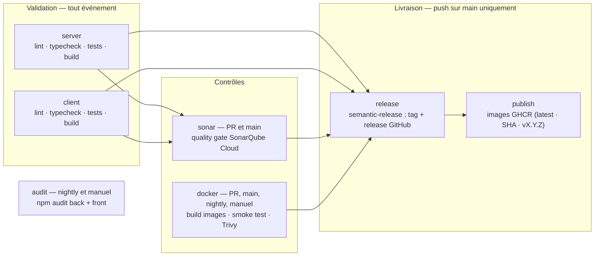
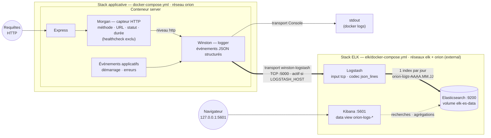

# Documentation technique – Orion CRM

- **Titre du document** : Documentation technique – Orion CRM
- **Auteur** : Vincent Vanwaelscappel
- **Option choisie** : Option B (Scénario Orion)
- **Date** :

## Sommaire

1. [Introduction](#1-introduction)
2. [Étapes de mise en œuvre du pipeline CI/CD](#2-étapes-de-mise-en-œuvre-du-pipeline-cicd)
    - 2.1 [Structure du pipeline](#21-structure-du-pipeline)
    - 2.2 [Scripts d'automatisation](#22-scripts-dautomatisation)
    - 2.3 [Reproductibilité](#23-reproductibilité)
3. [Plan de conteneurisation et de déploiement](#3-plan-de-conteneurisation-et-de-déploiement)
    - 3.1 [Dockerfiles](#31-dockerfiles)
    - 3.2 [docker-compose.yml](#32-docker-composeyml)
    - 3.3 [Stratégie de déploiement](#33-stratégie-de-déploiement)
4. [Plan de testing périodique](#4-plan-de-testing-périodique)
    - 4.1 [Types de tests automatisés](#41-types-de-tests-automatisés)
    - 4.2 [Fréquence d'exécution](#42-fréquence-dexécution)
    - 4.3 [Objectifs des tests](#43-objectifs-des-tests)
5. [Plan de sécurité](#5-plan-de-sécurité)
    - 5.1 [Résultats SonarQube](#51-résultats-sonarqube)
    - 5.2 [Analyse des risques](#52-analyse-des-risques)
    - 5.3 [Plan d'action / Remédiation](#53-plan-daction--remédiation)
6. [Monitoring, métriques & KPI](#6-monitoring-métriques--kpi)
    - 6.1 [Métriques DORA](#61-métriques-dora)
    - 6.2 [KPI personnalisés](#62-kpi-personnalisés)
    - 6.3 [Analyse synthétique du monitoring](#63-analyse-synthétique-du-monitoring)
7. [Plan de sauvegarde des données](#7-plan-de-sauvegarde-des-données)
    - 7.1 [Ce qui doit être sauvegardé](#71-ce-qui-doit-être-sauvegardé)
    - 7.2 [Procédure de sauvegarde](#72-procédure-de-sauvegarde)
    - 7.3 [Procédure de restauration](#73-procédure-de-restauration)
8. [Plan de mise à jour](#8-plan-de-mise-à-jour)
    - 8.1 [Mise à jour de l'application](#81-mise-à-jour-de-lapplication)
    - 8.2 [Mise à jour du pipeline CI/CD](#82-mise-à-jour-du-pipeline-cicd)
    - 8.3 [Fréquence & bonnes pratiques](#83-fréquence--bonnes-pratiques)
9. [Conclusion](#9-conclusion)

- [Annexes](#annexes) — A [Commandes utiles](#annexe-a---commandes-utiles) · B [Détails d'implémentation](#annexe-b---détails-dimplémentation) · C [Captures d'écran](#annexe-c---captures-décran)

## 1. Introduction

**Contexte.** Orion, PME dont l'équipe s'appuie sur un CRM interne développé en JavaScript full-stack, livre son
application à la main : le dépôt de départ ne contient ni tests réels (un placeholder par module, [§ 4](#4-plan-de-testing-périodique)), ni
conteneurisation exploitable (des Dockerfiles basiques, sans multi-stage et avec un serveur de dev en production,
[§ 3.1](#31-dockerfiles)), ni chaîne de livraison. La mission - Option B du projet, cadrée par la CTO - consiste à
**industrialiser** ce dépôt : d'abord un pipeline CI/CD complet (Partie 1), puis son exploitation - monitoring,
métriques, et les plans qui rendent la solution maintenable par l'équipe : testing périodique, sécurité, sauvegarde,
mise à jour (Partie 2).

**Objectifs de l'industrialisation.** Quatre fils conducteurs traversent ce document :

- **aucune livraison non validée** - ce qui transforme 46 % de changements défectueux en zéro défaut livré ([§ 6.1](#61-métriques-dora)) ;
- **tout est reproductible et versionné** - scripts identiques local/CI, lockfiles, SHA, digests, dashboards et
  calendriers en code ([§ 2.3](#23-reproductibilité), [§ 8](#8-plan-de-mise-à-jour)) ;
- **ce qui échoue doit se voir** - logs structurés, métriques mesurées, dashboards, chasse aux échecs silencieux
  (fil rouge du [§ 6.3](#63-analyse-synthétique-du-monitoring)) ;
- **rester au strict nécessaire** - choix dimensionnés pour une PME, chaque « non » justifié là où il se prend.

**Technologies principales.** Front React 19 + TypeScript + Vite ; back Node.js 22 + Express 5 + Prisma sur SQLite ;
conteneurisation Docker multi-stage orchestrée par Docker Compose ; pipeline GitHub Actions avec SonarQube Cloud
(quality gate bloquante), Trivy (scan d'images), semantic-release (versions SemVer automatisées) et publication sur
GHCR ; Dependabot pour la veille de dépendances ; stack ELK locale (Elasticsearch, Logstash, Kibana) pour
l'observation.

**Le pipeline en bref.** Un seul workflow, sept jobs (détail et diagramme au [§ 2.1](#21-structure-du-pipeline)) : validation back et front en
parallèle (lint → types → tests → build), puis quality gate SonarQube et build/smoke test/scan des images, et - sur
`main` uniquement - release SemVer et publication des images. Un nightly rejoue chaque nuit la validation et le
build/scan des images (l'analyse SonarQube, liée aux PR et à `main`, n'y court pas) et y ajoute l'audit de
dépendances, pour détecter les régressions qui arrivent *sans commit*.

## 2. Étapes de mise en œuvre du pipeline CI/CD

### 2.1 Structure du pipeline

Le pipeline tient dans un seul workflow (`.github/workflows/ci.yml`), déclenché sur **quatre événements** dont la
matrice est justifiée au [§ 4.2](#42-fréquence-dexécution) : push (toute branche), pull request vers `main`, nightly (3 h 30 UTC) et
déclenchement manuel (`workflow_dispatch`). Sept jobs le composent :

**Ordre d'exécution.** `server` et `client` tournent **en parallèle**, chacun du signal le plus rapide au plus lent
(`npm ci`, lint, types, tests avec couverture, build) - le *fail-fast* mesuré au [§ 6.2](#62-kpi-personnalisés) : une erreur de syntaxe coûte
une minute, pas dix. `sonar` consomme leurs rapports de couverture (artefacts) ; `docker` construit les images,
démarre la stack complète (`--wait` sur les healthchecks - le smoke test qui a débusqué les trois défauts du [§ 7.2](#72-procédure-de-sauvegarde))
puis scanne avec Trivy. `release` n'existe que sur un push `main` intégralement validé (`needs`) ; `publish` étiquette
les images avec la version fraîchement taguée. `concurrency` annule les runs obsolètes - sauf en nightly.

**Choix des actions GitHub.** Deux principes : des éditeurs de référence (actions officielles GitHub et Docker,
`SonarSource/sonarqube-scan-action` avec `qualitygate.wait=true` pour que le job **échoue** si la gate est rouge,
`aquasecurity/trivy-action`) et l'épinglage par SHA ([§ 8.2](#82-mise-à-jour-du-pipeline-cicd)). Un seul outil tourne **sans** action : semantic-release,
en `npx` depuis le lockfile racine - son wrapper communautaire installait du code non verrouillé à chaque run ([§ 8.2](#82-mise-à-jour-du-pipeline-cicd)).

### 2.2 Scripts d'automatisation

Règle de conception : **le YAML n'orchestre, il n'implémente pas**. Chaque étape exécute un script npm défini dans le
`package.json` du module concerné - la commande que la CI lance est donc **exactement** celle qu'un développeur lance
en local, et adapter une étape se fait dans le script, jamais dans le workflow. Conséquence directe : le pipeline est
reproductible à la main, et un développeur déboguant en local exécute le même code que la CI.

Inventaire des scripts par module : **[annexe A](#annexe-a---commandes-utiles)**.

### 2.3 Reproductibilité

**Relancer le pipeline** ne demande aucun état préalable : chaque run part d'un runner vierge et réinstalle tout.
Quatre portes d'entrée - un push, une PR, le nightly, et l'onglet Actions pour un déclenchement manuel
(`workflow_dispatch`) ou le re-run d'un run passé. En local, la reproduction est directe puisque la CI n'exécute que
des scripts npm : `npm ci && npm run lint && npm run typecheck && npm run test:coverage && npm run build` dans
`server/` ou `client/`, et `docker compose up --build` reconstitue la stack du smoke test (créer d'abord le
répertoire `backups/`, [§ 7.2](#72-procédure-de-sauvegarde)).

Le déterminisme repose sur une chaîne d'épinglages, chacune justifiée dans sa section : `npm ci` + lockfiles pour
toutes les dépendances (y compris l'outillage de release, [§ 8.2](#82-mise-à-jour-du-pipeline-cicd)), actions GitHub par SHA ([§ 8.2](#82-mise-à-jour-du-pipeline-cicd)), images de base par
digest ([§ 8.1](#81-mise-à-jour-de-lapplication)), version de Node centralisée (`env.NODE_VERSION`, alignée sur les Dockerfiles et `engines`). Le cache
npm de `setup-node` n'accélère que l'installation : il est invalidé par le lockfile, jamais source de dérive.

**Gestion des secrets.** Un seul secret est stocké dans le dépôt (Settings → Secrets → Actions) : `SONAR_TOKEN`,
consommé exclusivement par le job `sonar` via le contexte `secrets` - GitHub le **masque automatiquement** dans les
journaux, et il n'apparaît dans aucune commande. Tout le reste passe par le `GITHUB_TOKEN` éphémère fourni à chaque
run, régi par le moindre privilège : `contents: read` pour tout le monde, élevé ponctuellement et localement -
`contents: write` pour le seul job `release` (pousser le tag), `packages: write` pour le seul job `publish` (pousser
les images). En local, la configuration vit dans des `.env` **gitignorés**, dont `.env.example` documente les clés
attendues sans leurs valeurs ; leur sauvegarde est traitée au [§ 7.1](#71-ce-qui-doit-être-sauvegardé).

## 3. Plan de conteneurisation et de déploiement

### 3.1 Dockerfiles

**État initial.** Le dépôt fournit un Dockerfile par module (`server/Dockerfile`, `client/Dockerfile`), volontairement
basiques : image `node:22` complète (~1 Go), `npm install` non reproductible, build et exécution dans la même image,
processus lancé en root, et front servi par `vite preview` (outil de prévisualisation, non prévu pour la production).

**Choix techniques cibles.**

| Choix               | Décision                                                    | Justification                                                                                                                                                                                                                                                                                                                                                                                                                                                                                        |
|---------------------|-------------------------------------------------------------|------------------------------------------------------------------------------------------------------------------------------------------------------------------------------------------------------------------------------------------------------------------------------------------------------------------------------------------------------------------------------------------------------------------------------------------------------------------------------------------------------|
| Image de base build | `node:22-alpine`                                            | Alignée sur `engines` (Node ≥ 22) ; alpine ~5× plus légère, surface d'attaque réduite                                                                                                                                                                                                                                                                                                                                                                           |
| Installation        | `npm ci`                                                    | Reproductible depuis le lockfile (échoue s'il est désynchronisé), contrairement à `npm install`                                                                                                                                                                                                                                                                                                                                                                           |
| Structure           | Multi-stage build                                           | L'étage `builder` compile ; l'étage final ne contient que le build et les dépendances de production - plus petit, sans compilateur ni devDependencies                                                                                                                                                                                                                                                          |
| Runtime front       | `nginxinc/nginx-unprivileged:alpine`                        | Un build Vite = des statiques : nginx est fait pour ça, `vite preview` non. Variante *unprivileged* (NGINX Inc.) nativement non-root, préférable à un durcissement manuel |
| Utilisateur         | `USER node` (back) / `nginx` (front)                        | Jamais de conteneur en root : une compromission du processus n'obtient pas root                                                                                                                                                                                                                                                                                                                                                                |
| Healthcheck         | `HEALTHCHECK` sur `GET /api/health` (back) et `/` (front)   | Docker/Compose connaît l'état réel du service, pas la seule existence du processus                                                                                                                                                                                                                                                                                                                                                              |
| `.dockerignore`     | `node_modules`, `dist`, `.env*`, `*.db`, `.git`, `coverage` | Contexte minimal ; aucun secret ni base locale copiés dans l'image                                                                                                                                                                                                                                                                                                                                                                                                       |
| Outillage runtime   | npm/npx/yarn supprimés de l'image finale (back)             | Un runtime n'installe rien : surface réduite, et les CVE internes de npm (relevées par Trivy) disparaissent. L'entrypoint appelle `node_modules/.bin/prisma` directement |

**Spécificités Prisma/SQLite (back)** : `prisma generate` exécuté dans l'image finale (client dépendant de la
plateforme musl) avec le paquet `openssl` (sans lui, Prisma télécharge des moteurs incompatibles) ; migrations
**versionnées** (le starter les gitignorait !) et appliquées au démarrage par l'entrypoint ; fichier SQLite **hors de
l'image**, dans le volume `orion-db` - cible du plan de sauvegarde ([§ 7](#7-plan-de-sauvegarde-des-données)).

**Communication front → back.** Plutôt qu'une URL d'API figée au build Vite (une image par environnement), le nginx
du front fait reverse proxy : `/api` → `server:8080`, en miroir du proxy Vite de dev. URL relatives, image agnostique,
une seule origine pour le navigateur (pas de CORS inter-conteneurs).

### 3.2 docker-compose.yml

Trois services (pas de service base de données : SQLite est embarqué dans le back) :

| Service  | Image                     | Port hôte | Rôle                                                           |
|----------|---------------------------|-----------|----------------------------------------------------------------|
| `server` | build `server/Dockerfile` | 8080      | API Express + fichier SQLite dans le volume `orion-db`         |
| `client` | build `client/Dockerfile` | 4200      | nginx : statiques React + reverse proxy `/api` > `server:8080` |
| `backup` | celle du `server` (réutilisée) | -    | Planificateur de sauvegarde de la base (détail au [§ 7.2](#72-procédure-de-sauvegarde))       |

- **Healthchecks** : `server` est vérifié via `/api/health` ; `client` ne démarre qu'une fois le back sain
  (`depends_on: condition: service_healthy`).
- **Images nommées GHCR** : chaque service déclare à la fois `image:` (`ghcr.io/enhydrav/ocr-jsld-p7-server` /
  `-client`) et `build:` - `docker compose up --build` reste autonome depuis le dépôt (exigence du brief), tandis que
  `docker compose pull` bascule sur les dernières images publiées par la CI (déploiement, [§ 3.3](#33-stratégie-de-déploiement)).
- **Volume nommé** `orion-db` monté sur `/app/data` : persistance des données entre recréations de conteneurs.
- **Réseau bridge nommé** `orion`, déclaré explicitement : les services se résolvent par leur nom, et la stack ELK
  (compose séparé) s'y raccorde en `external: true` sans fusionner les deux stacks.
- **Configuration par variables d'environnement** (`.env` gitignoré, jamais copié dans les images) : aucune valeur
  sensible en dur.

**Lancement local** : `docker compose up --build`, application sur `http://localhost:4200`. `docker compose down`
préserve les données (volume nommé) ; `down -v` est **destructif** (supprime la base), réservé au poste de dev - le
risque est couvert par le plan de sauvegarde ([§ 7](#7-plan-de-sauvegarde-des-données)), et en production le volume serait déclaré `external: true`
(insupprimable par `down -v`), durcissement non appliqué ici pour préserver le lancement en une commande.

### 3.3 Stratégie de déploiement

- **Publication d'images** : chaque push sur `main` validé pousse les deux images sur **GHCR**, taguées `latest` +
  SHA du commit (traçabilité) + `vX.Y.Z` en cas de release. Authentification par le `GITHUB_TOKEN` du run
  (`packages: write`), aucun secret supplémentaire.
- **Déploiement** : sur la machine cible, `docker compose pull && docker compose up -d` ; le healthcheck sert de
  smoke test post-déploiement.
- **Retour arrière** : le tag par SHA permet de redémarrer l'image du commit précédent (données : plan de
  sauvegarde [§ 7](#7-plan-de-sauvegarde-des-données)).

**Releases versionnées (SemVer).** Les releases sont marquées par un tag git **`vX.Y.Z`** (MAJOR = rupture, MINOR =
fonctionnalité compatible, PATCH = correctif), **automatisé par semantic-release** depuis les *conventional commits* :
à chaque push sur `main` intégralement validé, l'historique est analysé (`feat:` → MINOR, `fix:`/`perf:` → PATCH,
`BREAKING CHANGE` → MAJOR ; les types neutres ne déclenchent rien), le tag est posé et une release GitHub publiée avec
notes et artefacts de build. L'arbitrage de version est ainsi encodé dans les messages de commit au moment où le
changement est écrit - leur qualité devient une exigence de production.

## 4. Plan de testing périodique

**État initial** : le starter ne contient qu'un test placeholder par module (`expect(true).toBe(true)`) ; la couverture
réelle est donc nulle. Le plan ci-dessous définit la cible que le pipeline met en œuvre ; le déroulé effectif de la mise
en place est décrit au [§ 2](#2-étapes-de-mise-en-œuvre-du-pipeline-cicd).

### 4.1 Types de tests automatisés

| Type                      | Périmètre                                                                               | Outil                                   | Ce qui est vérifié                                                                                                                   |
|---------------------------|-----------------------------------------------------------------------------------------|-----------------------------------------|--------------------------------------------------------------------------------------------------------------------------------------|
| Analyse statique          | back + front | ESLint, `tsc --noEmit` | Typage et règles, avant toute exécution |
| Tests unitaires back      | services, repositories, validation Zod                                                  | Vitest (+ mock Prisma)                  | Logique métier isolée : chaque couche testée sans base de données réelle                                                             |
| Tests d'intégration back  | routes Express de bout en bout | Vitest + Supertest, SQLite jetable | Contrats de l'API sur la vraie chaîne route > controller > service > Prisma |
| Tests de composants front | composants, hooks, appels API | Vitest + Testing Library (jsdom) | Rendu et comportement React/TanStack Query, couche API mockée |
| Tests e2e navigateur **(planifiés, non implémentés)** | smoke : parcours critiques (dashboard, CRUD contact) *(PR)* ; suite étendue *(nightly)* | Playwright (Chromium)                   | Le comportement réel vu de l'utilisateur : front, API et base réunis, dans un vrai navigateur                                        |
| Smoke test conteneurisé   | application complète | `docker compose up` + `curl` en CI | L'application démarre réellement en conteneurs |
| Analyse qualité/sécurité  | tout le code | SonarQube Cloud | Bugs, vulnérabilités, code smells, duplication, couverture ([§ 5](#5-plan-de-sécurité)) |
| Analyses de vulnérabilités | dépendances (back + front) et images construites en CI | `npm audit`, Trivy | CVE connues des dépendances et des couches d'images (seuil bloquant HIGH/CRITICAL corrigeables) |

Les tests unitaires et d'intégration produisent un rapport de couverture **lcov**, transmis à SonarQube. Les e2e
Playwright sont **planifiés, pas encore implémentés** (recommandation [§ 9](#9-conclusion)) : le **smoke e2e** (parcours critiques)
s'exécutera **en PR** - un merge sur `main` publiant immédiatement des images déployables ([§ 3.3](#33-stratégie-de-déploiement)), tout ce qui n'est
pas vérifié avant merge l'est trop tard - sur la stack Compose que le job PR démarre déjà ; la **suite étendue** ira
en nightly. Garde-fous prévus contre la *flakiness* : périmètre smoke minimal, `retries` en CI, test instable déplacé
en nightly le temps d'être fiabilisé.

### 4.2 Fréquence d'exécution

| Déclencheur                   | Tests exécutés                                                                                                                                             | Rôle                                                                                                                                                                                                                                                                                                                                        |
|-------------------------------|------------------------------------------------------------------------------------------------------------------------------------------------------------|---------------------------------------------------------------------------------------------------------------------------------------------------------------------------------------------------------------------------------------------------------------------------------------------------------------------------------------------|
| **Push** (toute branche)      | Lint + typecheck + tests unitaires, d'intégration et de composants avec couverture + build back et front                                                   | Feedback rapide au développeur à chaque commit poussé                                                                                                                                                                                                                                                                                       |
| **Pull request** vers `main`  | Idem push + quality gate SonarQube + build/smoke test/scan Trivy des images + *(planifié, [§ 4.1](#41-types-de-tests-automatisés))* smoke e2e. **Exception Dependabot** : tout sauf Sonar (voir ci-dessous) | Dès l'ouverture puis à chaque mise à jour : le reviewer ne relit que des PR vertes. La **protection de branche** recommandée ([§ 6.3](#63-analyse-synthétique-du-monitoring)) rendrait ces résultats opposables au merge |
| **Nightly** (cron quotidien)  | Validation complète + images + `npm audit` + *(planifié)* e2e étendus - Sonar, lié aux PR/main, n'y court pas | Détecter les régressions *sans commit* (nouvelle CVE, dérive de dépendance) : un pipeline vert hier peut être rouge aujourd'hui |
| **Release / push sur `main`** | Suite complète + publication des images GHCR                                                                                                               | Seul un état intégralement validé est promu en artefact déployable                                                                                                                                                                                                                                                                          |

**Cas particulier des pull requests Dependabot** - l'analyse SonarQube y est **exclue** (ces runs n'ont pas accès aux
secrets Actions, et une montée de dépendance n'apporte aucun code source à analyser) ; tout le reste s'exécute, dont le
scan Trivy. Mécanisme et arbitrage : **[annexe B](#annexe-b---détails-dimplémentation)**.

### 4.3 Objectifs des tests

- **Non-régression** : toute modification est confrontée aux comportements existants - la condition pour livrer
  fréquemment sans peur ([§ 6](#6-monitoring-métriques--kpi)).
- **Qualité** : critères de réussite explicites et bloquants - tests verts obligatoires, couverture ≥ 80 % sur le
  périmètre métier du back (services, repositories, validation - seuil appliqué par les *thresholds* Vitest, qui font
  échouer le job de tests sous 80 %), quality gate SonarQube au vert. Un échec rend le pipeline rouge et bloque la
  livraison (les jobs `release`/`publish` dépendent de tous les autres) ; la protection de branche recommandée au
  [§ 6.3](#63-analyse-synthétique-du-monitoring) rendrait cet échec bloquant dès le merge.
- **Déployabilité** : le smoke test conteneurisé garantit que ce qui est publié démarre réellement - on ne teste pas
  seulement le code, mais l'artefact déployé, dans les conditions du déploiement.
- **Alerte** : un échec de CI produit la notification GitHub par défaut (email/interface) - dont le [§ 6.3](#63-analyse-synthétique-du-monitoring) montre
  qu'elle est **insuffisante** pour le nightly (60,4 h de rouge sans réaction) ; une notification dédiée aux échecs
  planifiés y est recommandée. La cible : le nightly en échec traité comme un incident, pas comme du bruit.

## 5. Plan de sécurité

### 5.1 Résultats SonarQube

**Rôle dans le pipeline.** SonarQube Cloud analyse le monorepo (SAST) à chaque PR et push sur `main` : vulnérabilités,
*security hotspots*, bugs, code smells, duplication, complexité, couverture (rapports lcov de la CI). Le **quality
gate** est bloquant : un échec stoppe la livraison (`needs`) - et stopperait le merge avec la protection de branche
recommandée ([§ 6.3](#63-analyse-synthétique-du-monitoring)). Authentification par le secret `SONAR_TOKEN` ([§ 2.3](#23-reproductibilité)).

**Résultats d'analyse.** *(Section complétée en Partie 2, après plusieurs exécutions du pipeline : vulnérabilités et
hotspots relevés, code smells critiques, zones de complexité, couverture mesurée, avec captures en annexe.)*

L'analyse manuelle du starter identifie déjà des candidats que SonarQube et la revue devront confirmer :

- **CORS ouvert à toutes les origines** (`app.use(cors())`) : n'importe quel site peut appeler l'API depuis le
  navigateur d'un utilisateur interne ;
- **Middleware d'erreurs inopérant** : déclaré avec 3 paramètres alors qu'Express en exige 4 pour un error handler - il
  ne s'exécute jamais, les erreurs remontent au handler par défaut (risque de fuite de stack trace) ;
- **Aucune authentification** sur l'API CRM (données clients accessibles à quiconque atteint le port) ;
- **Absence d'en-têtes de sécurité HTTP** (pas de helmet côté Express, pas de CSP côté nginx).

### 5.2 Analyse des risques

**Risques applicatifs**

| Risque                                                 | Référence OWASP                 | Impact                                                                     |
|--------------------------------------------------------|---------------------------------|----------------------------------------------------------------------------|
| API sans authentification ni contrôle d'accès          | A01 – Broken Access Control     | Lecture/modification des données CRM par tout accédant au réseau           |
| CORS non restreint                                     | A05 – Security Misconfiguration | Requêtes cross-origin malveillantes vers l'API                             |
| Error handler inopérant > réponses d'erreur par défaut | A05                             | Fuite d'informations techniques (stack traces)                             |
| Pas de rate limiting                                   | A04 – Insecure Design           | Abus de l'API, force brute future sur l'authentification                   |
| Fichier SQLite unique, non chiffré                     | -                               | Perte/exfiltration des données si le volume est compromis (mitigé par [§ 7](#7-plan-de-sauvegarde-des-données)) |

Point positif du starter : les entrées sont déjà validées par **Zod** dans chaque controller (protection contre
l'injection et le mass-assignment).

**Risques pipeline et chaîne d'approvisionnement**

| Risque                                               | Mitigation prévue                                                                                                      |
|------------------------------------------------------|------------------------------------------------------------------------------------------------------------------------|
| Secret exposé en clair (token Sonar, `.env` commité) | Secrets GitHub Actions exclusivement ; `.env`, `*.db` gitignorés ; aucun secret dans les images (`.dockerignore`)      |
| Dépendance vulnérable (CVE)                          | `npm audit` en nightly + Dependabot (alertes et PR de mise à jour, [§ 8](#8-plan-de-mise-à-jour))                                                |
| Action GitHub compromise (supply chain)              | Actions épinglées par SHA de commit, pas seulement par tag ; permissions du `GITHUB_TOKEN` réduites au minimum par job |
| Image de base vulnérable                             | Images officielles minimales (alpine), épinglées par digest et montées par PR Dependabot ([§ 8.1](#81-mise-à-jour-de-lapplication)) ; scan Trivy en CI (PR + nightly), bloquant   |
| Conteneur exécuté en root                            | Utilisateurs non-root dans les deux images ([§ 3.1](#31-dockerfiles))                                                                     |

### 5.3 Plan d'action / Remédiation

**Actions immédiates** (intégrées à la mise en place du pipeline) :

- mettre à jour sans délai les dépendances vulnérables détectées par `npm audit` (politique de mise à jour et premier
  cas concret au [§ 8.1](#81-mise-à-jour-de-lapplication)) ;
- corriger le middleware d'erreurs (signature à 4 paramètres, réponse JSON générique sans stack trace) ;
- supprimer le middleware CORS : avec le reverse proxy ([§ 3.1](#31-dockerfiles)), front et API partagent la même origine, aucune requête
  cross-origin n'est légitime - l'absence totale d'en-têtes CORS est la politique la plus restrictive ;
- ajouter helmet (en-têtes de sécurité HTTP) côté Express ;
- durcir la conteneurisation : non-root, multi-stage, `.dockerignore`, secrets hors images ([§ 3](#3-plan-de-conteneurisation-et-de-déploiement)) ;
- brancher SonarQube Cloud avec quality gate bloquant et secrets GitHub ;
- scanner les images avec **Trivy** (seuil bloquant HIGH/CRITICAL corrigeables) - retenu à la place du Twistlock cité
  par le brief : même service, open source, sans console sous licence.

Les trois corrections applicatives (error handler, CORS, helmet) sont volontairement différées **après** la première
analyse SonarQube, pour documenter l'avant/après (captures au [§ 5.1](#51-résultats-sonarqube)) - preuve que le pipeline détecte puis valide la
remédiation. La baseline n'ayant pas encore été relevée, elles restent à appliquer (rappel [§ 9](#9-conclusion)).

**Actions à court terme** (itérations suivantes) :

- traiter les 10–20 alertes SonarQube prioritaires relevées en Partie 2 (en distinguant vulnérabilités réelles et code
  smells) ;
- atteindre et maintenir le seuil de couverture ([§ 4.3](#43-objectifs-des-tests)) pour fiabiliser la détection de régressions ;
- ~~activer Dependabot~~ **fait** (configuration versionnée et canaux de détection au [§ 8](#8-plan-de-mise-à-jour)) ; reste à instaurer la
  revue hebdomadaire du lot de PR du lundi ;
- ajouter un rate limiting sur l'API (`express-rate-limit`).

**Actions à long terme** :

- mettre en place une authentification (JWT + bcrypt, patterns éprouvés sur les projets précédents) et un contrôle
  d'accès par rôle (technique/commercial) - indispensable si l'application dépasse le réseau interne ;
- planifier la rotation des secrets et les montées de versions majeures (Node, React, Express) selon le plan de mise à
  jour ([§ 8](#8-plan-de-mise-à-jour)).

## 6. Monitoring, métriques & KPI

**Mise en place du monitoring (stack ELK)** - Les logs applicatifs sont collectés, centralisés et visualisés par une
stack **Elasticsearch + Logstash + Kibana 8.19** locale, décrite dans `elk/docker-compose.yml`. Conformément au brief,
elle reste **hors du pipeline CI/CD** (trop lourde pour y être exécutée à chaque run) : c'est un outil d'observation
lancé à la demande sur le poste (`docker compose up -d` depuis `elk/`, Kibana sur `http://localhost:5601`).

- **Sources** : logs **JSON structurés** via **Winston** - événements applicatifs, et un événement par requête HTTP
  via **Morgan** (méthode, URL, statut, durée). Ping du healthcheck exclu (bruit) ; front non raccordé, le signal
  utile vit dans l'API.
- **Acheminement** : transport TCP `winston-logstash` vers `logstash:5000`, activé **uniquement** si `LOGSTASH_HOST`
  est défini - sans la stack ELK, l'application logge sur stdout et n'est jamais pénalisée.
- **Résilience vérifiée** : Logstash injoignable → le transport se désactive seul, l'API continue de servir (écouteur
  d'erreur obligatoire sur le logger, verrouillé par tests). Principe : **l'observabilité ne doit jamais pouvoir
  arrêter l'application qu'elle observe.** Limite : le transport désactivé ne se reconnecte pas (relancer le service).
- **Réseau** : la stack ELK rejoint le réseau `orion` en `external: true` ([§ 3.2](#32-docker-composeyml)), cycles de vie indépendants.
- **Indexation** : un index par jour (`orion-logs-AAAA.MM.JJ`), purge = suppression d'index.
- **Sécurité** : `xpack.security.enabled=false` assumé - stack locale, ports liés à `127.0.0.1`, aucune exposition ;
  TLS + comptes n'apporteraient que de la friction.

Chemin d'un log, de la requête au dashboard :

### 6.1 Métriques DORA

**Source et méthode** - Les quatre métriques sont calculées sur l'historique **réel** du pipeline (API GitHub
Actions) par `tools/dora-metrics.ts` : chiffres **reproductibles**, rafraîchissables, jamais relevés à la main. Les
plateformes dédiées évaluées (**DevLake**, **Middleware** ; Four Keys archivé) ont été écartées à cette échelle - la
définition de « déploiement » serait enfouie dans une configuration au lieu d'être explicitée ici, et DevLake ajoute
4 conteneurs dont un second outil de visualisation ; le script maison est en contrepartie **testé comme le reste**
(`tools/dora/metrics.test.ts`). Avec plusieurs dépôts ou équipes, DevLake deviendrait le choix rationnel.

**Dashboards décrits en code, donc reproductibles** - un dashboard cliqué disparaît avec le poste qui l'héberge. Les
**quatre** dashboards (« Pipeline CI/CD - DORA », « Logs applicatifs », « Sauvegardes » [§ 7.3](#73-procédure-de-restauration), « Vulnérabilités »
[§ 8](#8-plan-de-mise-à-jour)) sont définis en code dans `tools/kibana/` et créés avec leurs trois data views par `npm run kibana:setup`
(rejouable ; `kibana:export`/`import` couvrent l'aller-retour avec l'interface, le code restant la référence). Les
contraintes de l'API Kibana découvertes à l'exécution sont consignées dans le code et verrouillées par 55 tests.
`npm run dora:index` projette l'historique dans l'index `orion-pipeline-metrics` (ids stables, réexécution
idempotente) ; Kibana dérive les indicateurs par agrégation, dans un index **distinct** des logs applicatifs. La
collecte est locale : la stack ELK n'est pas exposée, un job de CI ne peut pas l'alimenter (consigne du brief).

**Période observée** : du 23/07/2026 13:21 UTC au 27/07/2026 18:27 UTC, soit **4,21 jours** et **17 exécutions** sur
`main` - 13 déclenchées par un push, 4 par le cron nightly, **0 par une pull request**. Le brief demandait au moins 3
exécutions ; l'échantillon reste néanmoins petit, ce qui est signalé dans chaque interprétation.

**Limite fondamentale, à énoncer avant tout chiffre : ce projet n'a pas d'environnement de production**, or les
métriques DORA parlent de code *qui tourne en production*. Les indicateurs mesurés sont donc des **proxys nommés**,
arrêtés au dernier événement observable : la **publication** des images (job GHCR réussi = changement *installable*,
livraison continue [§ 3.3](#33-stratégie-de-déploiement)). Le **lead time** court du commit à la fin de cette publication ; un **épisode
d'indisponibilité** court du run rouge au run vert suivant. Les métriques deviendraient vraies avec une cible de
déploiement réelle et une étape `environment:` horodatée par GitHub - première recommandation d'évolution ([§ 6.3](#63-analyse-synthétique-du-monitoring)).

| Métrique DORA | Ce qui est réellement mesuré | Valeur | Interprétation |
|---|---|---|---|
| **Lead Time for Changes** | commit → **mise à disposition** (publication d'images), et non → production | **3,6 min** (médiane sur 2 publications) | Niveau *elite* (< 1 h) pour la partie mesurée ; le pipeline n'est pas le facteur limitant. Non compté : l'installation (`docker compose pull`), manuelle. |
| **Deployment Frequency** | fréquence de **livraison** (images prêtes à déployer) | **0,59 / jour** (2 publications en 3,37 j) | Niveau *high* rapporté à la livraison ; reflète le rythme d'un projet de formation. Complément : 7 pushes sur 13 intégralement verts = 7 versions livrables. |
| **MTTR** | rétablissement du **pipeline** (rouge → vert), pas d'un service | moyenne **26,4 h**, médiane **17,2 h** (3 épisodes) ; **1,4 h** hors nightly | L'écart est **le** diagnostic : un échec sur push se corrige vite, l'échec nightly est resté rouge **60,4 h** (#13-#15, [§ 6.3](#63-analyse-synthétique-du-monitoring)). Niveau *low* sur le périmètre complet. |
| **Change Failure Rate** | taux d'échec **du pipeline** (celui *au déploiement* est non mesurable sans production) | **46,2 %** (6 pushes rouges sur 13) | Près d'un changement sur deux défectueux, et **aucun livré** : `release`/`publish` conditionnés (`needs`), l'échec bloque au lieu de dégrader. |

**Détail des 6 échecs sur push** (analysés au [§ 6.3](#63-analyse-synthétique-du-monitoring)) : #1-#2 = mise en service SonarCloud ; #6/#8/#9 = défauts
détectables seulement à l'exécution des conteneurs (moteur Prisma absent, healthcheck IPv6) ; #16 = lockfile
désynchronisé (`npm ci` refuse, échec en 20 s).

**Limite de mesure : tout run rouge n'est pas une défaillance du code.** Un run peut être conclu en échec sans qu'aucune
étape n'ait été exécutée - cas constaté le 06/08/2026, où GitHub n'a pu allouer aucune machine (« The job was not
acquired by Runner of type hosted », jobs `cancelled`, run `failure`) alors que la plateforme ne déclarait aucun
incident ; le même code repassait intégralement au vert quelques heures plus tard. Ces aléas d'infrastructure entrent
donc dans le taux d'échec et dans le MTTR **au même titre qu'une régression**, ce qui les surestime tous deux. Les
distinguer supposerait de lire les annotations de chaque job, accessibles seulement avec authentification : la
correction est identifiée mais non implémentée, et le chiffre doit être lu avec cette réserve.

### 6.2 KPI personnalisés

Cinq KPI pipeline, complétés d'un sixième indicateur applicatif (dernière ligne du tableau), pour couvrir les deux
natures de mesure que le brief demande de **distinguer** : les
KPI **pipeline** (issus de GitHub Actions, ci-dessous) et les KPI **applicatifs** (issus de la stack ELK, [§ 6.3](#63-analyse-synthétique-du-monitoring)).

| KPI | Valeur mesurée | Pourquoi ce KPI | Seuil d'alerte proposé |
|---|---|---|---|
| **Durée d'un pipeline vert** | médiane **107 s** (86-232 s) | Délai de feedback : trop long, on contourne la CI | > 5 min |
| **Temps avant le premier signal d'échec** | médiane **67 s** (12-117 s) | Qualité du *fail-fast* : signaler tôt, pas seulement signaler | > 3 min |
| **Durée des jobs de test** | back **24 s**, front **23 s** (médianes) | Poste de coût principal quand la suite grossit ; stable = marge | > 2 min |
| **Taux de réussite des runs** | **41,2 %** global, **53,8 %** sur push | Santé du pipeline ; faible en phase de construction (#1-#9), assumé | < 80 % sur 20 runs |
| **Couverture de tests** | **89,2 %** (back, Vitest), seuil bloquant 80 % sur le métier | Condition de la détection de régressions et de la quality gate ([§ 5](#5-plan-de-sécurité)) | < 80 % = build rouge (déjà bloquant) |
| **Taux de réponses en erreur** (applicatif) | non significatif (trafic de démonstration) | Seule mesure de dégradation **vue par l'utilisateur**, invisible dans Actions | > 1 % de 5xx sur 1 h |

Décomposition d'un pipeline vert (médianes) : tests back/front 24/23 s en parallèle, Sonar 66 s, images + smoke test
+ Trivy 92 s, release 34 s, publication 73 s. La durée totale a triplé (86 → 232 s) au fil des ajouts : coût assumé
de la couverture, loin du seuil de 5 min.

### 6.3 Analyse synthétique du monitoring

**Tendances** - Le pipeline s'est stabilisé (échecs concentrés sur sa construction, #1-#9 ; un seul échec sur les 5
derniers pushes, vite corrigé) ; sa durée a triplé (86 → 232 s) sans approcher un seuil gênant ; aucun changement
défectueux livré.

**Points forts** - Lead time *elite* jusqu'à la mise à disposition (3,6 min) ; conditionnement effectif de la
livraison (un échec bloque au lieu de livrer) ; fail-fast réel (12 s au #16) ; détection de défauts invisibles aux
tests unitaires (moteur Prisma absent, healthcheck IPv6) par le smoke test conteneurisé.

**Points critiques identifiés** (anomalies relevées dans les métriques et les journaux d'exécution) :

1. **Les échecs nightly ne sont vus par personne** - trois exécutions planifiées consécutives (#13-#15) sont restées
   rouges **60,4 h** sur un audit de dépendances en échec (13 vulnérabilités *high* corrigeables), le correctif
   n'arrivant que par hasard d'un autre travail. C'est **le point critique principal** : sans notification dédiée, le
   nightly produit un faux sentiment de sécurité. *Correction proposée* : une étape de notification conditionnée à
   l'échec d'un run planifié (issue GitHub automatique, ou courriel/Slack).
2. **La voie des pull requests n'a jamais été empruntée** - 13 pushes directs, **0 PR** : les garde-fous les plus
   coûteux (quality gate, smoke test, Trivy avant fusion) ne protègent rien tant que tout arrive directement sur
   `main` - cause directe du taux d'échec de 46 %. *Correction proposée* : activer la protection de branche (checks
   requis + branche à jour) et passer par des branches courtes.
3. **Deux classes d'erreurs évitables en local** - #6/#8/#9 (conteneurs) et #16 (lockfile désynchronisé) auraient été
   détectés avant push par un `docker compose up --wait` et un `npm ci` locaux. *Correction proposée* : documenter
   cette vérification, voire un hook de pré-push.
4. **Aucun environnement de production, donc aucune métrique DORA au sens strict** - la limite la plus structurante :
   trois indicateurs sont des proxys arrêtés à la publication ([§ 6.1](#61-métriques-dora)), le quatrième (échec au déploiement) est non
   mesurable. *Correction proposée, première recommandation d'évolution* : une cible de déploiement réelle (un VPS
   suffit) et une étape d'installation en `environment:` horodatée par GitHub - les quatre métriques deviendraient
   vraies plutôt qu'approchées.

**Métriques applicatives (ELK) et dashboards** - Le dashboard « Logs applicatifs » (data view `orion-logs-*`) réunit
quatre visualisations et deux vues de logs bruts (dont une restreinte à `status >= 400`), la barre KQL affinant au
besoin : **taux de réponses en erreur** (4xx vs 5xx), **temps de réponse p95** (la moyenne masque les requêtes lentes),
**répartition des statuts dans le temps** (pics d'erreurs, volumétrie), **top des URL appelées**, et la recherche
sauvegardée « logs bruts » pour passer de la tendance au journal sans quitter le dashboard.

Le trafic de démonstration est produit par `GET /api/debug/status/:code` (statut à la demande), qui valide chaque
visualisation sans attendre un incident réel. Point d'attention : nginx ne proxifie que `/api/*` et sert `index.html`
pour tout le reste (fallback SPA) - les erreurs se cherchent donc dans Kibana avec `status >= 400`, pas au niveau de
log.

**Captures** - `docs/dashboard-pipeline-dora.png`, `docs/dashboard-logs-applicatifs.png`,
`docs/dashboard-sauvegardes.png` et `docs/dashboard-vulnerabilites.png` (les quatre dashboards produits par
`npm run kibana:setup` sur une stack ELK 8.19 ; le quatrième est décrit au [§ 8](#8-plan-de-mise-à-jour)).

**Fraîcheur des dashboards « pull ».** Les dashboards logs et sauvegardes sont alimentés **en continu** par Logstash ;
les dashboards pipeline et vulnérabilités sont des **projections de l'API GitHub** - et un index figé n'affiche pas
« données anciennes » mais « rien de nouveau », le mensonge silencieux du point critique n° 1. Le service **`indexer`**
de la stack ELK relance donc `dora:index` + `deps:index` toutes les heures (calendrier versionné dans le compose,
comme au [§ 7.2](#72-procédure-de-sauvegarde) ; exige `GITHUB_TOKEN` dans `elk/.env`, les alertes ne se lisant pas anonymement).

**Alertes** - Aucun seuil d'alerte n'est aujourd'hui automatisé : les valeurs proposées en [§ 6.2](#62-kpi-personnalisés) et les alertes
applicatives (taux de 5xx, temps de réponse) restent à instrumenter. Priorité recommandée, cohérente avec le point
critique n° 1 : **alerter d'abord sur l'échec du pipeline planifié**, puis sur le taux d'erreurs applicatives, avant
d'affiner des seuils de performance sur un échantillon encore trop petit.

## 7. Plan de sauvegarde des données

### 7.1 Ce qui doit être sauvegardé

Le principe de tri : **ce qui est reproductible n'a pas besoin d'être sauvegardé, ce qui est unique si.**

| Élément | Criticité | Pourquoi | Traitement |
|---|---|---|---|
| **Base SQLite** (`orion.db`, volume `orion-db`) | **Vitale** | Seule donnée **irremplaçable** : aucun build ne la régénère, un `down -v` la détruit ([§ 3.2](#32-docker-composeyml)). | Sauvegarde horaire ([§ 7.2](#72-procédure-de-sauvegarde)) |
| **Secrets** (`.env`, `SONAR_TOKEN`) | **Vitale** | Volontairement gitignorés, donc *pas* couverts par GitHub - le trou de couverture le plus facile à oublier. | Gestionnaire de mots de passe ; `.env.example` documente les clés |
| Code, migrations Prisma, workflows, dashboards | Élevée | **Déjà répliqués** : git est distribué, les dashboards sont du code ([§ 6](#6-monitoring-métriques--kpi)). | Miroir git + bundle ([§ 7.2](#72-procédure-de-sauvegarde)) |
| Historique des exécutions GitHub Actions | Moyenne | Source des métriques DORA ([§ 6.1](#61-métriques-dora)), hors dépôt. | Matérialisé dans Elasticsearch (`dora:index`) |
| Index Elasticsearch (logs) | Faible | Données d'observation jetables (un index par jour). | Aucune sauvegarde - assumé |
| Images Docker publiées sur GHCR | Faible | **Reconstructibles** à l'identique depuis un commit (`docker compose up --build`). | Aucune sauvegarde |
| Artefacts de build (`dist/`) | Nulle | Produits déterministes du code source. | Aucune sauvegarde |

### 7.2 Procédure de sauvegarde

**Base de données - pourquoi aucun composant annexe n'est nécessaire.** SQLite est une *bibliothèque*, pas un
serveur : rien à « dumper » à distance, mais tout processus voyant le fichier peut en prendre un instantané. Copier à
chaud (`cp`) est dangereux (état déchiré, fichiers `-wal`/`-shm` omis) ; **`VACUUM INTO` est sûr à chaud** - vérifié
ici : instantané cohérent en 15 ms avec un writer actif. L'image du serveur embarquant déjà Prisma, la sauvegarde est
un simple script de l'application : ni CLI `sqlite3`, ni sidecar, ni image dédiée (le *planificateur* est un service
de la stack, mais il réutilise l'image du serveur).

Commandes correspondantes : **[annexe A](#annexe-a---commandes-utiles)**.

| Élément | Format | Fréquence |
|---|---|---|
| Base SQLite | instantané `.db` vérifié (`integrity_check`) | **horaire**, service `backup` |
| Contrôle de restaurabilité | restauration à blanc ([§ 7.3](#73-procédure-de-restauration)) | quotidien (4 h UTC), même service |
| Base, stack arrêtée | idem, via l'image du serveur | à la demande, avant migration risquée |
| Dépôt (historique complet) | miroir git | hebdomadaire |
| Dépôt (archive froide) | fichier `.bundle` | hebdomadaire |
| Secrets | gestionnaire de mots de passe | à chaque changement |

**Durées mesurées** - sur une base de **4,7 Mo** (500 organisations, 20 000 contacts), soit un ordre de grandeur
au-delà de l'usage attendu de cette CRM interne :

| Opération | Durée | Remarque |
|---|---|---|
| `VACUUM INTO` seul | **0,85 s** | instantané de 4,6 Mo, pris **pendant une écriture concurrente aboutie** ; `integrity_check` = ok et les 20 000 contacts présents |
| Sauvegarde complète (`backup.js`) | **3,0 s** | démarrage Node + Prisma + instantané + contrôle d'intégrité + rétention |
| Contrôle de restaurabilité (`restore.js --verify`) | **0,35 s** | restauration à blanc, sans toucher à la base en service |
| Restauration réelle (`restore.js --yes`) | **1,1 s** | copie de sécurité `pre-restore-*` incluse |

Durées relevées sur le chemin de production (JavaScript compilé, celui du conteneur) ; les mêmes commandes lancées en
développement via `tsx` ajoutent 1 à 2 s de démarrage. Elles croissent avec la taille de la base, `VACUUM INTO`
réécrivant l'intégralité du fichier : d'où le renvoi vers **Litestream** (réplication continue) si la volumétrie
changeait d'échelle. À retenir pour le [§ 7.3](#73-procédure-de-restauration) : l'objectif de temps de rétablissement est dominé non par ces secondes,
mais par l'arrêt et le redémarrage du service.

**Rétention** - politique **grand-père / père / fils** : 24 heures, 7 jours, 4 semaines, 12 mois (algorithme de
`restic forget` : le plus récent de chaque période, un fichier pouvant satisfaire plusieurs paliers). Plafond :
**47 instantanés** à vie ; mesuré sur 720 instantanés simulés (30 jours) : 32 conservés, 688 supprimés. Un fichier au
nom non reconnu n'est **jamais** supprimé (protège dumps manuels et copies pré-restauration). Le palier horaire ramène
la perte maximale à **1 h** sur la journée écoulée - l'erreur de saisie repérée le jour même - pour ~15 ms par
instantané.

**Planification - service `backup` du compose (retenu, cf. `docker-compose.yml`).** Un service de la stack plutôt
qu'une tâche par machine : calendrier **versionné dans le dépôt** et identique partout - même raisonnement que pour les
dashboards ([§ 6.1](#61-métriques-dora)). Il réutilise l'image du serveur, ne monte **aucun socket Docker** (ce qui équivaudrait à root sur
l'hôte) et accède directement au volume ; une erreur ponctuelle est tracée sans tuer le planificateur. Détails de
conception : **[annexe B](#annexe-b---détails-dimplémentation)**.

Limite honnête : **une exécution manquée n'est pas rattrapée** (machine éteinte à l'heure prévue = instantané absent).
Une planification hôte reste possible pour qui la préfère - cron, minuterie systemd (seule à rattraper les exécutions
manquées via `Persistent=true`), Planificateur Windows - via
`docker compose exec -T server node dist/scripts/backup.js` ; hors du périmètre retenu, le service compose étant
versionné et portable.

**Destination** - les instantanés sont écrits dans `./backups` sur l'hôte, **hors du volume `orion-db`** : un
`down -v` détruit la base sans emporter ses sauvegardes. Le répertoire est gitignoré (données réelles) ; sa copie
**hors machine** reste manuelle - limite assumée, [§ 7.3](#73-procédure-de-restauration).

**Alternatives évaluées** - pas d'équivalent maintenu d'`automysqlbackup` pour SQLite, d'où le script maison
(30 lignes de logique, testées). Si les exigences montent : **restic** (chiffrement, déduplication, stockage distant,
même politique de rétention) ; **Litestream** (réplication continue du WAL vers un stockage objet, perte maximale
ramenée d'une heure à quelques secondes) - le seul cas où un sidecar se justifierait, écarté car perdre au pire une
heure de saisie d'un CRM interne est acceptable.

### 7.3 Procédure de restauration

**Action automatisée de vérification** - `npm run backup:verify` (ou `node dist/scripts/restore.js --verify`)
effectue une **restauration à blanc** : il copie le dernier instantané dans un emplacement temporaire, l'ouvre,
contrôle son intégrité et compte les enregistrements, puis le supprime - sans jamais toucher à la base en service.
C'est ce contrôle qui distingue une sauvegarde d'une simple intention de sauvegarde. Le service `backup` l'exécute
automatiquement une fois par jour ; il est aussi lançable à la demande.

**Que se passe-t-il si le contrôle échoue ?** Un échec inaperçu ne vaudrait pas mieux que pas de contrôle ([§ 6.3](#63-analyse-synthétique-du-monitoring)).
Il est signalé **à trois niveaux** :

1. **Journal structuré** - événement `backup_failed` (niveau `error`, même logger que l'application) → Elasticsearch
   → dashboard **« Sauvegardes »** : compteur d'échecs, journal détaillé, et une chronologie horaire où **un creux
   signale une sauvegarde manquée** - l'absence devient visible.
2. **État persistant + healthcheck** - le résultat est écrit dans `backups/backup-state.json`, relu par le healthcheck :
   conteneur **`unhealthy`** si la dernière sauvegarde a échoué, si l'instantané n'est pas restaurable, **ou si aucune
   sauvegarde n'a eu lieu depuis deux cycles** - ce dernier cas attrape le planificateur silencieusement bloqué.
3. **Code de sortie 1** en usage manuel ou planifié sur l'hôte.

Le planificateur, lui, **continue de tourner** (un échec ponctuel ne prive pas des sauvegardes suivantes), et l'état
conserve le nom du **dernier instantané vérifié** (`lastVerified`) : celui vers lequel se replier. Conduite à tenir
devant un échec : **[annexe B](#annexe-b---détails-dimplémentation)**.

**Ce qui a été réellement éprouvé, et à quelle fréquence** - un plan de sauvegarde non exercé n'est qu'une intention.
Trois niveaux d'épreuve, du plus fréquent au plus rare :

| Épreuve | Ce qu'elle couvre | Fréquence | Constat |
|---|---|---|---|
| **Contrôle de restaurabilité automatisé** | l'instantané s'ouvre, son intégrité est saine, ses volumes sont conformes | **quotidien** (service `backup`, 4 h UTC) | 0,35 s ; échec signalé à trois niveaux (ci-dessous) |
| **Tests automatisés** | rétention, nommage, cohérence de l'état, suppression des journaux résiduels, refus d'un instantané corrompu, restauration sur fichiers SQLite réels | **à chaque exécution du pipeline** | 123 tests back, dont **48 dédiés à la sauvegarde** |
| **Exercice de restauration complet** | la procédure entière du [§ 7.3](#73-procédure-de-restauration), arrêt et redémarrage du service compris | **trimestriel**, à consigner (date, durée, instantané utilisé, anomalies) | exercé manuellement : données supprimées puis retrouvées à l'identique |

Le premier exercice complet a été mené de bout en bout : jeu de données créé, sauvegarde, contrôle, **suppression de
tous les contacts**, refus de la restauration sans confirmation explicite, puis restauration - données retrouvées,
intégrité saine. C'est aussi la première exécution réelle du service en conteneur qui a révélé trois défauts
d'amorçage invisibles autrement ([§ 9](#9-conclusion)), argument concret en faveur du smoke test conteneurisé ([§ 4.2](#42-fréquence-dexécution)).

**Limite à assumer** : le contrôle quotidien est une restauration **à blanc** - il prouve que l'instantané est
exploitable, pas que la procédure d'exploitation l'est. Seul l'exercice trimestriel valide la chaîne humaine (arrêt du
service, choix de l'instantané, redémarrage, vérification applicative). C'est la raison d'être de sa périodicité.

**Scénario d'incident : suppression accidentelle de données** (le plus probable - un `down -v` de trop, une
suppression en masse, une migration fautive). Étapes :

1. **Arrêter l'application** (`docker compose stop server`) - sinon le serveur écrit pendant le remplacement ;
2. **Choisir l'instantané** (`ls backups/`, nommage horodaté) ;
3. **Vérifier avant d'agir** : `npm run backup:verify` confirme la restaurabilité et affiche les volumes contenus ;
4. **Restaurer** : `node dist/scripts/restore.js --yes` (`--from` pour un point précis). Le script copie l'état
   courant sous `pre-restore-*` (restauration réversible) et supprime les `-wal`/`-shm` résiduels, faute de quoi
   SQLite rejouerait l'ancien journal par-dessus la base restaurée ;
5. **Redémarrer et contrôler** (`docker compose start server`, `/api/health`).

Sans `--yes`, la commande refuse : une action destructive n'est jamais le comportement par défaut.

**Perte du dépôt GitHub** : indisponibilité temporaire indolore (git est distribué) ; perte définitive → recloner
depuis le miroir ou un bundle ([§ 7.2](#72-procédure-de-sauvegarde)). Le miroir ne contient ni issues/PR ni historique Actions (d'où l'archivage de
ce dernier dans Elasticsearch, [§ 7.1](#71-ce-qui-doit-être-sauvegardé)).

**Limitations assumées** :

- **Perte maximale d'une heure** (24 h au-delà de la journée écoulée) : acceptée en interne ; Litestream la
  réduirait à quelques secondes.
- La restauration exige un **arrêt de service** ; pas de bascule à chaud. Temps de rétablissement mesuré : **moins
  d'une minute** en tout - 1,1 s pour la restauration elle-même, le reste étant l'arrêt puis le redémarrage du
  conteneur et le contrôle applicatif.
- Sauvegardes **non chiffrées** (données nominatives) : toute copie externe devra viser un support chiffré (restic).
- La copie hors machine reste **manuelle** - la faiblesse résiduelle de ce plan, première automatisation à ajouter.

## 8. Plan de mise à jour

Le principe directeur : **une mise à jour est un commit comme un autre** - elle subit l'intégralité du pipeline et
n'atteint `main` que verte. Le plan ne consiste donc pas à inventer un processus de validation (il existe) mais à
**automatiser la détection**, pour que la décision humaine se limite à relire et merger. Elle s'appuie sur
**Dependabot** (natif GitHub, rien à héberger), configuré dans `.github/dependabot.yml` - versionné comme le reste.
Trois canaux se complètent :

| Canal | Déclencheur | Rôle |
|---|---|---|
| **Dependabot version updates** | hebdomadaire (lundi 7 h) | PR de montée de version : la maintenance ordinaire |
| **Dependabot security updates** | immédiat, dès l'avis | PR de correctif **hors calendrier** - une CVE n'attend pas lundi |
| **`npm audit` + Trivy en nightly** ([§ 4.2](#42-fréquence-dexécution)) | quotidien | Filet indépendant et canal **actif** (job rouge chaque nuit tant que rien n'est traité) ; couvre aussi le **contenu** des images, que Dependabot ne voit pas |

Les *security updates* s'activent une fois dans les réglages du dépôt (Settings → Advanced Security → Dependabot),
pas dans le fichier YAML.

**Le recouvrement entre Dependabot et l'audit nightly est voulu** : même base d'avis (GitHub Advisory Database), mais
propriétés opposées. Dependabot **remédie** (PR prête, quasi temps réel) avec un signal **passif** (onglet Security) ;
le nightly **rend l'état visible et bloquant** (job rouge, compté par les métriques [§ 6](#6-monitoring-métriques--kpi), qui revient chaque nuit).
Supprimer l'un perdrait soit le remède automatique, soit le rappel impossible à ignorer.

**Mesurer, pas seulement alerter : le dashboard « Vulnérabilités ».** L'onglet Security montre l'état, pas la
performance. Les alertes sont projetées dans Elasticsearch (`npm run deps:index`, un document par alerte, réindexation
idempotente qui suit les états) et visualisées dans le quatrième dashboard (capture
`docs/dashboard-vulnerabilites.png`) : encours ouvert (objectif zéro), encours critique/haute, chronologie par
sévérité, registre - et surtout le **délai médian de remédiation** (`fixed_at - created_at`), le KPI qui manquait au
[§ 5.3](#53-plan-daction--remédiation). Première donnée réelle : les deux alertes du lockfile racine (dont le `tar` du [§ 8.2](#82-mise-à-jour-du-pipeline-cicd)) sont arrivées
**auto-classées** par GitHub (dépendances dev-only). Rafraîchissement horaire par le service `indexer` ([§ 6.3](#63-analyse-synthétique-du-monitoring)).

### 8.1 Mise à jour de l'application

**Dépendances npm.** Dependabot surveille les quatre `package.json` (`/server`, `/client`, `/tools`, et la racine qui
porte l'outillage de release, [§ 8.2](#82-mise-à-jour-du-pipeline-cicd)) chaque semaine,
avec deux choix de configuration qui structurent le flux :

- **Mineures et correctifs groupés, majeures individuelles** : les `minor`/`patch` arrivent en une PR groupée par
  module (semver dit qu'elles ne cassent rien, la CI le vérifie) ; chaque **majeure** arrive seule, relue avec son
  changelog - on ne noie pas un breaking change sous quinze bumps triviaux.
- **Délai de maturation (`cooldown: 3 jours`)** : le temps qu'un paquet cassé ou compromis le jour de sa sortie soit
  signalé et retiré. Les *security updates* ignorent ce délai, c'est voulu.

Le préfixe des commits distingue ce qui est livré, car **semantic-release ([§ 2](#2-étapes-de-mise-en-œuvre-du-pipeline-cicd)) le lit** : dépendance de *production*
de `server/`/`client/` → `fix(deps)` (release patch, l'application expédiée change) ; devDependencies et outillage →
`chore(deps)`, sans release.

**Mises à jour React / Node.js.** Une majeure de framework ou de runtime n'est pas une PR Dependabot, c'est un
**chantier planifié** :

- **Node.js** : de LTS en LTS uniquement. La version est épinglée à **cinq endroits qui bougent ensemble**
  (`env.NODE_VERSION` de ci.yml, `FROM` des deux Dockerfiles, `engines` des deux package.json) - aucun robot ne sait
  les coordonner, d'où un processus manuel : branche dédiée, les cinq modifications, suite complète, release.
- **React** (et Prisma, Express, Vite) : la PR Dependabot déclenche, la relecture suit les notes de version et les
  codemods. Une seule majeure à la fois : si elle casse, on sait laquelle.

**Images Docker.** Deux cas distincts, et une limite d'outil assumée :

- **Images de base des Dockerfiles** (`node:22-alpine`, `nginx-unprivileged:alpine`) : épinglées par **digest**, pour
  la même raison que les actions le sont par SHA ([§ 8.2](#82-mise-à-jour-du-pipeline-cicd)) - un tag est **mutable** et consommé sans relecture au
  moment du build ; le digest est immuable et rend les builds reproductibles ([§ 2.3](#23-reproductibilité)). Contrepartie assumée : une base
  figée ne reçoit plus aucun correctif d'elle-même - l'épinglage n'est tenable qu'avec l'écosystème `docker` de
  Dependabot, qui fait monter **digest et tag ensemble**. Contrainte structurante : son parseur ne résout pas les
  `ARG` dans les `FROM` (vérifié dans son code), d'où des versions inlinées - un `ARG` réintroduit rendrait les
  images invisibles et le digest pourrirait en silence. En complément, le nightly reconstruit et scanne (Trivy)
  exactement la base publiée : CVE signalée sous 24 h, remède = merger la PR Dependabot puis republier. La montée
  **majeure** (`22-alpine` → `24-alpine`) est exclue : elle appartient au chantier Node ci-dessus.
- **Stack ELK** : images épinglées en version (`8.19.19`), surveillées par l'écosystème `docker-compose`. Pas de
  digest - outil local, jamais publié par la CI. **Groupe unique** pour les trois images (Elastic exige l'alignement
  des versions), majeures exclues : un 8.x → 9.x est une migration (mappings, dashboards [§ 6](#6-monitoring-métriques--kpi)), pas un merge.

Premier cas concret, antérieur à Dependabot : `npm audit` avait révélé 3 vulnérabilités (2 critiques) dans la chaîne
de test Vitest 2.x ; montée **majeure** (Vitest 4) validée par les suites avant le premier run du pipeline - le cycle
détection → mise à jour → validation que ce plan automatise.

### 8.2 Mise à jour du pipeline CI/CD

Le pipeline est lui-même un logiciel avec des dépendances, et il bénéficie du même traitement :

- **Actions GitHub** : épinglées par **SHA de commit**, version lisible en commentaire. Un tag `v7` est mutable -
  vecteur d'attaque réel (`tj-actions/changed-files`, mars 2025) - un SHA non ; même politique que les digests
  d'images ([§ 8.1](#81-mise-à-jour-de-lapplication)). Le coût (mettre à jour un SHA à la main) est payé par Dependabot, qui monte **SHA et commentaire
  ensemble**.
- **L'outillage de release est une dépendance comme une autre.** Le wrapper tiers qui exécutait semantic-release,
  bien qu'épinglé par SHA, installait le *latest* de npm **à chaque exécution**, hors de tout lockfile, avec un token
  en écriture - le SHA protégeait le téléchargeur, pas la cargaison. Corrigé par le schéma **officiel** de
  semantic-release (qui ne fournit volontairement aucune action) : devDependency dans un `package.json` racine sous
  lockfile, `npm ci` puis `npx semantic-release` - plus aucun code téléchargé à l'exécution, et l'outil passe sous
  Dependabot ; les sorties du job de publication sont écrites par le plugin `@semantic-release/exec`.
  *Limite assumée* : `npm audit` signale un `tar` vulnérable **bundlé** dans le paquet `npm` de `@semantic-release/npm`
  - plugin non chargé, binaire jamais exécuté, incorrigeable par `overrides` ; GitHub a **auto-classé** l'alerte
  (dépendance dev-only). L'audit nightly reste donc ciblé sur `server/` et `client/`, la racine étant couverte par
  les alertes Dependabot sans mettre le pipeline en rouge permanent sur un faux positif.
- **Auto-validation.** Une PR qui touche `ci.yml` exécute le pipeline modifié : la mise à jour d'une action est donc
  testée par le pipeline lui-même, dans les mêmes conditions que le code applicatif.
- **Le runner** (`ubuntu-latest`) est géré par GitHub : les mises à jour sont subies, pas choisies. Les bascules
  d'image majeure sont annoncées des mois à l'avance et testables en épinglant temporairement (`ubuntu-24.04`) - à ce
  jour, aucune raison de figer.
- **La version de Node du pipeline** est centralisée (`env.NODE_VERSION`) et suit le chantier Node du [§ 8.1](#81-mise-à-jour-de-lapplication) - le
  pipeline teste avec la version qui tourne en production, jamais une autre.

### 8.3 Fréquence & bonnes pratiques

| Quoi | Quand | Pourquoi ce rythme |
|---|---|---|
| Mineures / correctifs npm, actions, ELK | **hebdomadaire** (PR groupées) | Marches petites, revue en une fois |
| Correctifs de sécurité | **immédiat** (hors calendrier et cooldown) | Le nightly ([§ 4.2](#42-fréquence-dexécution)) sert de rattrapage sous 24 h |
| Majeures (une PR chacune) | **au fil de l'eau**, une à la fois | Si la CI casse, le coupable est connu |
| Node LTS, migration ELK | **planifié** | Chantiers coordonnés qu'aucun robot ne sait faire atomiquement |
| Montée des images de base (digest) | **hebdomadaire** (PR groupée) | Une base épinglée ne se soigne que par ces PR ; les laisser traîner = vieillir en silence |

Et les règles qui rendent le système tenable :

- **Ne jamais merger une PR de mise à jour rouge** « pour s'en débarrasser » : un signal ignoré ne protège plus rien
  ([§ 6.3](#63-analyse-synthétique-du-monitoring)) - une PR rouge est un travail à planifier ou une exclusion à documenter, pas du bruit.
- **Monter souvent plutôt que beaucoup** : dix retards = dix petites PR vertes ; deux ans de retard = une migration à
  risque. Le coût d'une mise à jour croît plus vite que son retard.
- **Laisser la CI dire non** : le plan repose sur la qualité du filet ([§ 4](#4-plan-de-testing-périodique)) - si la couverture baisse, le plan de
  mise à jour entier se dégrade avec elle.
- **Pas d'auto-merge pour l'instant** : raisonnable seulement quand une suite e2e couvrira les parcours critiques
  ([§ 4.1](#41-types-de-tests-automatisés)).
- Le service `backup` réutilise l'image du serveur : il suit ses mises à jour sans configuration - un service de
  moins à maintenir.

## 9. Conclusion

**Ce qui a changé.** Le dépôt est passé d'un starter livré à la main - sans tests réels, sans conteneurs, sans chaîne
de livraison - à une application **industrialisée de bout en bout** : un pipeline à sept jobs qui valide, analyse,
conteneurise, teste la stack complète et publie des images versionnées ; des plans d'exploitation écrits et **outillés**
(le plan de sauvegarde a son service et son healthcheck, le plan de mise à jour a Dependabot et ses garde-fous de
chaîne d'approvisionnement, le monitoring a ses quatre dashboards définis en code et rafraîchis automatiquement).

**Gains observés** - mesurés sur le pipeline réel ([§ 6](#6-monitoring-métriques--kpi)), pas déclarés :

- **Fiabilité** : 46,2 % des changements poussés étaient défectueux… et **aucun n'a été livré** - l'échec bloque au
  lieu de dégrader. La valeur du pipeline se lit dans ce qu'il a arrêté : dont trois défauts d'exécution du service
  de sauvegarde ([§ 7.2](#72-procédure-de-sauvegarde)), invisibles à tout test unitaire, interceptés par le smoke test.
- **Rapidité** : lead time médian commit → images de **3,6 min** (*elite* sur le périmètre mesuré) ; premier signal
  d'échec à **67 s** - l'erreur coûte une minute, pas une attente.
- **Qualité** : d'une couverture nulle à **≥ 80 %** bloquant, analyse SonarQube sur chaque PR, versionnement SemVer
  porté par les messages de commit.

**Ce que les métriques ont appris** dépasse les chiffres : l'écart entre le MTTR des pushes (1,4 h) et le nightly
resté rouge 60,4 h ([§ 6.3](#63-analyse-synthétique-du-monitoring)) a donné son fil rouge au document - *un signal que personne ne regarde ne protège rien* -
et ses choix : healthchecks, compteurs à zéro, PR plutôt que notifications, index rafraîchis automatiquement.

**Recommandations pour les itérations suivantes**, par ordre de priorité :

1. **Instrumenter les alertes** ([§ 6.3](#63-analyse-synthétique-du-monitoring)) : seuils définis, aucun automatisé - commencer par l'échec du nightly et le
   taux de 5xx.
2. **Compléter la chaîne de sauvegarde** ([§ 7.3](#73-procédure-de-restauration)) : copie hors machine automatisée, puis chiffrement des instantanés.
3. **Durcir l'application** ([§ 5.3](#53-plan-daction--remédiation)) : remédiations différées (error handler, CORS, helmet) puis authentification -
   le pipeline protège la livraison, pas encore le service livré.
4. **Implémenter la suite e2e planifiée** ([§ 4.1](#41-types-de-tests-automatisés)), qui débloquera l'auto-merge des mineures ([§ 8.3](#83-fréquence--bonnes-pratiques)).
5. **Mesurer le déploiement réel** : une étape d'installation horodatée donnerait les métriques DORA de bout en bout.

## Annexes

Matière de référence sortie du corps du document pour en préserver la lecture : les sections 1 à 9 portent les choix
et leurs justifications, les annexes leur mise en œuvre pratique.

### Annexe A - Commandes utiles

**Scripts npm** - règle de conception au [§ 2.2](#22-scripts-dautomatisation) : la commande que lance la CI est exactement celle qu'un développeur
lance en local.

| Module | Scripts | Rôle |
|---|---|---|
| `server/` | `lint`, `typecheck`, `test:coverage`, `build`, `prisma:generate` | Jobs `server` et `release` (build des artefacts) |
| `server/` | `backup`, `backup:verify`, `restore` | Hors pipeline : sauvegardes ([§ 7](#7-plan-de-sauvegarde-des-données)), exécutés par le service `backup` |
| `client/` | `lint`, `typecheck`, `test:coverage`, `build` | Jobs `client` et `release` |
| racine | `release` (semantic-release) | Job `release` ([§ 8.2](#82-mise-à-jour-du-pipeline-cicd)) |
| `tools/` | `dora`, `dora:index`, `kibana:setup`/`import`/`export` | Hors pipeline : métriques DORA et dashboards ([§ 6](#6-monitoring-métriques--kpi)) |

Un script shell complète l'ensemble : `docker-entrypoint.sh` (image du serveur) applique les migrations Prisma avant de
démarrer l'API - un conteneur neuf part d'un volume vide. Le healthcheck du service `backup` appelle directement
`node dist/scripts/backup.js --health` ([§ 7.3](#73-procédure-de-restauration)).

**Exploitation** - démarrage de l'ensemble : `./run.sh` (stack applicative, stack ELK, métriques et dashboards).

| Besoin | Commande |
|---|---|
| Sauvegarde à la demande, stack en marche | `docker compose exec -T server node dist/scripts/backup.js` |
| Sauvegarde stack arrêtée (avant migration risquée) | `docker run --rm --entrypoint node -v orion-db:/app/data -v "$PWD/backups":/app/backups ghcr.io/…-server:latest dist/scripts/backup.js` - `--entrypoint` indispensable, sinon l'image démarre l'API |
| Contrôle de restaurabilité ([§ 7.3](#73-procédure-de-restauration)) | `docker compose exec -T server node dist/scripts/restore.js --verify` |
| Restauration | `node dist/scripts/restore.js --yes` (`--from <instantané>` pour un point précis) |
| Miroir du dépôt | `git push --mirror <second-hébergeur>` |
| Archive froide du dépôt | `git bundle create orion-$(date +%F).bundle --all` |
| Métriques DORA (rapport) | `npm run dora` depuis `tools/` |
| Dashboards Kibana | `npm run kibana:setup` depuis `tools/` |

### Annexe B - Détails d'implémentation

**Service `backup` du compose** ([§ 7.2](#72-procédure-de-sauvegarde)) - six points de conception : aucune image dédiée (réutilise celle du serveur,
Prisma et scripts déjà dedans) ; **aucun socket Docker monté**, ce qui équivaudrait à root sur l'hôte - accès direct au
volume, comme tout client SQLite ; `entrypoint` remplacé, celui du serveur jouant des migrations déjà passées
(`depends_on: service_healthy`) ; cadence **alignée sur l'horloge** et non sur le démarrage du conteneur ; **sauvegarde
immédiate au démarrage** pour amorcer l'état du healthcheck (sinon « défaillant » jusqu'à 59 min sur un volume vierge,
vu par le smoke test CI), avec `start_interval: 5s` ; **`./backups` doit exister avant le premier `up`** - créé par
Docker il appartiendrait à root, que le service non-root ne pourrait pas écrire.

**Conduite devant un échec du contrôle de restaurabilité** ([§ 7.3](#73-procédure-de-restauration)) - un instantané non restaurable signifie le plus
souvent que la **base source est corrompue**, `VACUUM INTO` en étant une copie fidèle. Dans l'ordre : contrôler la base
en service, l'espace disque et le support, puis restaurer depuis `lastVerified`. Ne pas se contenter de relancer la
sauvegarde : elle reproduirait la corruption.

**Pull requests Dependabot et SonarQube** ([§ 4.2](#42-fréquence-dexécution)) - un run déclenché par Dependabot n'a accès qu'aux secrets
*Dependabot*, **jamais aux secrets Actions** : `SONAR_TOKEN` y arrive vide et l'analyse échoue en « Not authorized or
project not found ». L'analyse est donc exclue de ces PR, sans perte : elles ne modifient que des manifestes, aucun code
source nouveau à analyser, et tout le reste s'exécute - lint, typecheck, tests, build, smoke test et **scan Trivy**, les
contrôles pertinents pour une montée de version. Un job sauté comptant comme un succès pour la protection de branche, la
PR reste fusionnable. Alternative écartée : dupliquer `SONAR_TOKEN` en secret Dependabot exposerait un jeton d'écriture
à des exécutions automatiques sans rien analyser en retour.

### Annexe C - Captures d'écran

| Capture | Fichier | Section |
|---|---|---|
| Dashboard « Pipeline CI/CD - métriques DORA » | `docs/dashboard-pipeline-dora.png` | [§ 6.1](#61-métriques-dora) |
| Dashboard « Logs applicatifs » | `docs/dashboard-logs-applicatifs.png` | [§ 6.3](#63-analyse-synthétique-du-monitoring) |
| Dashboard « Sauvegardes » | `docs/dashboard-sauvegardes.png` | [§ 7.3](#73-procédure-de-restauration) |
| Résultats SonarQube Cloud | *(à insérer)* | [§ 5.1](#51-résultats-sonarqube) |
