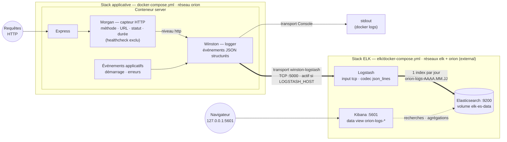

# Documentation technique – Orion CRM

- **Titre du document** : Documentation technique – Orion CRM
- **Auteur** : Vincent Vanwaelscappel
- **Option choisie** : Option B (Scénario Orion)
- **Date** :

## Sommaire

1. [Introduction](#1-introduction)
2. [Étapes de mise en œuvre du pipeline CI/CD](#2-étapes-de-mise-en-œuvre-du-pipeline-cicd)
    - 2.1 [Structure du pipeline](#21-structure-du-pipeline)
    - 2.2 [Scripts d'automatisation](#22-scripts-dautomatisation)
    - 2.3 [Reproductibilité](#23-reproductibilité)
3. [Plan de conteneurisation et de déploiement](#3-plan-de-conteneurisation-et-de-déploiement)
    - 3.1 [Dockerfiles](#31-dockerfiles)
    - 3.2 [docker-compose.yml](#32-docker-composeyml)
    - 3.3 [Stratégie de déploiement](#33-stratégie-de-déploiement)
4. [Plan de testing périodique](#4-plan-de-testing-périodique)
    - 4.1 [Types de tests automatisés](#41-types-de-tests-automatisés)
    - 4.2 [Fréquence d'exécution](#42-fréquence-dexécution)
    - 4.3 [Objectifs des tests](#43-objectifs-des-tests)
5. [Plan de sécurité](#5-plan-de-sécurité)
    - 5.1 [Résultats SonarQube](#51-résultats-sonarqube)
    - 5.2 [Analyse des risques](#52-analyse-des-risques)
    - 5.3 [Plan d'action / Remédiation](#53-plan-daction--remédiation)
6. [Monitoring, métriques & KPI](#6-monitoring-métriques--kpi)
    - 6.1 [Métriques DORA](#61-métriques-dora)
    - 6.2 [KPI personnalisés](#62-kpi-personnalisés)
    - 6.3 [Analyse synthétique du monitoring](#63-analyse-synthétique-du-monitoring)
7. [Plan de sauvegarde des données](#7-plan-de-sauvegarde-des-données)
    - 7.1 [Ce qui doit être sauvegardé](#71-ce-qui-doit-être-sauvegardé)
    - 7.2 [Procédure de sauvegarde](#72-procédure-de-sauvegarde)
    - 7.3 [Procédure de restauration](#73-procédure-de-restauration)
8. [Plan de mise à jour](#8-plan-de-mise-à-jour)
    - 8.1 [Mise à jour de l'application](#81-mise-à-jour-de-lapplication)
    - 8.2 [Mise à jour du pipeline CI/CD](#82-mise-à-jour-du-pipeline-cicd)
    - 8.3 [Fréquence & bonnes pratiques](#83-fréquence--bonnes-pratiques)
9. [Conclusion](#9-conclusion)

- [Annexes (optionnelles)](#annexes-optionnelles)

## 1. Introduction

- Contexte du projet
- Objectifs de l'industrialisation
- Technologies principales
- Présentation rapide du pipeline CI/CD mis en place

## 2. Étapes de mise en œuvre du pipeline CI/CD

### 2.1 Structure du pipeline

- Étapes principales (build back-end, build front-end, tests, analyse SonarQube, déploiement local ou optionnel cloud)
- Ordre d'exécution
- Justification du choix des actions GitHub

### 2.2 Scripts d'automatisation

- Scripts utilisés
- Leur rôle dans le pipeline
- Comment les exécuter ou les adapter

### 2.3 Reproductibilité

- Comment relancer le pipeline
- Gestion des secrets (sans jamais les afficher)

## 3. Plan de conteneurisation et de déploiement

### 3.1 Dockerfiles

**État initial.** Le dépôt fournit un Dockerfile par module (`server/Dockerfile`, `client/Dockerfile`), volontairement
basiques : image `node:22` complète (~1 Go), `npm install` non reproductible, build et exécution dans la même image,
processus lancé en root, et front servi par `vite preview` (outil de prévisualisation, non prévu pour la production).

**Choix techniques cibles.**

| Choix               | Décision                                                    | Justification                                                                                                                                                                                                                                                                                                                                                                                                                                                                                        |
|---------------------|-------------------------------------------------------------|------------------------------------------------------------------------------------------------------------------------------------------------------------------------------------------------------------------------------------------------------------------------------------------------------------------------------------------------------------------------------------------------------------------------------------------------------------------------------------------------------|
| Image de base build | `node:22-alpine`                                            | Version alignée sur `engines` (Node ≥ 22), variante alpine ~5× plus légère que l'image complète, surface d'attaque réduite                                                                                                                                                                                                                                                                                                                                                                           |
| Installation        | `npm ci`                                                    | Installation reproductible depuis `package-lock.json` (échoue si le lock est désynchronisé), contrairement à `npm install`                                                                                                                                                                                                                                                                                                                                                                           |
| Structure           | Multi-stage build                                           | L'étage `builder` compile (TypeScript > `dist/`, Vite > `dist/`) ; l'étage final ne contient que le résultat du build et les dépendances de production (`npm ci --omit=dev`). Image finale plus petite, sans compilateur ni devDependencies                                                                                                                                                                                                                                                          |
| Runtime front       | `nginxinc/nginx-unprivileged:alpine`                        | Un build Vite est un ensemble de fichiers statiques : nginx est fait pour ça (performances, cache, gzip), là où `vite preview` ne l'est pas. La variante *unprivileged* tourne nativement en utilisateur non-root sur un port non privilégié (8080). Image maintenue par NGINX Inc. (éditeur de nginx, Docker Verified Publisher), construite depuis les mêmes sources que l'image officielle `nginx` - préférable à un durcissement non-root manuel de l'image officielle, plus fragile à maintenir |
| Utilisateur         | `USER node` (back) / `nginx` (front)                        | Ne jamais exécuter un conteneur en root : en cas de compromission du processus, l'attaquant n'a pas les droits root dans le conteneur                                                                                                                                                                                                                                                                                                                                                                |
| Healthcheck         | `HEALTHCHECK` sur `GET /api/health` (back) et `/` (front)   | Le back expose déjà `/api/health` ; permet à Docker/Compose de connaître l'état réel du service, pas seulement l'existence du processus                                                                                                                                                                                                                                                                                                                                                              |
| `.dockerignore`     | `node_modules`, `dist`, `.env*`, `*.db`, `.git`, `coverage` | Contexte de build minimal, et garantie qu'aucun secret ni base locale n'est copié dans l'image                                                                                                                                                                                                                                                                                                                                                                                                       |
| Outillage runtime   | npm/npx/yarn supprimés de l'image finale (back)             | Un runtime n'installe pas de paquets : surface d'attaque réduite, et les dépendances internes de npm (tar, sigstore…) portent des CVE relevées par le scan Trivy sans aucun rapport avec l'application. L'entrypoint appelle le binaire prisma directement (`node_modules/.bin/prisma`)                                                                                                                                                                                                              |

**Spécificités Prisma/SQLite (back).** Trois contraintes structurent le Dockerfile back :

1. `prisma generate` doit être exécuté dans l'image finale (le client généré dépend de la plateforme - musl sur alpine),
   et l'image doit embarquer le paquet `openssl` : sans lui, Prisma ne détecte pas OpenSSL 3 et télécharge des moteurs
   `openssl-1.1` incompatibles avec alpine ;
2. les migrations doivent être **versionnées** (le starter les excluait du versionnement via `.gitignore`) et appliquées
   au démarrage du conteneur via `prisma migrate deploy` dans l'entrypoint - sans cela, un conteneur neuf démarre sans
   base ;
3. le fichier SQLite doit vivre **hors de l'image**, dans un volume (`DATABASE_URL=file:/app/data/orion.db`), sinon les
   données sont perdues à chaque recréation du conteneur. Ce volume est aussi la cible du plan de sauvegarde (§ 7).

**Communication front > back.** L'URL d'API du front (`VITE_API_URL`) est injectée **au moment du build** Vite, ce qui
figerait l'URL dans l'image. Plutôt que de builder une image par environnement, le nginx du front fait office de reverse
proxy : `/api` est relayé vers le service back (`proxy_pass http://server:8080`), en miroir exact du proxy Vite utilisé
en dev. Le front appelle donc des URL relatives, l'image est agnostique de l'environnement, et le navigateur ne parle
qu'à une seule origine (pas de CORS inter-conteneurs).

### 3.2 docker-compose.yml

Deux services (pas de service base de données : SQLite est embarqué dans le back) :

| Service  | Image                     | Port hôte | Rôle                                                           |
|----------|---------------------------|-----------|----------------------------------------------------------------|
| `server` | build `server/Dockerfile` | 8080      | API Express + fichier SQLite dans le volume `orion-db`         |
| `client` | build `client/Dockerfile` | 4200      | nginx : statiques React + reverse proxy `/api` > `server:8080` |

- **Healthchecks** : `server` est vérifié via `/api/health` ; `client` ne démarre qu'une fois le back sain
  (`depends_on: condition: service_healthy`).
- **Images nommées GHCR** : chaque service déclare à la fois `image:` (`ghcr.io/enhydrav/ocr-jsld-p7-server` /
  `-client`) et `build:` - `docker compose up --build` reste autonome depuis le dépôt (exigence du brief), tandis que
  `docker compose pull` bascule sur les dernières images publiées par la CI (déploiement, § 3.3).
- **Volume nommé** `orion-db` monté sur `/app/data` : persistance des données entre recréations de conteneurs.
- **Réseau** : réseau bridge **nommé** `orion` (`name: orion`), déclaré explicitement plutôt que le réseau par défaut de
  Compose ; les services se résolvent par leur nom (`server`, `client`). Le nom stable et prévisible prépare la Partie
  2 : la stack de monitoring ELK, qui vivra dans un docker-compose séparé, pourra se raccorder à ce réseau via
  `external: true` pour collecter les logs applicatifs sans fusionner les deux stacks.
- **Configuration par variables d'environnement** (fichier `.env` gitignoré, jamais copié dans les images) : aucune
  valeur sensible en dur dans `docker-compose.yml`.

**Lancement local** : `docker compose up --build` puis application sur `http://localhost:4200` (API directement
joignable sur `http://localhost:8080/api/health` pour vérification). Arrêt : `docker compose down` - les données
**persistent** (le volume nommé survit aux arrêts, recréations de conteneurs et mises à jour d'images). Remise à zéro
complète : `docker compose down -v` - commande **destructive** (elle supprime le volume, donc la base), réservée au
poste de développement.

Ce risque de suppression accidentelle est traité à deux niveaux : le plan de sauvegarde (§ 7) prévoit une sauvegarde
automatisée du fichier SQLite et sa procédure de restauration ; et pour un déploiement de production, le volume serait
déclaré `external: true` (créé une fois via `docker volume create`), ce qui le rend insupprimable par `down -v`. Ce
durcissement n'est pas appliqué ici car il ajoute une étape manuelle avant le premier `docker compose up`, en
contradiction avec l'exigence d'un lancement direct.

### 3.3 Stratégie de déploiement

- **Publication d'images** : à chaque push sur `main` validé par la CI, les deux images sont construites et poussées sur
  **GitHub Container Registry** (GHCR), taguées `latest` + SHA du commit (traçabilité : toute image est reliable à un
  commit exact), plus le tag de version `vX.Y.Z` lorsque ce push a donné lieu à une release (voir plus bas).
  L'authentification utilise le `GITHUB_TOKEN` fourni par GitHub Actions (permission `packages: write`), aucun secret
  supplémentaire à gérer.
- **Déploiement** : sur la machine cible (poste ou serveur interne Orion), `docker compose pull && docker compose up -d`
  récupère et démarre les dernières images publiées. Le healthcheck sert de smoke test post-déploiement.
- **Retour arrière** : le tag par SHA permet de redémarrer explicitement l'image du commit précédent en cas de problème
  (voir aussi plan de sauvegarde § 7 pour les données).

**Releases versionnées (SemVer).** En complément du flux continu, les releases sont marquées par un tag git **`vX.Y.Z`**
(SemVer strict : MAJOR = rupture d'API ou de schéma de données, MINOR = fonctionnalité rétrocompatible, PATCH =
correctif) ; le tag git est la référence de version. Le versioning est **automatisé par semantic-release**, adossé à la
convention *conventional commits* déjà appliquée sur le dépôt : à chaque push sur `main` **intégralement validé par la
CI** (le job release dépend de tous les autres - tests, quality gate SonarQube, smoke test conteneurisé, scan Trivy),
l'historique depuis la dernière release est analysé - `feat:` > MINOR, `fix:`/`perf:` > PATCH,
`BREAKING CHANGE` > MAJOR ; les types neutres (`docs:`, `ci:`, `test:`, `chore:`) ne déclenchent aucune release. Le
workflow pose alors le tag, et publie une **release GitHub** avec notes générées depuis les commits et artefacts
(`orion-server-dist.tar.gz` : build Node + schéma/migrations Prisma ; `orion-client-dist.tar.gz` : dist React).
L'arbitrage MAJOR/MINOR/PATCH est ainsi encodé dans les messages de commit au moment où le changement est écrit - la
qualité des messages devient une exigence de production, vérifiable en revue de PR.

## 4. Plan de testing périodique

**État initial** : le starter ne contient qu'un test placeholder par module (`expect(true).toBe(true)`) ; la couverture
réelle est donc nulle. Le plan ci-dessous définit la cible que le pipeline met en œuvre ; le déroulé effectif de la mise
en place est décrit au § 2.

### 4.1 Types de tests automatisés

| Type                      | Périmètre                                                                               | Outil                                   | Ce qui est vérifié                                                                                                                   |
|---------------------------|-----------------------------------------------------------------------------------------|-----------------------------------------|--------------------------------------------------------------------------------------------------------------------------------------|
| Analyse statique          | back + front                                                                            | ESLint, `tsc --noEmit`                  | Erreurs de typage et violations de règles avant même d'exécuter le code                                                              |
| Tests unitaires back      | services, repositories, validation Zod                                                  | Vitest (+ mock Prisma)                  | Logique métier isolée : chaque couche testée sans base de données réelle                                                             |
| Tests d'intégration back  | routes Express de bout en bout                                                          | Vitest + Supertest, base SQLite jetable | Contrats de l'API (statuts HTTP, corps de réponse, erreurs de validation) sur une vraie chaîne route > controller > service > Prisma |
| Tests de composants front | composants, hooks, services d'appel API                                                 | Vitest + Testing Library (jsdom)        | Rendu et comportement des composants React et des hooks TanStack Query, couche d'appel API (axios) mockée                            |
| Tests e2e navigateur      | smoke : parcours critiques (dashboard, CRUD contact) *(PR)* ; suite étendue *(nightly)* | Playwright (Chromium)                   | Le comportement réel vu de l'utilisateur : front, API et base réunis, dans un vrai navigateur                                        |
| Smoke test conteneurisé   | application complète                                                                    | `docker compose up` en CI + `curl`      | L'application démarre réellement en conteneurs : `/api/health` répond 200, le front sert sa page                                     |
| Analyse qualité/sécurité  | tout le code                                                                            | SonarQube Cloud                         | Bugs, vulnérabilités, code smells, duplication, couverture (voir § 5)                                                                |
| Audit de dépendances      | back + front                                                                            | `npm audit`                             | Vulnérabilités connues (CVE) dans les dépendances                                                                                    |
| Scan d'images conteneur   | images `server` et `client` construites en CI                                           | Trivy                                   | Vulnérabilités (CVE) des couches des images (OS alpine, paquets système), seuil bloquant HIGH/CRITICAL corrigeables                  |

Les tests unitaires et d'intégration produisent un rapport de couverture **lcov** (provider v8), transmis à SonarQube.
Les tests e2e Playwright sont découpés en deux niveaux. Le **smoke e2e** (parcours critiques) s'exécute **en PR**, car
dans ce pipeline un merge sur `main` publie immédiatement des images déployables (§ 3.3) : tout ce qui n'est pas vérifié
avant merge l'est trop tard. Son coût est marginal - il tourne sur la stack Docker Compose que le job PR démarre déjà
pour le smoke test. La **suite étendue** (parcours secondaires, cas d'erreur) reste en nightly. Garde-fous contre la
*flakiness*, principal risque des e2e bloquants : périmètre smoke volontairement minimal, `retries` Playwright activés
en CI, et tout test devenu instable est déplacé vers la suite nightly le temps d'être fiabilisé.

### 4.2 Fréquence d'exécution

| Déclencheur                   | Tests exécutés                                                                                                                                             | Rôle                                                                                                                                                                                                                                                                                                                                        |
|-------------------------------|------------------------------------------------------------------------------------------------------------------------------------------------------------|---------------------------------------------------------------------------------------------------------------------------------------------------------------------------------------------------------------------------------------------------------------------------------------------------------------------------------------------|
| **Push** (toute branche)      | Lint + typecheck + tests unitaires, d'intégration et de composants avec couverture + build back et front                                                   | Feedback rapide au développeur à chaque commit poussé                                                                                                                                                                                                                                                                                       |
| **Pull request** vers `main`  | Idem push + analyse SonarQube (quality gate) + build des images Docker + smoke test compose + scan Trivy des images + smoke e2e Playwright sur cette stack | Exécutée **dès l'ouverture de la PR** puis à chaque mise à jour de la branche : feedback immédiat pour l'auteur, et le reviewer ne relit que des PR déjà vertes. La protection de branche (*required status checks* + *require branches up to date*) exige ces mêmes résultats, revalidés contre le `main` courant, pour autoriser le merge |
| **Nightly** (cron quotidien)  | Suite complète + suite e2e étendue + `npm audit` + scan Trivy des images                                                                                   | Détecter les régressions *sans commit* : nouvelle CVE publiée, dérive d'une dépendance, panne d'un service externe (Sonar). Un pipeline vert hier peut être rouge aujourd'hui. Les e2e longs ou en cours de fiabilisation s'exécutent ici (déclenchement manuel possible avant release)                                                     |
| **Release / push sur `main`** | Suite complète + publication des images GHCR                                                                                                               | Seul un état intégralement validé est promu en artefact déployable                                                                                                                                                                                                                                                                          |

### 4.3 Objectifs des tests

- **Non-régression** : toute modification (fix, feature, montée de dépendance) est confrontée aux comportements
  existants avant d'atteindre `main` ; c'est la condition pour déployer fréquemment sans peur (métriques DORA, § 6).
- **Qualité** : critères de réussite explicites et bloquants - tests verts obligatoires, couverture ≥ 80 % sur le
  périmètre métier du back (services, repositories, validation - seuil appliqué par les *thresholds* Vitest, qui font
  échouer le job de tests sous 80 %), quality gate SonarQube au vert. Un échec bloque le merge (branche `main`
  protégée).
- **Déployabilité** : le smoke test conteneurisé garantit que ce qui est publié démarre réellement - on ne teste pas
  seulement le code, mais l'artefact déployé, dans les conditions du déploiement.
- **Alerte** : tout échec de la CI (y compris nightly) notifie l'équipe via GitHub (email/interface) ; le nightly en
  échec est traité comme un incident à investiguer, pas comme du bruit.

## 5. Plan de sécurité

### 5.1 Résultats SonarQube

**Rôle dans le pipeline.** SonarQube Cloud réalise une analyse statique (SAST) du monorepo à chaque pull request et push
sur `main` : vulnérabilités, *security hotspots* (code sensible à revoir manuellement), bugs, code smells, duplication,
complexité, et couverture de tests (via les rapports lcov produits en CI, § 4.1). Le **quality gate** est bloquant : une
PR qui le fait échouer ne peut pas être mergée. L'authentification utilise le secret GitHub `SONAR_TOKEN` (jamais en
clair dans le workflow).

**Résultats d'analyse.** *(Section complétée en Partie 2, après plusieurs exécutions du pipeline : vulnérabilités et
hotspots relevés, code smells critiques, zones de complexité, couverture mesurée, avec captures en annexe.)*

L'analyse manuelle du starter identifie déjà des candidats que SonarQube et la revue devront confirmer :

- **CORS ouvert à toutes les origines** (`app.use(cors())`) : n'importe quel site peut appeler l'API depuis le
  navigateur d'un utilisateur interne ;
- **Middleware d'erreurs inopérant** : déclaré avec 3 paramètres alors qu'Express en exige 4 pour un error handler - il
  ne s'exécute jamais, les erreurs remontent au handler par défaut (risque de fuite de stack trace) ;
- **Aucune authentification** sur l'API CRM (données clients accessibles à quiconque atteint le port) ;
- **Absence d'en-têtes de sécurité HTTP** (pas de helmet côté Express, pas de CSP côté nginx).

### 5.2 Analyse des risques

**Risques applicatifs**

| Risque                                                 | Référence OWASP                 | Impact                                                                     |
|--------------------------------------------------------|---------------------------------|----------------------------------------------------------------------------|
| API sans authentification ni contrôle d'accès          | A01 – Broken Access Control     | Lecture/modification des données CRM par tout accédant au réseau           |
| CORS non restreint                                     | A05 – Security Misconfiguration | Requêtes cross-origin malveillantes vers l'API                             |
| Error handler inopérant > réponses d'erreur par défaut | A05                             | Fuite d'informations techniques (stack traces)                             |
| Pas de rate limiting                                   | A04 – Insecure Design           | Abus de l'API, force brute future sur l'authentification                   |
| Fichier SQLite unique, non chiffré                     | -                               | Perte/exfiltration des données si le volume est compromis (mitigé par § 7) |

Point positif du starter : les entrées sont déjà validées par **Zod** dans chaque controller (protection contre
l'injection et le mass-assignment).

**Risques pipeline et chaîne d'approvisionnement**

| Risque                                               | Mitigation prévue                                                                                                      |
|------------------------------------------------------|------------------------------------------------------------------------------------------------------------------------|
| Secret exposé en clair (token Sonar, `.env` commité) | Secrets GitHub Actions exclusivement ; `.env`, `*.db` gitignorés ; aucun secret dans les images (`.dockerignore`)      |
| Dépendance vulnérable (CVE)                          | `npm audit` en nightly + Dependabot (alertes et PR de mise à jour, § 8)                                                |
| Action GitHub compromise (supply chain)              | Actions épinglées par SHA de commit, pas seulement par tag ; permissions du `GITHUB_TOKEN` réduites au minimum par job |
| Image de base vulnérable                             | Images officielles minimales (alpine), reconstruites régulièrement (§ 8) ; scan Trivy en CI (PR + nightly), bloquant   |
| Conteneur exécuté en root                            | Utilisateurs non-root dans les deux images (§ 3.1)                                                                     |

### 5.3 Plan d'action / Remédiation

**Actions immédiates** (intégrées à la mise en place du pipeline) :

- mettre à jour sans délai les dépendances vulnérables détectées par `npm audit` (politique de mise à jour et premier
  cas concret au § 8.1) ;
- corriger le middleware d'erreurs (signature à 4 paramètres, réponse JSON générique sans stack trace) ;
- supprimer le middleware CORS du starter : avec le reverse proxy (§ 3.1), front et API partagent la même origine et
  aucune requête cross-origin n'est légitime - l'absence totale d'en-têtes CORS est la politique la plus restrictive
  (une allowlist explicite ne serait réintroduite que si un autre client navigateur devait un jour consommer l'API
  directement) ;
- ajouter helmet (en-têtes de sécurité HTTP) côté Express ;
- durcir la conteneurisation : non-root, multi-stage, `.dockerignore`, secrets hors images (§ 3) ;
- brancher SonarQube Cloud avec quality gate bloquant et secrets GitHub ;
- scanner les images Docker dans la CI avec **Trivy** (seuil bloquant HIGH/CRITICAL corrigeables), retenu à la place du
  Twistlock cité par le brief : produit commercial nécessitant une console sous licence, là où Trivy rend le même
  service de scan en open source.

Les trois corrections applicatives (error handler, CORS, helmet) sont volontairement appliquées **après** la première
analyse SonarQube : le constat est ainsi documenté avant/après (captures § 5.1), preuve que le pipeline détecte puis
valide la remédiation.

**Actions à court terme** (itérations suivantes) :

- traiter les 10–20 alertes SonarQube prioritaires relevées en Partie 2 (en distinguant vulnérabilités réelles et code
  smells) ;
- atteindre et maintenir le seuil de couverture (§ 4.3) pour fiabiliser la détection de régressions ;
- activer Dependabot et instaurer une revue hebdomadaire des alertes `npm audit` ;
- ajouter un rate limiting sur l'API (`express-rate-limit`).

**Actions à long terme** :

- mettre en place une authentification (JWT + bcrypt, patterns éprouvés sur les projets précédents) et un contrôle
  d'accès par rôle (technique/commercial) - indispensable si l'application dépasse le réseau interne ;
- planifier la rotation des secrets et les montées de versions majeures (Node, React, Express) selon le plan de mise à
  jour (§ 8).

## 6. Monitoring, métriques & KPI

**Mise en place du monitoring (stack ELK)** - Les logs applicatifs sont collectés, centralisés et visualisés par une
stack **Elasticsearch + Logstash + Kibana 8.19** locale, décrite dans `elk/docker-compose.yml`. Conformément au brief,
elle reste **hors du pipeline CI/CD** (trop lourde pour y être exécutée à chaque run) : c'est un outil d'observation
lancé à la demande sur le poste (`docker compose up -d` depuis `elk/`, Kibana sur `http://localhost:5601`).

- **Sources de logs** : le back émet des logs **structurés en JSON** via **Winston** - événements applicatifs
  (démarrage, erreurs via le handler d'erreurs) et, via **Morgan** branché sur Winston, un événement par requête HTTP
  (méthode, URL, statut, temps de réponse, taille). Le ping du healthcheck Docker (toutes les 30 s) est **exclu** pour
  ne pas noyer la volumétrie réelle sous du bruit. Le front (fichiers statiques nginx) n'est pas raccordé : la
  quasi-totalité du signal utile (erreurs, performances, volumétrie métier) vit dans l'API.
- **Acheminement** : transport TCP `winston-logstash` vers `logstash:5000` (entrée `json_lines`, aucun parsing à
  écrire), activé **uniquement** si `LOGSTASH_HOST` est défini (fichier `.env`) - sans la stack ELK, l'application
  logge simplement sur stdout et n'est jamais pénalisée.
- **Résilience du transport, vérifiée en conditions réelles** : Logstash injoignable, le transport épuise ses
  4 tentatives de connexion puis se désactive seul, l'API continuant de servir et de loguer sur stdout. Ce résultat
  n'est cependant **pas acquis par défaut** : winston fait remonter les erreurs de ses transports **sur le logger
  lui-même**, et un `EventEmitter` sans écouteur `'error'` fait tomber le process Node (« Unhandled 'error' event »).
  Sans ce détail, un simple `docker compose up` de l'application sans la stack ELK suffisait à faire sortir le
  conteneur `server` immédiatement. Un écouteur d'erreur sur le logger est donc obligatoire, et deux tests de
  non-régression le verrouillent (`logger.test.ts`, « logger resilience »). Principe général : **l'observabilité ne
  doit jamais pouvoir arrêter l'application qu'elle observe.** Limite connue et assumée : une fois le transport
  désactivé, il ne se reconnecte pas - relancer le service (`docker compose restart server`) après un redémarrage de
  Logstash pour reprendre l'expédition des logs.
- **Raccordement réseau** : la stack ELK vit dans son propre compose et rejoint le réseau applicatif `orion` en
  `external: true` (préparé au § 3.2) - les deux stacks restent indépendantes (démarrage, arrêt, cycle de vie).
- **Indexation** : un index Elasticsearch par jour (`orion-logs-AAAA.MM.JJ`), consultés dans Kibana via la data view
  `orion-logs-*` ; la purge des vieux logs se réduit à une suppression d'index.
- **Sécurité** : `xpack.security.enabled=false` assumé - stack locale d'analyse, tous les ports (9200, 5601, 5000)
  liés à `127.0.0.1`, aucune exposition réseau ; activer TLS + comptes n'apporterait ici que de la friction.

Chemin d'un log, de la requête au dashboard :



### 6.1 Métriques DORA

**Source et méthode** - Les quatre métriques sont calculées sur l'historique **réel** des exécutions du pipeline,
récupéré via l'API GitHub Actions (`/repos/.../actions/runs` et `.../jobs`). Le calcul est implémenté dans
`tools/dora-metrics.ts` (`npm run dora` depuis `tools/`) : les chiffres sont ainsi **reproductibles** et
rafraîchissables à mesure que l'historique s'allonge, plutôt que relevés à la main.

**Plateforme dédiée ou script maison : arbitrage** - des outils calculent ces métriques automatiquement et ont été
évalués. **Apache DevLake** (projet Apache actif : ingestion multi-sources, dashboards Grafana livrés, déploiement en
4 conteneurs - MySQL, backend, interface de configuration, Grafana) et **Middleware** (plateforme DORA open source
auto-hébergée) sont les deux références sérieuses. Le **Four Keys** de Google, longtemps la référence, est **archivé
depuis janvier 2024** : écarté à ce titre. Côté marketplace GitHub, aucune action ne dépasse la dizaine d'étoiles - rien
sur quoi asseoir un livrable.

L'argument en faveur de la plateforme est réel et doit être reconnu : **maintenance externalisée**, définitions éprouvées
par des années d'usage, aucun code propre à maintenir. Trois éléments ont malgré tout fait retenir le script :

1. **Le travail de définition n'est pas supprimé, seulement déplacé.** Une plateforme doit être configurée pour savoir
   ce qui compte comme déploiement dans *ce* dépôt ; la décision (« un déploiement = job de publication GHCR réussi »)
   reste à prendre et à défendre. Elle serait alors enfouie dans une configuration, alors que la présente documentation
   doit précisément l'expliciter.
2. **Coût local** : 4 conteneurs supplémentaires, dont une base de données et un **second outil de visualisation**
   (Grafana) à côté du Kibana déjà en place, sur un poste qui fait déjà tourner la stack applicative et la stack ELK.
   Le brief autorise Grafana, mais la cohérence du livrable y perdrait.
3. **Fréquence d'usage** : ces chiffres sont produits ponctuellement (rédaction, actualisation avant dépôt), pas
   surveillés en continu ; une plateforme amortit son installation sur un usage durable. À noter en sens inverse
   qu'externaliser la maintenance signifie aussi subir les montées de version et migrations de schéma, là où un script
   sans dépendance adossé à une API REST stable dérive peu.

Contrepartie assumée du choix : le script est du code propre au projet, donc **il doit être testé comme le reste** -
`tools/dora/metrics.test.ts` couvre les calculs sensibles (regroupement des épisodes, lead time, taux d'échec,
détection des déploiements). Le raisonnement s'inverse avec plusieurs dépôts, plusieurs équipes ou un historique long :
**DevLake devient alors le choix rationnel**, et c'est la recommandation d'évolution.

**Dashboards décrits en code, donc reproductibles** - un dashboard construit à la main dans une interface n'est pas
reproductible : il disparaît avec le poste qui l'héberge et personne ne peut le recréer à l'identique. Les **deux**
dashboards sont donc **définis en code** - « Pipeline CI/CD - métriques DORA » (`tools/kibana/buildDashboard.ts`,
7 panneaux) et « Logs applicatifs - Orion » (`tools/kibana/buildLogsDashboard.ts`, 6 panneaux) - et créés par
`npm run kibana:setup`, qui pose au préalable les deux data views (`orion-logs-*` pour les logs applicatifs,
`orion-pipeline-metrics` pour le pipeline). Deux commandes complètent le cycle :
`npm run kibana:export` capture dans `tools/kibana/dashboards.ndjson` ce qui a été retouché dans l'interface, et
`npm run kibana:import` réinjecte ce fichier. Les créations passent par `overwrite=true`, les commandes sont donc
rejouables. Le code reste la référence par défaut, pour qu'une modification ne soit jamais masquée par un export plus
ancien.

Quatre contraintes de l'API, découvertes en exécutant réellement la stack et consignées dans le code, expliquent la
forme des objets produits : les identifiants des data views doivent être **imposés** (un UUID généré rend les
références du dashboard invalides à l'import) ; le type `lens` refuse l'attribut `kibanaSavedObjectMeta` (mapping
strict - la requête vit dans `state`) ; l'API d'**import** applique la chaîne de migrations des versions antérieures et
échoue sur un objet écrit à la main, d'où le choix de l'API de **création** pour les objets définis en code ; enfin un
champ `text` n'est pas agrégeable, ce qui laissait un panneau vide (le message de commit est donc indexé en `keyword`).
Onze tests structurels (`buildDashboard.test.ts`) verrouillent ces invariants sans nécessiter d'instance Kibana.

**Visualisation dans Kibana** - `npm run dora:index` indexe les métriques dans Elasticsearch (index
`orion-pipeline-metrics`, un document par run, par job et par épisode d'indisponibilité ; identifiants stables, donc
réexécution idempotente). Kibana dérive alors les indicateurs par agrégation - fréquence de déploiement (compte des
runs marqués `is_deployment`), lead time (médiane de `lead_time_min`), MTTR (médiane de `recovery_hours`), CFR (ratio
des `conclusion`) - plutôt que de stocker des valeurs pré-calculées qui se périmeraient. **Index distinct** des logs
applicatifs (`orion-logs-*`) : les deux natures de mesure cohabitent dans le même Elasticsearch sans se mélanger.
Contrainte assumée : la collecte est **locale et à la demande** (ou par tâche planifiée sur le poste), car la stack ELK
n'est pas exposée et reste hors du pipeline (consigne du brief) - un job de CI ne peut donc pas l'alimenter.

**Période observée** : du 23/07/2026 13:21 UTC au 27/07/2026 18:27 UTC, soit **4,21 jours** et **17 exécutions** sur
`main` - 13 déclenchées par un push, 4 par le cron nightly, **0 par une pull request**. Le brief demandait au moins 3
exécutions ; l'échantillon reste néanmoins petit, ce qui est signalé dans chaque interprétation.

**Limite fondamentale, à énoncer avant tout chiffre : ce projet n'a pas d'environnement de production.** Or les
métriques DORA parlent de code *qui tourne en production*. Le nombre réel de déploiements de cette application est donc
**zéro**, et aucun des quatre indicateurs n'est mesurable au sens strict. Ce qui est mesuré ici, ce sont des **proxys
explicitement nommés**, arrêtés au dernier événement observable du pipeline : la publication des images. Une image sur
GHCR est **prête à être déployée**, elle n'est pas déployée - c'est la définition de la livraison continue (§ 3.3), pas
du déploiement continu. Chaque métrique ci-dessous porte donc la mention de ce qu'elle mesure réellement.

**Définitions retenues** (indispensables : les mêmes mots recouvrent des mesures différentes selon les organisations) -
une **publication** est un job « Publication GHCR » réussi, c'est-à-dire le moment où le changement devient
*installable* ; le **lead time** court du commit (horodatage exposé par l'API) jusqu'à la fin de cette publication ; un
**épisode d'indisponibilité** court du run rouge jusqu'au run vert suivant (les rouges consécutifs appartiennent au même
épisode : l'incident n'est pas résolu tant que rien n'est repassé au vert).

**Ce qui rendrait ces métriques vraies** : un environnement de production réel (VPS ou hébergeur, même modeste) et une
étape de déploiement automatisée dans le workflow, idéalement déclarée en `environment:` afin que GitHub horodate les
déploiements via son API dédiée - c'est d'ailleurs le mécanisme sur lequel s'appuient les plateformes comme DevLake.
Le lead time inclurait alors l'installation, la fréquence compterait de vrais déploiements, le MTTR mesurerait le
rétablissement d'un **service** et le taux d'échec au changement deviendrait observable. C'est la première
recommandation d'évolution du § 6.3.

| Métrique DORA | Ce qui est réellement mesuré | Valeur | Interprétation |
|---|---|---|---|
| **Lead Time for Changes** | délai commit → **mise à disposition** (fin de la publication d'images), et non → production | **3,6 min** (médiane sur 2 publications : 3,2 et 4,1 min) | Niveau *elite* au sens DORA (< 1 h) **pour la partie mesurée**. Le pipeline n'est pas le facteur limitant. Ce que le chiffre ne contient pas : l'installation sur une cible (`docker compose pull`), manuelle et non horodatée. |
| **Deployment Frequency** | fréquence de **livraison** : publications d'images prêtes à déployer | **0,59 / jour** (2 publications en 3,37 jours) | Niveau *high* (entre une fois par jour et une fois par semaine) rapporté à la livraison. La capacité de publication n'existe que depuis le run #12 ; la fréquence reflète le rythme d'un projet de formation, pas une limite technique. Indicateur complémentaire : **7 pushes sur 13 intégralement verts**, donc 7 versions livrables. |
| **MTTR** (*time to restore*) | rétablissement du **pipeline** (run rouge → run vert), et non d'un service rendu à des utilisateurs | **26,4 h** en moyenne (médiane 17,2 h) sur 3 épisodes ; **1,4 h** de médiane hors échecs nightly | Écart considérable entre les deux périmètres, et c'est **le** diagnostic : un échec sur push est corrigé vite (32 min à 17 h), un échec nightly est resté rouge **60,4 h** (runs #13 à #16). Niveau *low* sur le périmètre complet. Traité en § 6.3. |
| **Change Failure Rate** | taux d'échec **du pipeline** sur les changements poussés. Le taux d'échec *au déploiement* est **non mesurable** : sans service en production, il n'y a aucune dégradation à observer | **46,2 %** (6 pushes rouges sur 13) | Près d'un changement sur deux était défectueux et **aucun n'a atteint le registre d'images** : les jobs `release` et `publish` étant conditionnés (`needs`) à l'ensemble des vérifications, un échec bloque la livraison au lieu de la dégrader. Ce que l'on peut affirmer des 2 publications : elles ont toutes deux été précédées d'un smoke test de la stack complète réussi - donc des images qui démarrent, ce qui n'est pas une garantie d'absence d'incident en usage réel. |

**Détail des 6 échecs sur push** (utile pour l'analyse § 6.3) : runs **#1** et **#2** = échec du seul job d'analyse
SonarQube, pendant la mise en service du projet côté SonarCloud (les deux jobs de tests étaient verts) ; runs **#6**,
**#8** et **#9** =
défauts détectables uniquement à l'exécution des conteneurs (moteur Prisma absent de l'image, healthchecks résolus en
IPv6) ; run **#16** = `package.json` mis à jour sans les lockfiles régénérés, `npm ci` refusant alors de s'exécuter
(échec des 3 jobs en moins de 20 s).

### 6.2 KPI personnalisés

Cinq indicateurs suivis, choisis pour couvrir les deux natures de mesure que le brief demande de **distinguer** : les
KPI **pipeline** (issus de GitHub Actions, ci-dessous) et les KPI **applicatifs** (issus de la stack ELK, § 6.3).

| KPI | Valeur mesurée | Pourquoi ce KPI | Seuil d'alerte proposé |
|---|---|---|---|
| **Durée d'un pipeline vert** | médiane **107 s** (min 86 s, max 232 s) | C'est le délai de feedback au développeur : au-delà de quelques minutes, l'attente pousse à contourner la CI. | > 5 min = examiner la parallélisation et les caches |
| **Temps avant le premier signal d'échec** | médiane **67 s** (min 12 s, max 117 s) | Mesure la qualité du *fail-fast* : un pipeline doit signaler tôt, pas seulement signaler. Les 12 s du run #16 illustrent le cas idéal (échec à l'installation des dépendances). | > 3 min = déplacer les vérifications rapides en amont |
| **Durée des jobs de test** | back **24 s**, front **23 s** (médianes sur 16 exécutions) | Poste de coût principal quand la suite grossit ; stable ici, donc marge disponible avant que les tests ne deviennent le facteur limitant. | > 2 min = découper ou paralléliser les suites |
| **Taux de réussite des runs** | **41,2 %** tous événements, **53,8 %** sur les pushes | Indicateur de santé du pipeline et, indirectement, de la discipline de développement. Valeur faible assumée en phase de construction du pipeline (les échecs #1-#9 sont ceux de sa mise au point), à surveiller une fois l'outillage stabilisé. | < 80 % sur 20 runs glissants = investiguer |
| **Couverture de tests** | **89,2 %** des instructions sur le module back (mesure Vitest), seuils bloquants à 80 % sur le périmètre métier | Fiabilise la détection de régressions, condition de la quality gate SonarQube (§ 5). Mesuré par Vitest, publié à Sonar à chaque run. | < 80 % = build rouge (seuil déjà bloquant) |
| **Taux de réponses en erreur** (KPI applicatif) | relevé sur le dashboard Kibana, **non significatif à ce stade** : le trafic observé est celui de la démonstration (généré via `/api/debug/status/:code`), pas un usage réel | Seul KPI de la couche applicative et non du pipeline : c'est lui qui révèle une dégradation vue par l'utilisateur, invisible dans GitHub Actions. | > 1 % de 5xx sur 1 h = investiguer |

Décomposition de la durée du pipeline par job (médianes) : tests back 24 s et front 23 s (en parallèle), analyse
SonarQube 66 s, images Docker + smoke test + Trivy 92 s, release 34 s, publication GHCR 73 s. La durée totale est
passée de **86 s** (run #4) à **232 s** (run #17) au fil de l'ajout des étapes : c'est le **coût assumé** de la
couverture ajoutée (analyse de qualité, scan de vulnérabilités, publication), qui reste très inférieur au seuil de 5
minutes.

### 6.3 Analyse synthétique du monitoring

**Tendances observées** - Le pipeline s'est stabilisé : les échecs se concentrent sur sa période de construction
(runs #1 à #9), tandis que les 5 derniers pushes n'ont produit qu'un seul échec, immédiatement corrigé. Sa durée a
presque triplé (86 s → 232 s) au fil des ajouts, sans jamais approcher un seuil gênant. Aucun changement défectueux n'a
atteint le registre d'images.

**Points forts** - Lead time de niveau *elite* jusqu'à la mise à disposition (3,6 min du commit à l'image publiée,
étant entendu que l'installation n'est pas comptée) ; conditionnement effectif des
jobs de livraison, qui transforme un échec en blocage plutôt qu'en régression livrée ; fail-fast réel (échec signalé
en 12 s au run #16) ; détection par le pipeline de défauts qu'aucun test unitaire n'aurait vus (moteur Prisma manquant
dans l'image, healthcheck résolu en IPv6) - ce sont les jobs `docker` et `Trivy` qui les ont révélés.

**Points critiques identifiés** (anomalies relevées dans les métriques et les journaux d'exécution) :

1. **Les échecs nightly ne sont vus par personne** - trois exécutions planifiées consécutives (runs #13, #14, #15)
   sont restées rouges pendant **60,4 h**, sur l'échec de l'audit des dépendances : 5 vulnérabilités de gravité *high*
   côté back et 8 côté front (chaîne `brace-expansion`/`minimatch` via ESLint, et `react-router` côté front), toutes
   corrigeables. Le correctif n'a été poussé que le 27/07, à l'occasion d'un autre travail. C'est **le point critique
   principal** : le nightly n'a de valeur que si son échec déclenche une action - c'est précisément son rôle de
   détecter ce qu'aucun commit ne révèle (§ 4.2). Sans notification, il produit un faux sentiment de sécurité. *Correction proposée* : ajouter au workflow une étape de notification conditionnée à
   l'échec d'un run planifié (issue GitHub ouverte automatiquement, ou notification par courriel/Slack), et vérifier
   les préférences de notification du dépôt.
2. **La voie des pull requests n'a jamais été empruntée** - 13 pushes directs sur `main`, **0 pull request** sur toute
   la période. Les garde-fous les plus coûteux du plan (quality gate SonarQube, smoke test de la stack, scan Trivy
   avant fusion) existent mais ne protègent rien tant que les changements arrivent directement sur `main` : c'est la
   cause directe du taux d'échec de 46 % sur `main`. *Correction proposée* : activer la protection de branche
   (checks requis + branche à jour avant fusion) et passer par des branches courtes, comme le § 4.2 le prévoit.
3. **Deux classes d'erreurs évitables en local** - les échecs #6/#8/#9 (comportement des conteneurs) et #16
   (désynchronisation `package.json` / lockfile) auraient tous été détectés avant le push, respectivement par un
   `docker compose up --wait` et par un `npm ci` local. *Correction proposée* : documenter cette vérification
   préalable, voire l'automatiser par un hook de pré-push.
4. **Aucun environnement de production, donc aucune métrique DORA au sens strict** - c'est la limite la plus
   structurante de cette analyse, et elle n'est pas cosmétique : trois des quatre indicateurs sont des proxys arrêtés à
   la publication des images (§ 6.1), et le quatrième - le taux d'échec au déploiement - est simplement **non
   mesurable**, puisqu'il n'existe aucun service en fonctionnement dont on pourrait observer la dégradation. *Correction
   proposée, et première recommandation d'évolution* : disposer d'une cible de déploiement réelle (un VPS modeste
   suffit) et automatiser l'installation dans le workflow, en déclarant un `environment:` pour que GitHub horodate les
   déploiements. Les quatre métriques deviendraient alors vraies plutôt qu'approchées.

**Métriques applicatives (ELK) et dashboards** - Le dashboard « Logs applicatifs », construit sur la data view
`orion-logs-*` alimentée par les logs structurés décrits en tête du § 6, réunit quatre visualisations et deux vues de
logs bruts - dont une restreinte aux réponses en erreur (`status >= 400`), la barre KQL du dashboard permettant
d'affiner encore :

- **taux de réponses en erreur** (tuile *metric* : `count(kql='status >= 400') / count()`) - distingue l'usage fautif
  (4xx) du défaut serveur (5xx) ;
- **temps de réponse au 95e centile** (tuile *metric* sur `responseTimeMs`) - le p95 plutôt que la moyenne, parce que
  la moyenne masque précisément les requêtes lentes qui dégradent l'expérience ;
- **répartition des statuts dans le temps** (histogramme empilé par `status`) - fait apparaître les pics d'erreurs et
  la volumétrie ;
- **top des URL appelées** (table sur `url.keyword`) - identifie les points d'entrée les plus sollicités ;
- **recherche sauvegardée « logs bruts »** - permet de passer de la tendance au journal détaillé sans quitter le
  dashboard.

Le trafic de démonstration est produit par `GET /api/debug/status/:code`, qui renvoie le statut demandé et permet donc
de valider chaque visualisation sans attendre un incident réel. Point d'attention relevé pendant la mise en place : une
URL inconnue saisie dans le navigateur ne produit **pas** de 404 côté API - nginx ne proxifie que `/api/*` et sert
`index.html` pour tout le reste (fallback SPA, § 3.1) ; les erreurs applicatives se cherchent donc dans Kibana avec
`status >= 400`, non en filtrant sur le niveau de log.

**Captures** - `docs/dashboard-pipeline-dora.png`, `docs/dashboard-logs-applicatifs.png` et
`docs/dashboard-sauvegardes.png` (les trois dashboards produits par `npm run kibana:setup` sur une stack ELK 8.19).

**Alertes** - Aucun seuil d'alerte n'est aujourd'hui automatisé : les valeurs proposées en § 6.2 et les alertes
applicatives (taux de 5xx, temps de réponse) restent à instrumenter. Priorité recommandée, cohérente avec le point
critique n° 1 : **alerter d'abord sur l'échec du pipeline planifié**, puis sur le taux d'erreurs applicatives, avant
d'affiner des seuils de performance sur un échantillon encore trop petit.

## 7. Plan de sauvegarde des données

### 7.1 Ce qui doit être sauvegardé

Le principe de tri : **ce qui est reproductible n'a pas besoin d'être sauvegardé, ce qui est unique si.**

| Élément | Criticité | Pourquoi | Traitement |
|---|---|---|---|
| **Base SQLite** (`orion.db`, volume `orion-db`) | **Vitale** | Seule donnée **irremplaçable** du projet : elle n'existe nulle part ailleurs et aucun build ne la régénère. Un `docker compose down -v` suffit à la détruire (§ 3.2). | Sauvegarde quotidienne (§ 7.2) |
| **Secrets et configuration d'exécution** (`.env`, secret `SONAR_TOKEN`) | **Vitale** | Volontairement **hors du dépôt** (gitignorés) : ils ne sont donc *pas* couverts par GitHub, contrairement au reste. C'est le trou de couverture le plus facile à oublier. | Gestionnaire de mots de passe ; `.env.example` versionné documente les clés attendues |
| Code source, migrations Prisma, workflows, dashboards Kibana | Élevée | **Déjà répliqués** : git est distribué, chaque clone contient l'intégralité de l'historique. Les dashboards sont du code depuis le § 6, les migrations sont versionnées. | Miroir git + bundle (§ 7.2) |
| Historique des exécutions GitHub Actions | Moyenne | Source des métriques DORA (§ 6.1), non contenue dans le dépôt. | Matérialisée dans Elasticsearch par `npm run dora:index` ; cache JSON brut dans `tools/.dora-cache` |
| Index Elasticsearch (logs applicatifs) | Faible | Données d'observation à durée de vie courte, volontairement jetables (un index par jour, purge par suppression d'index). | Aucune sauvegarde - assumé |
| Images Docker publiées sur GHCR | Faible | **Reconstructibles** à l'identique depuis un commit (`docker compose up --build`). | Aucune sauvegarde |
| Artefacts de build (`dist/`) | Nulle | Produits déterministes du code source. | Aucune sauvegarde |

### 7.2 Procédure de sauvegarde

**Base de données - pourquoi aucun conteneur annexe n'est nécessaire.** SQLite est une *bibliothèque*, pas un
serveur : aucun processus distant ne peut « dumper » la base, mais tout processus ayant accès au fichier peut en
prendre un instantané. Deux conséquences :

- **copier le fichier à chaud (`cp`) est dangereux** : la copie peut capturer un état déchiré si une écriture est en
  cours, et en mode WAL elle omettrait les fichiers `-wal`/`-shm` ;
- **`VACUUM INTO` (ou `sqlite3 .backup`) est sûr à chaud** : SQLite garantit un instantané cohérent même sous
  écritures concurrentes - vérifié sur ce projet, instantané valide en 15 ms avec un writer actif en parallèle.

Comme l'image du serveur embarque déjà Prisma (nécessaire aux migrations au démarrage), la sauvegarde est un simple
script de l'application : **ni CLI `sqlite3` à ajouter à l'image, ni sidecar, ni conteneur permanent.**

| Élément | Format | Fréquence | Commande |
|---|---|---|---|
| Base SQLite | instantané `.db` cohérent, vérifié par `PRAGMA integrity_check` | **horaire**, par le service `backup` de la stack | automatique ; à la demande : `docker compose exec -T server node dist/scripts/backup.js` |
| Contrôle de restaurabilité | restauration à blanc (§ 7.3) | quotidienne (4 h UTC), par le même service | automatique ; à la demande : `docker compose exec -T server node dist/scripts/restore.js --verify` |
| Base, stack arrêtée | idem | à la demande (avant une migration risquée) | `docker run --rm -v orion-db:/app/data -v "$PWD/backups":/app/backups ghcr.io/enhydrav/ocr-jsld-p7-server:latest node dist/scripts/backup.js` |
| Dépôt (historique complet) | miroir git | hebdomadaire | `git push --mirror <second-hébergeur>` |
| Dépôt (archive froide) | fichier `.bundle` | hebdomadaire | `git bundle create orion-$(date +%F).bundle --all` |
| Secrets | entrées de gestionnaire de mots de passe | à chaque changement | manuel, documenté |

**Rétention** - le script applique une politique **grand-père / père / fils** identique dans son esprit à
`automysqlbackup`, avec un palier horaire en plus : les **24 dernières heures**, les **7 derniers jours**, un
instantané par semaine sur **4 semaines**, puis un par mois sur **12 mois**. C'est l'algorithme de `restic forget` (le
plus récent de chaque période), et un même fichier peut satisfaire plusieurs paliers. Le plafond est donc de
**47 instantanés**, quelle que soit la durée de vie du système. Mesuré sur un jeu simulé de 720 instantanés horaires
(30 jours) : **32 conservés, 690 supprimés**. Un fichier au nom non reconnu n'est **jamais** supprimé, ce qui protège
les dumps manuels et les sauvegardes créées avant restauration.

Le palier horaire ramène la perte de données maximale de 24 h à **1 h** sur la journée écoulée, ce qui couvre le cas
le plus fréquent : l'erreur de saisie repérée le jour même. Le coût est négligeable ici - `VACUUM INTO` réécrit la base
entière, soit quelques dizaines de kilo-octets et une quinzaine de millisecondes ; la question se poserait autrement
sur une base de plusieurs giga-octets, où l'on préférerait alors Litestream.

**Planification - service `backup` du compose (retenu).** La sauvegarde est planifiée par un **service dédié de la
stack**, et non par une tâche à configurer sur chaque machine : le calendrier vit ainsi **dans le dépôt**, versionné et
relu comme du code, et fonctionne à l'identique sous Linux, macOS et Windows. C'est le même raisonnement que pour les
dashboards (§ 6.1) : ce qui est configuré à la main sur un poste n'est pas reproductible.

```yaml
  backup:
    image: ghcr.io/enhydrav/ocr-jsld-p7-server:latest
    entrypoint: ["node", "dist/scripts/backup.js", "--loop"]
    environment:
      - DATABASE_URL=file:/app/data/orion.db
      - BACKUP_DIR=/app/backups
      - BACKUP_INTERVAL_MINUTES=60
    volumes:
      - orion-db:/app/data
      - ./backups:/app/backups
    depends_on:
      server:
        condition: service_healthy
    restart: unless-stopped
```

Quatre points de conception :

- **Aucune image dédiée** : le service réutilise celle du serveur, qui contient déjà Prisma et les scripts compilés.
  Elle n'y déclare pas de `build:`, pour ne pas construire deux fois la même image ; `docker compose up --build` la
  construit une fois via le service `server` et les deux la partagent.
- **Aucun socket Docker monté.** La tentation serait de faire lancer `docker compose exec` par le conteneur, ce qui
  exigerait `/var/run/docker.sock` : or donner accès au socket Docker équivaut à donner les droits **root sur l'hôte**.
  Le service accède donc directement au volume de données, comme n'importe quel autre client SQLite.
- **`entrypoint` remplacé** : celui du serveur applique les migrations, ce qui n'a pas de sens ici. Le service attend
  d'ailleurs que le serveur soit sain (`depends_on`), donc que les migrations soient déjà passées.
- **Cadence alignée sur l'horloge**, pas sur l'instant de démarrage : un conteneur relancé à 10 h 47 sauvegarde à
  11 h 00 et non à 11 h 47. Une erreur ponctuelle (base verrouillée, disque plein) est tracée sans tuer le
  planificateur, qui retentera au tour suivant.

Limite honnête, commune à cette solution et à `cron` : **une exécution manquée n'est pas rattrapée**. Si la machine est
éteinte à l'heure prévue, cet instantané-là n'existera pas. Seule une minuterie `systemd` (`Persistent=true`) rattrape
le tir - c'est l'unique avantage qu'elle conserve sur le service embarqué, et la raison pour laquelle les variantes
hôte restent documentées ci-dessous.

**Variantes hôte** (si l'on préfère ne pas faire tourner de service supplémentaire, ou si l'on veut le rattrapage) :

*Linux / macOS - cron* (`crontab -e`) :

```cron
# Sauvegarde horaire de la base Orion (§ 7.2)
5 * * * * cd /srv/orion && /usr/bin/docker compose exec -T server node dist/scripts/backup.js >> /var/log/orion-backup.log 2>&1
# Contrôle quotidien de restaurabilité (§ 7.3)
30 4 * * * cd /srv/orion && /usr/bin/docker compose exec -T server node dist/scripts/restore.js --verify >> /var/log/orion-backup.log 2>&1
```

Trois précautions qui font échouer la moitié des tâches planifiées : l'option **`-T`** est indispensable
(`docker compose exec` alloue un pseudo-terminal par défaut, or cron n'en fournit aucun) ; les **chemins doivent être
absolus**, l'environnement de cron étant minimal ; et la **redirection des sorties** est ce qui permettra de constater
l'échec - une sauvegarde silencieuse est le pendant exact du nightly que personne ne regarde (§ 6.3).

*Linux - minuterie systemd*, préférable à cron sur un serveur : journalisation dans `journalctl` et surtout
`Persistent=true`, qui **rattrape l'exécution manquée** si la machine était éteinte.

```ini
# /etc/systemd/system/orion-backup.service
[Unit]
Description=Sauvegarde de la base Orion
[Service]
Type=oneshot
WorkingDirectory=/srv/orion
ExecStart=/usr/bin/docker compose exec -T server node dist/scripts/backup.js

# /etc/systemd/system/orion-backup.timer
[Unit]
Description=Sauvegarde horaire de la base Orion
[Timer]
OnCalendar=hourly
Persistent=true
[Install]
WantedBy=timers.target
```

Activation : `sudo systemctl enable --now orion-backup.timer`, contrôle : `systemctl list-timers orion-backup*`.

*Windows - Planificateur de tâches* : créer une tâche déclenchée toutes les heures, action
`docker` avec les arguments `compose exec -T server node dist/scripts/backup.js` et le dépôt comme
répertoire de démarrage. Cocher « Exécuter même si l'utilisateur n'est pas connecté » ; si Docker Desktop n'est pas
démarré, la tâche échouera - c'est la limite de cet environnement, à surveiller.

**Destination** - les instantanés sont écrits dans `./backups` sur l'hôte, monté dans le conteneur : **hors du volume
`orion-db`**, pour qu'un `down -v` détruise la base sans emporter ses sauvegardes. Sauvegarder au même endroit que la
donnée est l'erreur classique à ne pas commettre. Ce répertoire est gitignoré (données réelles) et doit être **recopié
hors de la machine** (disque externe, stockage objet) : une sauvegarde sur le même disque que la production ne protège
que des erreurs humaines, pas d'une panne matérielle.

**Alternatives évaluées** - `automysqlbackup` ne concerne que MySQL et il n'existe pas d'équivalent maintenu pour
SQLite, d'où le script maison (30 lignes de logique, testée). Deux outils sont pertinents si les exigences montent :
**restic** (chiffrement, déduplication, envoi direct vers un stockage objet distant, rétention `--keep-daily/weekly/monthly`
- même politique, en plus robuste), et surtout **Litestream**, conçu spécifiquement pour SQLite : il réplique le
journal WAL en continu vers un stockage objet et permet une restauration à un instant donné, ramenant la perte de
données maximale de 24 h à quelques secondes. C'est **le** choix si l'objectif de point de reprise devient serré ;
c'est aussi le seul cas où un sidecar est justifié, Litestream tournant en processus permanent aux côtés de
l'application. Écarté ici : pour un CRM interne à faible volumétrie d'écritures, perdre au pire une journée de saisie
est acceptable, et la simplicité a été préférée.

### 7.3 Procédure de restauration

**Action automatisée de vérification** - `npm run backup:verify` (ou `node dist/scripts/restore.js --verify`)
effectue une **restauration à blanc** : il copie le dernier instantané dans un emplacement temporaire, l'ouvre,
contrôle son intégrité et compte les enregistrements, puis le supprime - sans jamais toucher à la base en service.
C'est ce contrôle qui distingue une sauvegarde d'une simple intention de sauvegarde. Le service `backup` l'exécute
automatiquement une fois par jour ; il est aussi lançable à la demande.

**Que se passe-t-il si le contrôle échoue ?** La question est décisive : un contrôle dont l'échec passerait inaperçu ne
vaudrait pas mieux que pas de contrôle - c'est exactement le travers relevé au § 6.3 avec les exécutions nocturnes
restées rouges 60 h. L'échec est donc signalé **à trois niveaux**, du plus discret au plus visible :

1. **Journal structuré** - l'événement `backup_failed` est émis au niveau `error` avec sa cause, via le même logger que
   l'application : il part donc dans Elasticsearch et apparaît dans le dashboard **« Sauvegardes »** (compteur d'échecs
   et journal détaillé). Le dashboard porte aussi une chronologie horaire où **un creux signale une sauvegarde
   manquée** - l'absence devient visible, alors qu'elle n'émet par nature aucun message.
2. **État persistant + healthcheck** - le résultat est écrit dans `backups/backup-state.json`, que le healthcheck du
   service relit toutes les 5 minutes. Le conteneur passe **`unhealthy`** dans `docker compose ps` si la dernière
   sauvegarde a échoué, si l'instantané n'est pas restaurable, **ou si aucune sauvegarde n'a eu lieu depuis deux
   cycles** - ce dernier cas attrapant le planificateur silencieusement bloqué, le plus dangereux de tous.
3. **Code de sortie** - en usage manuel ou par tâche planifiée sur l'hôte, la commande **sort en erreur** (code 1), ce
   que cron et systemd remontent.

Le planificateur, lui, **continue de tourner** : un échec ponctuel (base momentanément verrouillée, disque plein) ne
doit pas priver l'application de ses sauvegardes suivantes. L'état conserve par ailleurs le nom du **dernier instantané
vérifié avec succès** (`lastVerified`) : c'est celui vers lequel se replier sans hésitation.

**Conduite à tenir devant un échec de contrôle** - un instantané non restaurable signifie le plus souvent que la
**base source est elle-même corrompue**, puisque `VACUUM INTO` en est une copie fidèle. Dans l'ordre : vérifier la base
en service (`PRAGMA integrity_check` via `restore.js --verify --from <base>`), vérifier l'espace disque et l'état du
support, puis restaurer depuis le dernier instantané `lastVerified` - la rétention horaire garantit qu'il en existe un
antérieur à l'incident. Ne pas se contenter de relancer la sauvegarde : elle reproduirait la corruption.

**Scénario d'incident : suppression accidentelle de données** (le plus probable - un `down -v` de trop, une
suppression en masse, une migration fautive). Étapes :

1. **Arrêter l'application** : `docker compose stop server` - indispensable, sinon le serveur écrit dans le fichier
   pendant son remplacement.
2. **Choisir l'instantané** : `ls backups/` (nommage horodaté, l'ordre alphabétique est l'ordre chronologique).
3. **Vérifier avant d'agir** : `npm run backup:verify` confirme que l'instantané est restaurable et affiche les
   volumes qu'il contient - on sait donc ce que l'on va récupérer *avant* de remplacer quoi que ce soit.
4. **Restaurer** : `node dist/scripts/restore.js --yes` (ou `--from backups/<instantané>` pour un point précis). Le
   script sauvegarde l'état courant sous `pre-restore-*` **avant** de le remplacer : la restauration est réversible.
   Il supprime aussi les journaux `-wal`/`-shm` résiduels, faute de quoi SQLite rejouerait le journal de l'ancienne
   base par-dessus la base restaurée.
5. **Redémarrer et contrôler** : `docker compose start server`, puis vérifier `/api/health` et l'application.

La commande refuse de s'exécuter sans `--yes` : une action destructive ne doit jamais être le comportement par défaut.

**Scénario : perte du dépôt GitHub.** Distinguer deux cas. *Indisponibilité temporaire* : sans conséquence
immédiate - git étant distribué, tout clone local contient l'historique complet, et `docker compose up --build`
fonctionne sans réseau ; seuls la CI, la publication d'images et les releases sont suspendus. *Perte définitive*
(dépôt ou compte supprimé) : restauration depuis le miroir (`git clone <second-hébergeur>`) ou depuis un bundle
(`git clone orion-2026-07-31.bundle`), puis `git remote set-url` vers le nouvel hébergeur. **Ce que le miroir ne
contient pas**, et qu'il faut accepter de perdre : les issues, les discussions de pull requests, l'historique des
exécutions Actions (d'où l'intérêt de son archivage dans Elasticsearch, § 7.1) et les packages publiés - ces derniers
étant reconstructibles depuis le code.

**Limitations assumées** :

- **Perte de données maximale d'une heure** (fréquence horaire), et de 24 h pour un incident détecté au-delà d'une
  journée : acceptée pour un usage interne, à réduire à quelques secondes avec Litestream si le besoin évolue.
- La restauration exige un **arrêt de service** de quelques secondes ; aucune bascule à chaud n'est prévue.
- Les sauvegardes ne sont **pas chiffrées** : elles contiennent des données nominatives (contacts), leur copie hors
  machine doit donc viser un support chiffré - `restic` apporterait le chiffrement nativement.
- La copie hors machine reste **manuelle** : c'est la première automatisation à ajouter, l'absence de copie distante
  étant la faiblesse résiduelle de ce plan.

## 8. Plan de mise à jour

Le principe directeur : **une mise à jour est un commit comme un autre.** Elle entre par une pull request, subit
l'intégralité du pipeline (tests § 4, quality gate SonarQube § 5, build des images, scan Trivy, smoke e2e) et n'atteint
`main` que verte. Le plan de mise à jour ne consiste donc pas à inventer un processus de validation - il existe déjà -
mais à **automatiser la détection** de ce qui doit monter de version, pour que la décision humaine se limite à relire
et merger.

La détection s'appuie sur **Dependabot** (natif GitHub, aucun service tiers à héberger ni à authentifier), configuré
dans `.github/dependabot.yml` - versionné et relu comme du code, même argument que pour les dashboards (§ 6.1) et la
planification des sauvegardes (§ 7.2). Trois canaux se complètent :

| Canal | Déclencheur | Rôle |
|---|---|---|
| **Dependabot version updates** | hebdomadaire (lundi 7 h) | PR de montée de version pour chaque dépendance en retard ; c'est le flux de maintenance ordinaire |
| **Dependabot security updates** | immédiat, dès publication d'un avis | PR de correctif de sécurité **sans attendre le lundi** - une CVE ne suit pas le calendrier |
| **`npm audit` + Trivy en nightly** (§ 4.2) | quotidien | Filet indépendant : signale une vulnérabilité *sans commit* - y compris dans une image déjà publiée, ce que Dependabot ne voit pas |

Les *security updates* s'activent une fois dans les réglages du dépôt (Settings → Advanced Security → Dependabot),
pas dans le fichier YAML.

### 8.1 Mise à jour de l'application

**Dépendances npm.** Dependabot surveille les trois `package.json` (`/server`, `/client`, `/tools`) chaque semaine,
avec deux choix de configuration qui structurent le flux :

- **Mineures et correctifs groupés, majeures individuelles.** Les montées `minor`/`patch` d'un même module arrivent en
  **une seule PR groupée** (`mineures-et-correctifs`) : d'après semver elles ne cassent rien, la CI le vérifie, la
  relecture est rapide. Chaque **majeure** arrive au contraire **seule**, pour être relue avec son changelog et ses
  instructions de migration - on ne mélange pas un breaking change avec quinze bumps triviaux qui le noieraient.
- **Délai de maturation (`cooldown: 3 jours`).** Une version n'est proposée que trois jours après sa publication :
  le temps qu'un paquet cassé ou compromis le jour de sa sortie soit signalé et retiré. Les *security updates*
  ignorent ce délai, c'est voulu.

Le préfixe des commits distingue ce qui est livré de ce qui ne l'est pas, car **semantic-release (§ 2) lit ces
préfixes** : une dépendance de *production* de `server/` ou `client/` fait partie de l'application expédiée, sa montée
est donc un `fix(deps)` qui déclenche une release patch et une reconstruction d'images ; une devDependency ou l'outillage
de `tools/` (métriques DORA, dashboards) reste en `chore(deps)`, sans release.

**Mises à jour React / Node.js.** Une majeure de framework ou de runtime n'est pas une PR Dependabot, c'est un
**chantier planifié** :

- **Node.js** : suivre le calendrier LTS officiel (une LTS paire tous les deux ans, maintenue ~30 mois) et ne monter
  que de LTS en LTS. La version est épinglée à **quatre endroits qui doivent bouger ensemble** : `env.NODE_VERSION`
  dans `ci.yml`, les `FROM` des deux Dockerfiles, et `engines` dans les deux `package.json`. C'est
  précisément parce qu'aucun robot ne sait coordonner ces quatre points qu'une montée majeure de Node reste un
  processus manuel documenté : branche dédiée, les quatre modifications, suite complète + e2e, release.
- **React** (et les autres majeures structurantes : Prisma, Express, Vite) : la PR Dependabot sert de déclencheur,
  mais la relecture suit les notes de version officielles et applique les codemods fournis le cas échéant. Une seule
  majeure à la fois : si elle casse, on sait laquelle.

**Images Docker.** Deux cas distincts, et une limite d'outil assumée :

- **Images de base des Dockerfiles** (`node:22-alpine`, `nginx-unprivileged:alpine`) : épinglées par **digest**
  (`node:22-alpine@sha256:…`), pour la même raison que les actions GitHub le sont par SHA (§ 8.2) - un *tag* est
  **mutable** : quiconque contrôle le dépôt d'images en amont peut le faire pointer vers autre chose, et un tag
  flottant est consommé **sans relecture**, au moment du build. Le digest est immuable : ce qui est construit est
  exactement ce qui a été relu, et deux builds du même commit partent de la même base (reproductibilité, § 2.3).
  La contrepartie est assumée : une base figée ne reçoit **plus aucun correctif tant qu'on ne la fait pas monter**,
  l'épinglage n'est donc tenable qu'avec un robot qui propose les montées. C'est le rôle de l'écosystème `docker` de
  Dependabot, qui met à jour **le digest et le tag ensemble** - et c'est pour lui que les `FROM` inlinent leurs
  versions : le parseur docker de Dependabot ne résout pas les `ARG` (vérifié dans son code : la regex des `FROM`
  n'interprète pas `${...}`), un Dockerfile paramétré par `ARG` lui serait invisible et le digest pourrirait en
  silence. En complément, le **nightly** (§ 4.2) reconstruit les images et les passe au scan Trivy : la base étant
  épinglée, il scanne **exactement celle qui est publiée**, et une CVE est signalée sous 24 h, sans commit. Le
  remède est alors la PR Dependabot (ou une montée manuelle du digest), mergée puis republiée au push sur `main`
  (§ 3.3). La montée **majeure** (`22-alpine` → `24-alpine`) est exclue de ces PR : elle appartient au chantier Node
  ci-dessus, dont les `FROM` sont l'un des quatre points de coordination.
- **Stack ELK** (`elk/docker-compose.yml`) : images épinglées en dur (`8.19.19`), donc surveillées par l'écosystème
  `docker-compose` de Dependabot. Pas de digest ici, et c'est un choix : cette stack est un outil d'observation
  **local**, jamais construit ni publié par la CI - le tag de version suffit à son niveau de risque. Les trois images (Elasticsearch, Logstash, Kibana) doivent monter **en même temps** -
  Elastic exige l'alignement des versions - d'où un **groupe unique** produisant une seule PR pour les trois. Les
  majeures sont exclues : un passage 8.x → 9.x est une migration (mappings, dashboards § 6 à revalider), pas un merge.

Premier cas concret, antérieur à Dependabot : dès la mise en place de la CI, `npm audit` a révélé 2 vulnérabilités
critiques et 1 haute dans la chaîne de test Vitest 2.x ; montée en version **majeure** (Vitest 4) validée par les
suites de tests avant le premier run du pipeline. C'est exactement le cycle que ce plan automatise : détection
(désormais Dependabot + audit nightly) → mise à jour → validation par les tests.

### 8.2 Mise à jour du pipeline CI/CD

Le pipeline est lui-même un logiciel avec des dépendances, et il bénéficie du même traitement :

- **Actions GitHub.** Elles sont épinglées par **SHA de commit** avec la version lisible en commentaire
  (`actions/checkout@3d3c42e5... # v7.0.1`) : un tag `v7` est mutable et constitue un vecteur d'attaque de chaîne
  d'approvisionnement (cas réel : `tj-actions/changed-files`, mars 2025), un SHA ne l'est pas - même politique que
  l'épinglage par digest des images de base (§ 8.1). Ce format a un coût -
  mettre à jour un SHA à la main est pénible - et c'est Dependabot qui le paie : l'écosystème `github-actions` met à
  jour **le SHA et le commentaire de version ensemble**, chaque semaine, mineures groupées et majeures individuelles.
- **L'outillage de release est une dépendance comme une autre.** L'audit de ce plan a révélé que le maillon le plus
  sensible du pipeline y échappait : le wrapper tiers qui exécutait semantic-release, bien qu'épinglé par SHA, faisait
  `npm install semantic-release --no-audit --silent` **à chaque exécution** - le *latest* de npm, hors de tout
  lockfile, exécuté avec un token en écriture sur le dépôt. Le SHA protégeait le téléchargeur, pas la cargaison.
  Corrigé en adoptant le schéma **officiel** de semantic-release (qui ne fournit volontairement aucune action) :
  devDependency dans un `package.json` racine couvert par un lockfile, `npm ci` puis `npx semantic-release` - plus
  aucun code de release téléchargé au moment de l'exécution, et l'outil passe sous Dependabot comme toutes les autres
  dépendances. Les sorties consommées par le job de publication (`new_release_published`, `new_release_version`) sont
  écrites par le plugin `@semantic-release/exec` dans `$GITHUB_OUTPUT`.
  *Limite connue et assumée* : `npm audit` signale une vulnérabilité `tar` dans le paquet `npm` **bundlé** par
  `@semantic-release/npm` - plugin que notre configuration ne charge pas (rien n'est publié sur le registre npm) et
  dont le binaire n'est jamais exécuté ; un paquet bundlé n'est pas corrigeable par `overrides`, l'alerte Dependabot
  restera donc ouverte jusqu'au correctif amont. C'est aussi pourquoi l'audit nightly (§ 4.2) reste ciblé sur
  `server/` et `client/` : la racine est couverte par les alertes Dependabot, sans mettre le pipeline en rouge
  permanent sur un faux positif.
- **Auto-validation.** Une PR qui touche `ci.yml` exécute le pipeline modifié : la mise à jour d'une action est donc
  testée par le pipeline lui-même, dans les mêmes conditions que le code applicatif.
- **Le runner** (`ubuntu-latest`) est géré par GitHub : les mises à jour sont subies, pas choisies. Les bascules
  d'image majeure sont annoncées des mois à l'avance et testables en épinglant temporairement (`ubuntu-24.04`) - à ce
  jour, aucune raison de figer.
- **La version de Node du pipeline** est centralisée (`env.NODE_VERSION`) et suit le chantier Node du § 8.1 - le
  pipeline teste avec la version qui tourne en production, jamais une autre.

### 8.3 Fréquence & bonnes pratiques

| Quoi | Quand | Pourquoi ce rythme |
|---|---|---|
| Mineures / correctifs npm, actions, ELK | **hebdomadaire** (lundi 7 h, PR groupées) | Assez fréquent pour que chaque marche reste petite, assez espacé pour ne pas noyer la revue ; le lot du lundi se traite en une fois |
| Correctifs de sécurité | **immédiat** (PR Dependabot dès l'avis, hors calendrier et hors cooldown) | Une CVE exploitable n'attend pas lundi ; le nightly (§ 4.2) sert de rattrapage sous 24 h |
| Majeures (une PR chacune) | **au fil de l'eau**, une à la fois | Isoler chaque breaking change : si la CI casse, le coupable est connu d'avance |
| Node LTS, migration ELK | **planifié** (calendrier LTS / fin de support 8.x) | Chantiers coordonnés multi-fichiers qu'aucun robot ne sait faire atomiquement |
| Montée des images de base (digest) | **hebdomadaire** (PR Dependabot groupée), merge → republication au push sur `main` | Une base épinglée par digest ne reçoit ses correctifs que par ces PR : les laisser traîner, c'est vieillir en silence. Le nightly (rebuild + Trivy) détecte, le push sur `main` publie |

Et les règles qui rendent le système tenable dans la durée :

- **Ne jamais merger une PR de mise à jour rouge « pour s'en débarrasser »** - c'est le pendant exact du nightly que
  personne ne regarde (§ 6.3) : un signal ignoré ne protège plus rien. Une PR Dependabot rouge est un vrai travail à
  planifier (ou une exclusion à documenter), pas du bruit.
- **Monter souvent plutôt que beaucoup.** Dix retards de version se rattrapent en dix petites PR vertes ; deux ans de
  retard se rattrapent en une migration à risque. Le coût d'une mise à jour croît plus vite que son retard.
- **Laisser la CI dire non.** Le plan repose entièrement sur la qualité du filet (§ 4) : c'est parce que les tests,
  le quality gate et les scans sont exigés par la protection de branche qu'une PR de bump peut être mergée en
  confiance. Si la couverture baisse, c'est le plan de mise à jour entier qui se dégrade avec elle.
- **Pas d'auto-merge pour l'instant.** L'activer (`gh pr merge --auto`) est tentant pour les patchs groupés, mais ne
  devient raisonnable que si la suite e2e couvre les parcours critiques - à réévaluer quand elle aura mûri (§ 4.3).
- Le service `backup` (§ 7.2) réutilise l'image du serveur : il suit ses mises à jour sans configuration
  supplémentaire - un service de moins à maintenir.

## 9. Conclusion

- Résumé des améliorations apportées
- Gains observés (fiabilité, rapidité, qualité)
- Recommandations pour les itérations suivantes

## Annexes (optionnelles)

- Captures SonarQube
- Captures de logs (monitoring Option B)
- Extraits de workflows
- Commandes utiles
